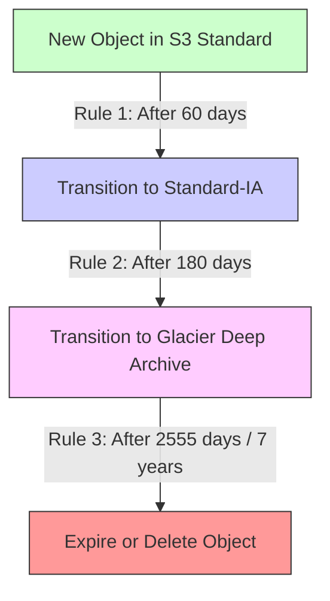

-----

# 🚀 Mastering S3 Lifecycle Management: Automate Your Storage Costs

This guide explains how to use Amazon S3 features to automatically manage your data's lifecycle, ensuring you only pay for the storage you actually need.

-----

## \#\# The Problem: Data Gets "Cold" 🥶

Storing data in S3 Standard is great for files you access all the time. But what about log files from 6 months ago? Or user backups from 3 years ago? You're paying premium "hot" storage prices for "cold" data that's rarely, if ever, touched.

The solution is to automatically move this data to cheaper storage tiers over time.

-----

## \#\# A Quick Refresher: S3 Storage Classes

Before we automate, let's remember *what* we're moving between. The primary goal is to move data from more expensive, high-availability classes to less expensive, archival classes.

| Storage Class | Use Case | Analogy |
| :--- | :--- | :--- |
| **S3 Standard** | Frequently accessed, general-purpose data. | Files on your main hard drive. |
| **S3 Standard-IA** | Infrequently accessed, but needs fast retrieval. | Files in a compressed .zip folder. |
| **S3 One Zone-IA** | Infrequently accessed, **recreatable** data. | A thumbnail file. (It's cheaper, but gone if the one AZ fails). |
| **S3 Glacier Flexible**| Long-term archival, 1 min to 12-hour retrieval. | A box of files in your garage. |
| **S3 Glacier Deep Archive** | Long-term archival (7+ years), 12-48 hour retrieval. | A box of files in a secure, off-site vault. |

-----

## \#\# The "Easy Button": S3 Intelligent-Tiering 🤖

Before building manual rules, know that AWS has an "auto-magic" solution: the **S3 Intelligent-Tiering** storage class.

Instead of creating your own rules, you can just move your objects to this class. S3 will *automatically* monitor their access patterns and move them between a "Frequent Access" tier and an "Infrequent Access" tier for you, all with no retrieval fees.

**This is the modern, set-it-and-forget-it solution for data with unknown or changing access patterns.**

-----

## \#\# The Manual Way: S3 Lifecycle Rules

For predictable patterns or when you need to move data to **Glacier**, you use **Lifecycle Rules**. These are policies you apply to a bucket that automate two key actions.

### \#\#\# 1. Transition Actions

This action moves an object from one storage class to a cheaper one after a set number of days.

  * **Example:** Move objects from `S3 Standard` to `S3 Standard-IA` after 60 days of non-access.

### \#\#\# 2. Expiration Actions

This action permanently deletes an object after a set number of days.

  * **Example:** Delete log files (`/logs/`) 365 days after they are created.

<!-- end list -->

### \#\#\# Advanced Rule Scoping

You don't have to apply a rule to your entire bucket. You can filter rules to apply only to objects with:

  * **A specific prefix:** (e.g., `images/thumbnails/` or `logs/`)
  * **Specific object tags:** (e.g., `Department: Finance` or `Status: Archive`)

### \#\#\# Important Cleanup Actions

Lifecycle rules can also delete:

  * **Old (non-current) object versions** (if versioning is on).
  * **Incomplete multi-part uploads** that have failed and are just taking up space.

-----

## \#\# The Most Critical Interaction: Lifecycle Rules + Versioning

This is a key concept for disaster recovery and a common exam topic. When you enable **S3 Versioning**, "deleting" a file just adds a "delete marker" on top. The old versions are still there, hidden.

Lifecycle rules let you manage this by creating separate rules for **current** and **non-current** versions.

  * **Current Version:** The "live" file everyone sees.
  * **Non-Current Versions:** All the old, previous copies of the file.

```mermaid
graph TD
    subgraph Rule_for_Current_Version_v2
        A[v2 in Standard] -->|After 60 days| A1[Transition to Standard-IA]
        A1 -->|After 120 days| A2[Transition to Glacier]
    end

    subgraph Rule_for_Non_Current_Version_v1
        B[v1 becomes Non-Current] -->|After 30 days| B1[Transition to Standard-IA]
        B1 -->|After 90 days| B2[Transition to Deep Archive]
        B2 -->|After 365 days| B3[Permanently Delete v1]
    end

    style A fill:#fdd,stroke:#333
    style A1 fill:#ffd,stroke:#333
    style A2 fill:#dfd,stroke:#333

    style B fill:#ddf,stroke:#333
    style B1 fill:#ccf,stroke:#333
    style B2 fill:#bdf,stroke:#333
    style B3 fill:#fbb,stroke:#333
```

<!-- end list -->

-----

## \#\# Practical Scenarios (from the transcript)

### \#\#\# Scenario 1: Thumbnails vs. Source Images

  * **Problem:** An app creates thumbnails that are only needed for 60 days and can be easily recreated. The original images need to be kept for 6+ months but can be slow to retrieve after 60 days.
  * **Solution:**
    1.  **Source Images (`/source/`):** Use S3 Standard. Create a lifecycle rule to **transition** to S3 Glacier after 60 days.
    2.  **Thumbnails (`/thumbnails/`):** Use **S3 One Zone-IA** (since they are recreatable). Create a lifecycle rule to **expire** (delete) them after 60 days.

### \#\#\# Scenario 2: Recover Deleted Objects

  * **Problem:** Must be able to recover deleted objects *immediately* for 30 days. After that, must be able to recover them within 48 hours for up to one year.
  * **Solution:**
    1.  **Enable S3 Versioning.** (This ensures "deleted" objects are just non-current versions).
    2.  Create a lifecycle rule for **non-current versions**:
          * **Transition** to `S3 Standard-IA` after 1 day (keeps it cheap but immediately accessible).
          * **Transition** to `S3 Glacier Deep Archive` after 30 days (meets the 48-hour recovery goal).
          * **Expire** after 365 days.

-----

## \#\# How Do I Know the *Right* Number of Days?

Guessing "60 days" or "90 days" is hard. For this, you can use **S3 Analytics - Storage Class Analysis**.

  * **What it is:** A tool you enable on your bucket that analyzes the access patterns of your objects.
  * **What it does:** It generates a daily CSV report that gives you **recommendations** on when to transition objects between `S3 Standard` and `S3 Standard-IA`.
  * **Limitations:** It only provides recommendations for Standard and Standard-IA, not for Glacier or One Zone-IA. It can take 24-48 hours to get your first report.