-----

# 💸 Amazon S3: Requester Pays

This guide explains the **S3 Requester Pays** feature, a billing setting that flips the script on who pays for data transfer costs.

-----

## \#\# The Default Billing: Owner Pays All

By default, an S3 bucket owner is responsible for **all** associated costs:

1.  **Storage:** The cost of storing the objects.
2.  **Data Transfer:** The cost of data downloaded *from* the bucket (egress).

This is fine for most use cases, like serving a website's images, where you expect to pay for your users' downloads.

```mermaid
graph TD
    subgraph Standard_Billing
        Owner[Bucket Owner] -->|Pays for storage| S3[S3 Bucket]
        Requester[🌐 User] -->|Downloads file| S3
        S3 -->|Data Transfer Cost| Owner
    end

    style Owner fill:#ddf,stroke:#333
    style Requester fill:#dfd,stroke:#333
    style S3 fill:#ffd,stroke:#333
```



-----

## \#\# The Problem: Sharing Large Datasets

Imagine you're a research institute that wants to share massive 100TB-plus datasets (like genomic data or satellite imagery) with other research teams around the world.

Under the default model, every time another team downloads this dataset, *you* get billed for 100TB of data transfer. This cost would be astronomical and unsustainable.

-----

## \#\# The Solution: S3 Requester Pays

This feature allows you to shift the cost of data transfer to the person *requesting* the data.

When you enable **Requester Pays** on your bucket:

  * **You (the Owner)** still pay for the **storage** of the data.
  * **The Requester** (the person downloading) pays for all **data transfer** costs.

This makes it economically feasible to share large volumes of data publicly.

```mermaid
graph TD
    subgraph Requester_Pays_Billing
        Owner[Bucket Owner] -->|Pays for storage| S3[S3 Bucket]
        Requester[🧑‍💻 Authenticated AWS User] -->|Downloads file| S3
        S3 -->|Data Transfer Cost| Requester
    end

    style Owner fill:#ddf,stroke:#333
    style Requester fill:#dfd,stroke:#333
    style S3 fill:#ffd,stroke:#333
 Requester
    end
```

-----

## \#\# 🔑 The Critical Requirement

This feature cannot be used for anonymous downloads. For this to work, the **requester must be an authenticated AWS user**.

Why? Because AWS needs to know *which* AWS account to send the bill to for the data transfer. Anonymous users can't be billed.

When a user from another account wants to download from your "Requester Pays" bucket, they must make an authenticated request that acknowledges they will be paying the cost.

### \#\# When to use it:

  * Sharing large datasets with other companies or research groups.
  * Providing data for which you don't want to be charged for download fees.

### \#\# When NOT to use it:

  * Serving web assets (images, CSS) for your public website.
  * Any scenario involving anonymous public downloads.