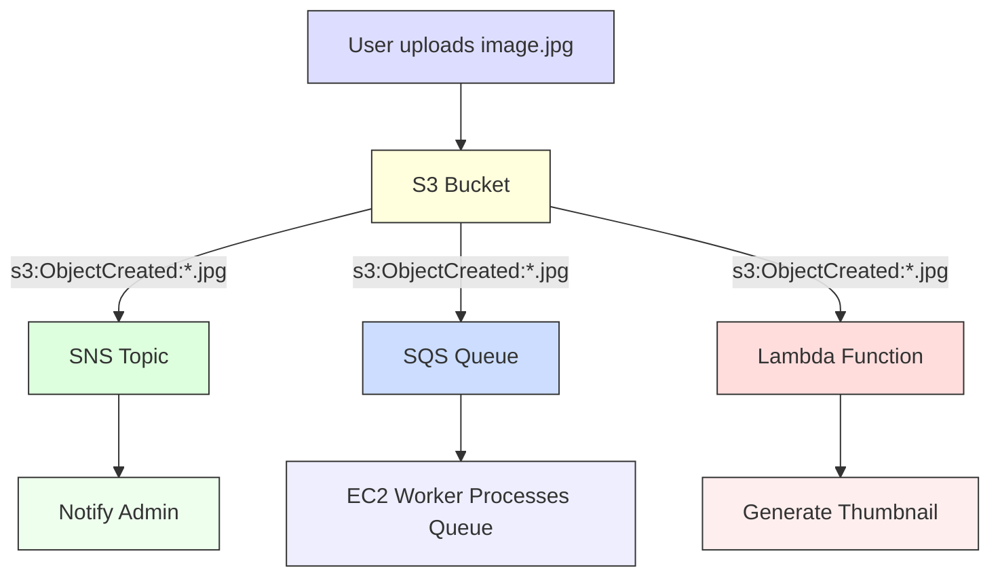
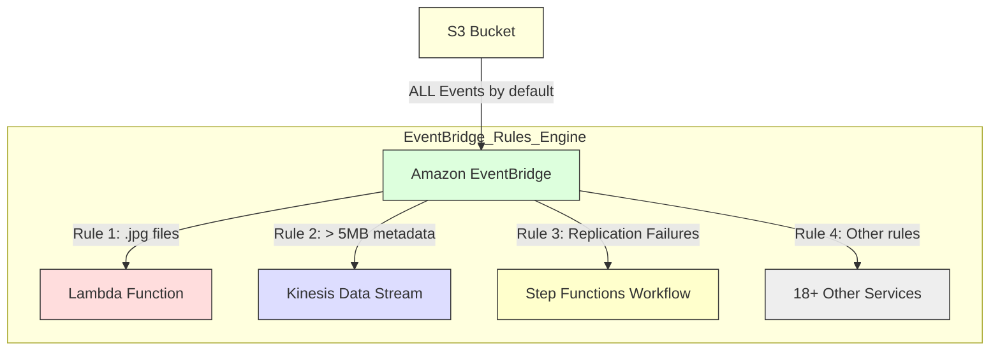

-----

# 🔔 S3 Event Notifications: Reacting to Your Data in Real-Time

This guide explains Amazon S3 Event Notifications, a feature that transforms your S3 bucket from a passive storage container into an active part of your application architecture.

-----

## \#\# The Core Concept: From Passive to Active

Think of your S3 bucket like a mailbox. By default, you have to manually walk to it and check if you have new mail.

**S3 Event Notifications** are like a "ding" on your phone the *instant* new mail arrives. It's a "push" system that allows your S3 bucket to automatically send a message when something happens, enabling you to build powerful, event-driven automations.

### \#\#\# What is an "Event"?

An event is simply an action that happens in your bucket. The most common ones are:

  * `s3:ObjectCreated:*` (e.g., a file is uploaded)
  * `s3:ObjectRemoved:*` (e.g., a file is deleted)
  * `s3:ObjectRestore:*` (e.g., a file is restored from Glacier)
  * `s3:Replication:*` (e.g., a file is replicated to another region)

You can also **filter** these events to only react to specific objects, such as those in a certain "folder" (prefix) or those with a specific file extension (suffix like `.jpg`).

**Common Use Case:** Automatically generate a thumbnail image every time a new full-size photo is uploaded to your bucket.

-----

## \#\# How It Works: The Two Main Paths for Events

There are two primary ways to configure and use event notifications, a "classic" method and a "modern" method.

### \#\#\# Path 1: The "Classic" Destinations (SNS, SQS, Lambda)

The original method allows you to send event messages directly to one of three AWS services:

1.  **Amazon SNS (Simple Notification Service):** To *notify* multiple subscribers at once (e.g., send an email, a text, and trigger another function).
2.  **Amazon SQS (Simple Queue Service):** To *queue* the event as a job for another service to process reliably. This is great for decoupling your system.
3.  **AWS Lambda:** To *execute code* immediately. This is the most direct way to process an event (e.g., the thumbnail generation use case).

<!-- end list -->

#### **A Critical Note on Permissions**

This is a common "gotcha." S3 is *pushing* an event to another service, so the **destination service must have a policy that allows S3 to send it messages.**

You **do not** attach an IAM Role to the S3 bucket. Instead, you attach a **Resource-Based Policy** to the SNS topic, SQS queue, or Lambda function that grants the S3 service principal (`s3.amazonaws.com`) permission to invoke it.

-----

### \#\#\# Path 2: The "Modern" Way (Amazon EventBridge)

A more powerful and flexible method is to use **Amazon EventBridge**.

The best part? **S3 *automatically* sends all bucket events to EventBridge by default.** You don't need to configure anything on the S3 bucket itself. You just go to EventBridge and set up rules to *listen* for the events you care about.

#### **Why is EventBridge Better?**

  * **Advanced Filtering:** You can write complex rules that filter events based on *anything* in the event JSON, such as object size, tags, or other metadata—not just the prefix/suffix.
  * **Multiple Destinations:** A single rule can send an event to *multiple* targets (e.g., a Lambda function *and* a Kinesis stream).
  * **More Destinations:** EventBridge can route S3 events to over 18 different AWS services (like Step Functions, Kinesis, etc.), not just the classic three.
  * **Built-in Features:** You get all of EventBridge's power, including the ability to **archive** events for later, **replay** past events, and more reliable delivery.

-----

## \#\# At a Glance: Classic vs. EventBridge

| Feature | Classic S3 Events (SNS, SQS, Lambda) | Amazon EventBridge |
| :--- | :--- | :--- |
| **Setup** | Configured on the S3 bucket itself. | Configured in the EventBridge console. |
| **Filtering** | **Simple:** Prefix (`images/`) and Suffix (`.jpg`). | **Advanced:** Any field in the event JSON (size, tags, metadata). |
| **Destinations** | **3:** SNS, SQS, Lambda. | **18+:** Step Functions, Kinesis, and many more. |
| **Reliability** | "Typically seconds," but can be longer. | More reliable, with built-in retry mechanisms. |
| **Features** | Basic notifications. | Archive, Replay, Input Transformation, etc. |

**Recommendation:** For all new applications, **use the Amazon EventBridge integration** for its superior flexibility, filtering, and power.