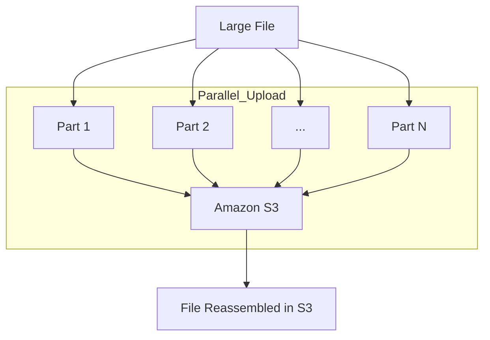
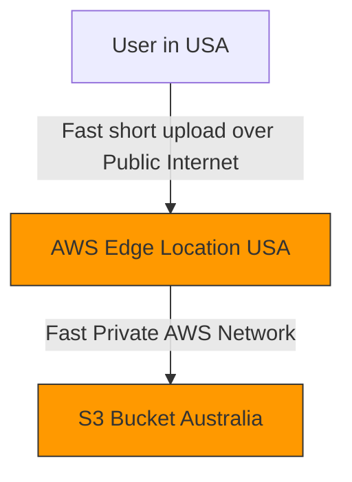
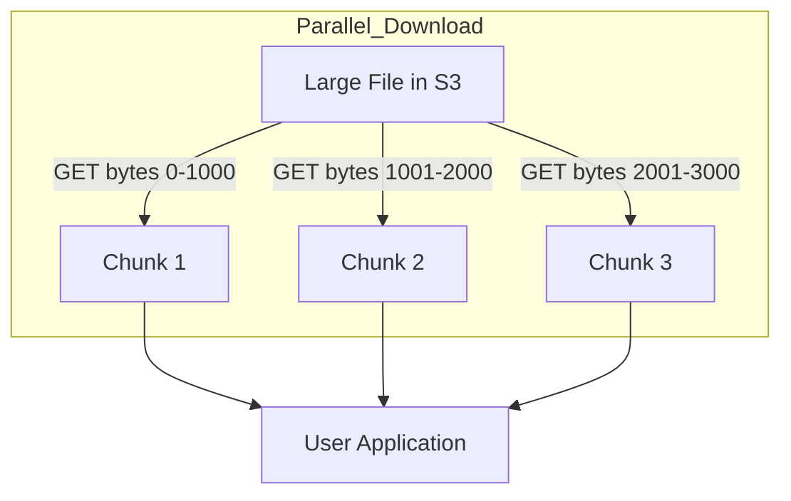

-----

# 🚀 Supercharging Amazon S3: A Guide to High-Speed Data Transfers

Amazon S3 is built for high performance, but when you're dealing with very large files or vast geographic distances, you can't just use the standard upload and download. This guide covers the three key techniques to maximize your S3 transfer speeds.

-----

## \#\# 1. Speeding Up Uploads: S3 Multi-Part Upload

Think of this as turning a single giant truckload into a fleet of small, fast delivery vans.

Instead of trying to upload one massive file (e.g., 50GB) in a single, long-running stream, **Multi-Part Upload** breaks the file into smaller "parts" or "chunks." Your application can then upload these parts in parallel, dramatically increasing throughput and maximizing your available bandwidth.

If any single part fails to upload, you only need to retry that small part, not the entire 50GB file.

  * **When to use it:**
      * **Recommended:** For files over 100 MB.
      * **Required:** For any file over 5 GB.

<!-- end list -->

-----

## \#\# 2. Beating Long Distances: S3 Transfer Acceleration

This technique is designed to minimize the time your data spends traveling over the slow, congested "public internet."

Think of the public internet as a busy city street, while the AWS private network is a high-speed, multi-lane highway.

Instead of uploading a file from your laptop in the US all the way to a bucket in Australia over the public internet, **Transfer Acceleration** routes your file to the *nearest* **AWS Edge Location** (e.g., one in your city). From that Edge Location, your file travels over the fast, optimized, private AWS global network backbone directly to the S3 bucket.

This is a simple setting you enable on your bucket and is compatible with Multi-Part Upload.

-----

## \#\# 3. Speeding Up Downloads: S3 Byte-Range Fetches

This is the download equivalent of Multi-Part Upload. Instead of requesting one giant file, you request it in "chunks" by specifying the byte range you want (e.g., "give me bytes 0-1000").

This has three key benefits:

1.  **Speed (Parallel Gets):** Your application can make multiple requests for different byte ranges in parallel, speeding up the total download time.
2.  **Resilience:** If a single request for one chunk fails, you only need to retry that small chunk, not the entire download.
3.  **Efficiency (Partial Retrieval):** You can download just a *piece* of a file. For example, if you only need to read the header (the first 50 bytes) of a 10GB file, you can fetch just that range instead of downloading the whole thing.

<!-- end list -->

-----

## \#\# 💡 At a Glance: Which Method to Use?

| Method | Use Case | Direction | Key Benefit |
| :--- | :--- | :--- | :--- |
| **Multi-Part Upload** | Large files (\> 100MB) | **Upload** | Parallelism & Resilience |
| **Transfer Acceleration**| Long distances (inter-continental) | **Upload / Download** | Minimizes public internet travel |
| **Byte-Range Fetch** | Large files (or partial-file needs) | **Download** | Parallelism & Efficiency |