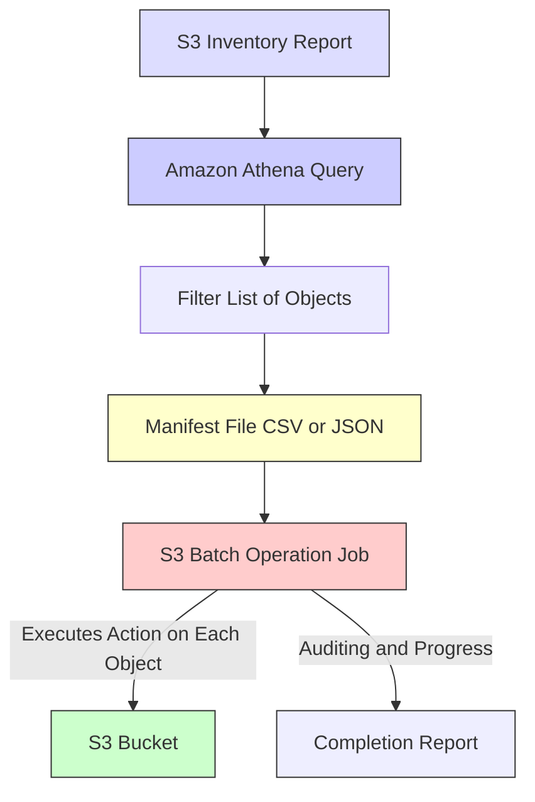

# 🛠️ S3 Batch Operations: Scaling Object Management

This guide covers **Amazon S3 Batch Operations**, the indispensable, managed service for performing large-scale, bulk actions on your S3 objects. Instead of running complex custom scripts, S3 Batch Operations handles the heavy lifting, giving you enterprise-grade reliability and reporting.

-----

## \#\# What is S3 Batch Operations?

S3 Batch Operations allows you to execute a specified action (an **Operation**) on a massive list of S3 objects (the **Manifest**) with a single, unified job request. It's designed to manage **millions or even billions of objects** at scale.

### \#\#\# Common Operations (Use Cases)

A Batch Operation job can perform a wide variety of actions:

  * **Metadata Changes:** Modify properties like **Tags** or **ACLs (Access Control Lists)** in bulk.
  * **Data Integrity:** **Encrypt** all existing unencrypted objects across your buckets.
  * **Archival:** **Restore** numerous archived objects from S3 Glacier or Deep Archive in a single request.
  * **Migration:** **Copy objects** between S3 buckets, even across different AWS accounts or regions.
  * **Custom Logic:** **Invoke an AWS Lambda function** on every object in the list for custom processing (e.g., re-indexing, format conversion, or validation).

-----

## \#\# The S3 Batch Job Workflow

A Batch Operation job requires two primary components: the **Manifest** (the list of objects) and the **Operation** (the action to perform).

### \#\#\# 1. Creating the Manifest (List of Objects)

To tell the job *which* objects to act on, you need a list. The most scalable way to generate this is:

1.  **S3 Inventory:** Configure S3 Inventory to periodically generate a list of all objects and their metadata (like encryption status or tags) in your source bucket. This list is saved as a CSV or Parquet file.
2.  **Amazon Athena:** Use Athena, a serverless query service, to run standard **SQL queries** against the S3 Inventory report. This allows you to **filter** the list to only include the objects that need attention (e.g., `SELECT * FROM inventory WHERE encryption_status = 'NOT_ENCRYPTED'`).
3.  **Manifest Output:** The result of the Athena query becomes the **Manifest file**, which is fed into the S3 Batch Job.

### \#\#\# 2. Running the Job

Once you create the job, S3 takes over, managing the entire process asynchronously:

  * **Retries:** Manages automatic retries for any temporary failures.
  * **Concurrency:** Scales the operation to handle the massive volume of objects.
  * **Reporting:** Tracks progress in real-time and provides a detailed **Completion Report** (CSV file) listing the status of the operation for every single object—essential for auditing.
  * **Notifications:** Sends completion notifications to SNS or EventBridge.

-----

## \#\# 🆚 Why Use S3 Batch Operations Over Custom Scripts?

While you *could* write a custom script using the AWS CLI or SDKs to loop through objects, S3 Batch Operations provides a fully **managed, reliable, and auditable** solution.

| Feature | S3 Batch Operations | Custom Script (e.g., Python/Boto3) |
| :--- | :--- | :--- |
| **Error Handling**| **Managed** retries, exponential backoff built-in. | Must be coded manually; complex to get right at scale. |
| **Progress Tracking**| **Built-in** console status, notifications, and reports. | Requires custom logging and tracking mechanisms. |
| **Scale** | **Serverless**, handles billions of objects easily. | Limited by the capacity and stability of the host machine/environment. |
| **Auditability** | **Detailed Completion Report** for every object. | Requires complex custom reporting logic. |
| **Cost** | You pay per object processed, plus the cost of the action (e.g., PUT request). | You pay for compute (EC2, Lambda) and requests. |

S3 Batch Operations is the superior choice for **mission-critical, large-scale, one-time or recurring tasks** where reliability and auditing are paramount.