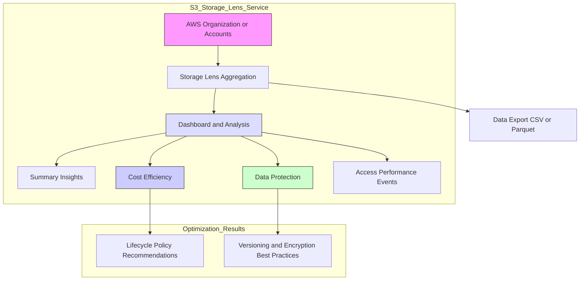

# Amazon S3 Storage Lens: A Comprehensive Learning Guide

**Amazon S3 Storage Lens** is a powerful cloud storage analytics and insights feature that provides a unified view of your storage usage and activity across your entire AWS Organization. It helps you understand, analyze, and optimize your Amazon S3 storage resources to discover anomalies, identify cost efficiencies, and apply data protection best practices.

-----

## Key Features and Capabilities

| Feature | Description | Aggregation Levels |
| :--- | :--- | :--- |
| **Unified Visibility** | Centralized configuration and view of S3 storage usage and activity. | Organization, Accounts, Regions, Buckets, or Prefixes |
| **Metrics & Insights** | Provides usage and activity metrics to analyze storage. | 30-day usage and activity metrics (Free), 15-month historical data (Advanced/Paid) |
| **Default Dashboard** | Automatically provided and pre-configured for multi-region and multi-account data. | Cannot be deleted, but can be disabled. |
| **Custom Dashboards** | Allows creation of custom views with selected regions, accounts, and buckets/prefixes. | User-defined scope. |
| **Data Export** | All metrics and reports can be exported to an S3 bucket. | CSV or Parquet format. |
| **Optimization Focus** | Provides insights for **Summary**, **Cost Efficiency**, and **Data Protection**. | |

-----

## S3 Storage Lens Metrics

S3 Storage Lens offers a variety of metrics organized into categories to provide actionable insights.

### General Insights (Summary Metrics)

| Metric Example | Use Case |
| :--- | :--- |
| **Storage Bytes** | Know the size of your storage. |
| **Object Counts** | Know the total number of objects. |
| **Use Cases:** Identify the fastest-growing or least-used buckets/prefixes. |

### Cost Optimization Metrics

| Metric Example | Use Case |
| :--- | :--- |
| **Non-current Version Storage Bytes** | Measures space taken by non-current versions of objects. |
| **Incomplete Multi-part Upload Storage Bytes** | Measures space from failed or incomplete uploads. |
| **Use Cases:** See which buckets have failed multi-part uploads, or identify objects that can be transitioned to lower-cost storage classes. |

### Data Protection Metrics

| Metric Example | Use Case |
| :--- | :--- |
| **Versioning Enabled Bucket Counts** | Check if versioning is enabled on buckets. |
| **MFA Delete Enabled Bucket Counts, SSE-KMS Enabled Bucket Counts, Cross Region Replication Rules Counts** | Ensure compliance with data protection best practices. |
| **Use Cases:** Identify buckets not following your data protection best practices. |

### Other Advanced Metrics

  * **Access Management Metrics:** Provide insights for S3 bucket ownership settings.
  * **Event Metrics:** Get insights for S3 event notifications (e.g., number of buckets with event notifications configured).
  * **Performance Metrics:** Get insights into S3 Transfer Acceleration adoption.
  * **Activity Metrics:** Information about all requests (e.g., GET, PUT), bytes downloaded.
  * **HTTP Status Code Metrics:** Metrics around status codes (e.g., 200 OK, 403 Forbidden) to understand bucket usage patterns.

-----

## Free vs. Advanced (Paid) Metrics

S3 Storage Lens has two tiers of metrics with different features and data retention.

| Feature | Free Metrics | Advanced Metrics & Recommendations (Paid) |
| :--- | :--- | :--- |
| **Availability** | Automatically available to all customers. | Additional paid feature/charge per million objects monitored. |
| **Usage Metrics** | $\approx 28$ usage metrics (Summary, limited Cost Optimization, Data Protection, Access Management, Performance, Events). | Additional metrics (Activity, Advanced Cost Optimization, Advanced Data Protection, Status Codes). |
| **Data Availability** | 14 days of historical data for queries. | 15 months of historical data for queries. |
| **Aggregation Level** | Organization, Account, Region, Bucket. | Includes **Prefix** level within S3 buckets. |
| **CloudWatch Integration** | Not available. | Metrics can be published to CloudWatch for alarms/dashboards without extra CloudWatch charges. |

-----

## Conceptual Diagram (Mermaid)

This diagram illustrates how S3 Storage Lens aggregates data from the organization down to various levels (Accounts, Buckets, etc.) to produce actionable analysis and reports for optimization.

-----

## Missing Concept from Transcript: Storage Lens Groups

While the transcript covers aggregation levels like Organization, Account, Region, Bucket, and Prefix, it is worth noting that **Storage Lens Groups** are an advanced feature.

  * **Storage Lens Groups:** This advanced feature allows you to aggregate metrics using **custom filters** based on object metadata, such as **object tags**, prefix, suffix, age, or size. This provides an additional layer of granularity for analyzing specific datasets and is a key feature for deep dives into storage optimization and cost allocation.