-----

# 🚀 AWS Elastic Beanstalk: The Developer's Fast Lane to Deployment

This guide explores AWS Elastic Beanstalk, a service designed to get your applications deployed and running on AWS with minimal infrastructure friction.

-----

## \#\# The Problem: The "Standard Architecture" is Complicated

As developers, we often build web applications that follow a very similar, highly-available architecture:

1.  A **Load Balancer (ELB)** to distribute traffic.
2.  An **Auto Scaling Group (ASG)** to manage compute capacity across multiple Availability Zones.
3.  Multiple **EC2 Instances** to run the application code.
4.  A **Relational Database (RDS)**, often in a Multi-AZ setup, for data persistence.
5.  A **Caching Layer (ElastiCache)** to improve performance.

Manually provisioning, configuring, and connecting all these services for every new application (or even just for dev/test/prod environments) is complex, time-consuming, and error-prone.

As a developer, your primary goal is to **run your code**, not to become a full-time infrastructure expert.

```mermaid
graph TD
    User[🌐 User] --> ELB[Load Balancer]
    ELB --> ASG[Auto Scaling Group]
    ASG --> EC2_1[EC2 App 1]
    ASG --> EC2_2[EC2 App 2]
    EC2_1 --> RDS[RDS Database]
    EC2_2 --> RDS[RDS Database]
    EC2_1 --> Cache[ElastiCache]
    EC2_2 --> Cache[ElastiCache]
```

-----

## \#\# The Solution: Elastic Beanstalk (PaaS)

**Elastic Beanstalk** is a developer-centric service that automates the deployment and management of this entire architecture. Think of it as an expert "general contractor" for your AWS application. You just hand over your code (the blueprint), and Beanstalk handles all the heavy lifting:

  * Capacity provisioning
  * Load balancer configuration
  * Auto scaling rules
  * Application health monitoring
  * Instance configuration

It's a **PaaS (Platform as a Service)**, meaning AWS manages the "platform" (the OS, runtime, servers, etc.), allowing you to focus purely on your **application code**.

You still have full control to tweak the underlying components if you need to, but you don't have to build them from scratch.

### \#\#\# 💸 The Cost

The Elastic Beanstalk service itself is **free**. You only pay for the AWS resources it creates on your behalf (e.g., the EC2 instances, the Load Balancer, the RDS database).

-----

## \#\# 🔑 Key Beanstalk Terminology

Understanding Beanstalk's "language" is the first step:

  * **Application:** This is the top-level container for your project, like a folder. It holds all the different parts of your app.
  * **Version:** A specific iteration of your application code. You upload your code (e.g., a `.zip` or `.war` file) as a new version (e.g., `v1`, `v1.1`, `v2`).
  * **Environment:** A *running instance* of your application. This is the collection of all the AWS resources (ELB, ASG, EC2s) that are running a specific **Version**. You can have multiple environments, such as `dev`, `test`, and `prod`, all under one **Application**.

The lifecycle is simple:

1.  **Create** an Application.
2.  **Upload** a Version of your code.
3.  **Launch** an Environment to run that version.
4.  **Update** the Environment by deploying a new Version.

-----

## \#\# The Two Tiers: Web vs. Worker

Beanstalk can build two different *types* of environments (or "tiers"):

### \#\#\# 1. Web Server Environment

This is the standard architecture we've been discussing. It's designed for user-facing applications that respond to HTTP requests.

  * **How it works:** A client sends a request to an Elastic Load Balancer, which routes it to an EC2 instance in an Auto Scaling Group.
  * **Supported Platforms:** Java, .NET, Node.js, PHP, Python, Ruby, Go, Docker, and more.

```mermaid
graph TD
    subgraph Web Server Environment
        User[🌐 User] --> ELB[Load Balancer]
        ELB --> ASG[Auto Scaling Group]
        ASG --> EC2_1[EC2 Instance]
        ASG --> EC2_2[EC2 Instance]
    end

    EB[Beanstalk Manages This] -.-> ELB
    EB -.-> ASG
```

<!-- end list -->

### \#\#\# 2. Worker Environment

This is for backend processing tasks, not user-facing requests. It's perfect for long-running jobs, processing video, sending emails, or any task you want to offload from your main web app.

  * **How it works:** A message is sent to an **Amazon SQS Queue**. The EC2 instances in the ASG pull messages from this queue and process them. There is no load balancer.
  * **How it scales:** The ASG scales based on the number of messages in the queue (more messages = more EC2 instances).

<!-- end list -->

-----

## \#\# Deployment Modes: Dev vs. Prod

When you launch an environment, you have two main architecture choices:

  * **Single Instance:**

      * **What it is:** One EC2 instance with an Elastic IP.
      * **Best for:** **Development**. It's cheap, simple, and quick to launch. It is **not** highly available.

  * **High Availability (HA) with Load Balancer:**

      * **What it is:** The full architecture—an ELB managing an ASG across multiple AZs.
      * **Best for:** **Production**. It's fault-tolerant and scalable. You can also have it provision a Multi-AZ RDS database for a complete, resilient stack.

-----

## \#\# ⚠️ A Key Missing Concept: Deployment Strategies

The transcript mentions Beanstalk has a "really cool way of updating applications," but doesn't detail what that means. This is a critical feature of the service.

When you want to deploy a new version (e.g., `v2`) to an environment that is currently running `v1`, Beanstalk gives you several strategies to choose from. This is a concept you should research further:

  * **All at once:** Deploys `v2` to all instances simultaneously. Fastest but causes downtime.
  * **Rolling:** Updates a few instances at a time. No downtime, but your environment will temporarily run two different versions of your code.
  * **Rolling with additional batch:** A safer version of rolling. It launches a new batch of instances first to maintain full capacity.
  * **Immutable:** The safest method. It launches an entirely new, separate ASG with the new version. Once it's healthy, it swaps the new ASG for the old one.
  * **Blue/Green:** A more advanced method (often done with two separate environments) where you can test the new version (`Green`) before redirecting live traffic from the old version (`Blue`).