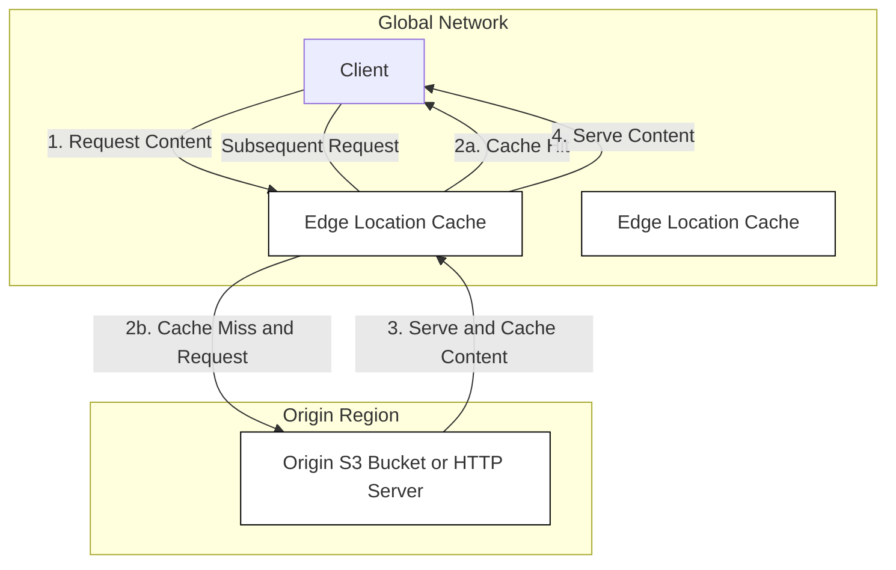

# 🚀 CloudFront: Your Global Content Delivery Network (CDN) Learning Guide

This guide breaks down **AWS CloudFront**, a core service for speeding up content delivery and enhancing application performance globally.

-----

## 💡 Core Concept: What is CloudFront?

CloudFront is AWS's **Content Delivery Network (CDN)**.

  * **Goal:** Improve **read performance** and **user experience** by lowering latency for users worldwide.
  * **Mechanism:** It achieves this by **caching** your website's content at various geographical points of presence.

-----

## 🌐 The Global CloudFront Network

CloudFront's infrastructure is spread across the world to bring content closer to your users.

  * **Points of Presence (POPs):** CloudFront is made up of hundreds of global POPs, which include:
      * **Edge Locations:** Primary caching locations closer to the end-users.
      * **Edge Caches:** Locations where content is stored.
  * **How Caching Works:**
    1.  A user requests content (e.g., in America) from the **nearest edge location**.
    2.  If the content isn't in the cache (**cache miss**), the edge location fetches it from the **origin** (e.g., an S3 bucket in Australia).
    3.  The edge location then **caches** the content locally and serves it to the user.
    4.  Subsequent requests from other nearby users will be served **directly from the edge cache** (**cache hit**), avoiding the long trip back to the origin.

### 🛡️ Built-in Security

Distributing content globally with CloudFront automatically provides **DDoS protection** because the attack load is spread across the network. It integrates with other services for enhanced security:

  * **AWS Shield:** For DDoS protection.
  * **Web Application Firewall (WAF):** For application-layer security.

-----

## 🎯 CloudFront Origin Types

The **Origin** is the backend source where CloudFront gets its content. CloudFront can connect to several types of origins:

| Origin Type | Description | Key Use Case | Security |
| :--- | :--- | :--- | :--- |
| **Amazon S3 Bucket** | For storing and distributing files. | Distributing static files and media. | Secured using **Origin Access Control (OAC)** to prevent public access directly to the S3 bucket. |
| **VPC Origin** | An application hosted in a private subnet within a VPC. | Private load balancers (ALB/NLB) or EC2 instances. | Connects **privately** to the application. |
| **Custom Origin** | Any public HTTP endpoint. | A website hosted as a **static S3 website** (different from a regular S3 bucket origin), or any public HTTP backend **within or outside of AWS**. | Must use an HTTP/HTTPS endpoint. |

-----

## 🔄 CloudFront vs. S3 Cross-Region Replication

These two AWS features serve **very different purposes**:

| Feature | CloudFront (CDN) | S3 Cross-Region Replication (CRR) |
| :--- | :--- | :--- |
| **Primary Goal** | Low-latency **content delivery** to a global audience. | **Data redundancy** and high availability in different AWS regions. |
| **Network** | Global Edge Network (hundreds of POPs). | Between a few specific AWS Regions. |
| **Mechanism** | **Caching** static content for a set duration (TTL). | Near **real-time replication** of an entire bucket. |
| **Best For** | **Static content** that needs to be available everywhere quickly. | **Dynamic content** that needs to change often and be available in a few, specific regions at low latency. |
| **Read/Write** | Read-only delivery (though CloudFront supports PUT/POST to S3). | Read/Write operations on the origin, replicated data is read-only. |

-----

## 🏗️ Missing Concept: Origin Access Identity (OAI)

The transcript mentions **Origin Access Control (OAC)**, which is the **recommended, modern successor** to the older **Origin Access Identity (OAI)**.

  * **OAC (Origin Access Control):** Uses **IAM service principals** to authenticate with S3, providing enhanced security (like short-term credentials, SigV4 signing) and better feature support compared to OAI.

-----

## 📊 Diagram for High-Level CloudFront Flow

A visual representation of how CloudFront works.

