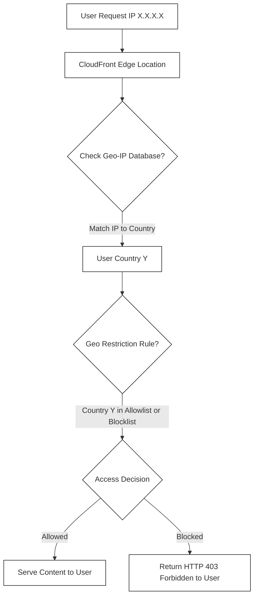

## 🔒 CloudFront Geo Restriction: Controlling Content Access

This guide focuses on **CloudFront Geo Restriction**, a powerful feature that allows you to control who can access your content based on the user's geographic location.

-----

## 🗺️ What is CloudFront Geo Restriction?

CloudFront Geo Restriction allows you to define geographical boundaries for accessing your content distribution.

  * **Purpose:** To **restrict access** to your CloudFront distribution based on the **user's country**.
  * **Mechanism:** It uses a **third-party Geo-IP database** to match the user's IP address to its corresponding country. The restriction is enforced at the **CloudFront Edge Location**, preventing requests from unauthorized regions from reaching your origin.
  * **Primary Use Case:** Enforcing **copyright laws** or **licensing agreements** to ensure content is only consumed in approved territories.

-----

## ⚙️ Configuration Types: Allowlist vs. Blocklist

You can configure Geo Restriction in two ways:

| Restriction Type | Description | Example | Effect |
| :--- | :--- | :--- | :--- |
| **Allowlist (Whitelist)** | Specifies a list of countries that **ARE ALLOWED** to access the content. | Allowed: India, United States | Users from India and the US can access; users from all other countries are **BLOCKED**. |
| **Blocklist (Blacklist)** | Specifies a list of countries that are **BANNED** from accessing the content. | Banned: Russia, China | Users from Russia and China are **BLOCKED**; users from all other countries are **ALLOWED**. |

### 🛠️ Where to Configure

The Geo Restriction setting is found within your CloudFront Distribution settings:

1.  Navigate to your CloudFront Distribution.
2.  Go to the **Security** section.
3.  Look for **CloudFront geographic restrictions** (sometimes labeled *Countries*).
4.  Click **Edit** to select your restriction type (Allowlist or Blocklist) and list the corresponding countries.

-----

## 🏗️ Conceptual Flow of a Geo-Restricted Request

Here is a simplified diagram illustrating the process when Geo Restriction is enabled:

-----

## 🚨 Missing Concept: HTTP Response Code

When a user's request is blocked by CloudFront due to a Geo Restriction policy, CloudFront will typically return an **HTTP 403 Forbidden** error code to the user, indicating that access to the resource is denied.

-----

## ⏭️ Next Steps

Geo Restriction is a simple, effective layer of access control. You can combine it with other security features like Signed URLs and Cookies to create more granular, time-based, or per-user content access controls.