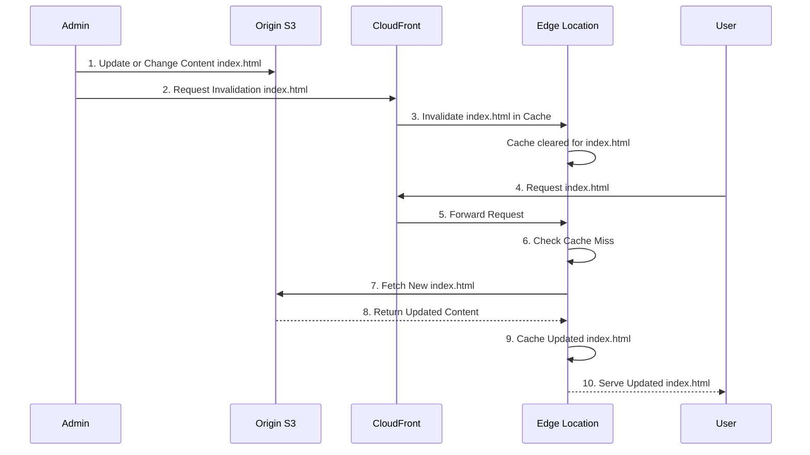

## ⚡ CloudFront Cache Invalidation: Forcing a Content Refresh

This guide explains **CloudFront Cache Invalidation**, the process of manually forcing CloudFront Edge Locations to clear cached content, ensuring users receive the latest updates immediately.

-----

## 🔄 The Need for Invalidation

CloudFront caches content based on a **Time-To-Live (TTL)**.

  * **Default Behavior:** When you update your **backend origin** (e.g., your S3 bucket), CloudFront Edge Locations won't know about the change. They will continue to serve the old, cached content until the file's TTL expires.
  * **The Problem:** If you need an update (e.g., a critical bug fix or a new image) to be reflected **immediately**, waiting for the TTL to expire is unacceptable.
  * **The Solution:** You perform a **CloudFront Invalidation** to force an entire or partial cache refresh.

-----

## 🗑️ How CloudFront Invalidation Works

An invalidation is an action you initiate that tells CloudFront to remove specific files from its Edge Caches.

1.  **Admin Update:** An administrator updates or changes files on the **Origin** (e.g., changes `index.html` and adds/changes images in an S3 bucket).
2.  **Invalidation Request:** The administrator submits an invalidation request to CloudFront, specifying the file paths.
3.  **Cache Removal:** CloudFront marks the specified files as **invalidated** (effectively removing them) across all Edge Locations.
4.  **First User Request:** The next time a user requests an invalidated file, the Edge Location will register a **cache miss**.
5.  **Forced Fetch:** The Edge Location is forced to send a request to the **Origin** to fetch the updated file.
6.  **New Content Served:** The new, refreshed content is served to the user and is simultaneously cached at the Edge Location for future requests.

### 📝 Specifying Invalidation Paths

You must specify the path(s) of the files you want to remove from the cache. This can be:

| Path Type | Example | Description |
| :--- | :--- | :--- |
| **Specific File** | `/index.html` | Invalidates only that single file. |
| **Directory** | `/images/*` | Invalidates all files within the `/images` directory (and typically subdirectories, depending on configuration). |
| **All Files** | `/*` or `*` | Invalidates **everything** in the distribution's cache (use with caution). |

-----

## 🧠 Missing Concepts: Caching Best Practices and Costs

While invalidation solves the immediate need for a refresh, it's an operational and potentially costly action.

  * **Concept 1: Cache Control Headers (Optimal Practice):** The best practice for managing content updates is by using **Cache-Control headers** (like `max-age`) and **versioning** file names (e.g., `style-v2.css`). If the file name changes, CloudFront automatically treats it as a new file, and the Edge Location must fetch it—no invalidation needed\!
  * **Concept 2: Invalidation Costs:** AWS typically provides a **free tier** for a certain number of invalidation paths per month (e.g., 1,000 paths). Requests beyond this free allowance will incur a cost. Therefore, bulk invalidations (like `/*`) should be minimized.

-----

## 📈 Diagram: Invalidation Flow

This ensures the user sees the new content immediately, bypassing the original TTL.