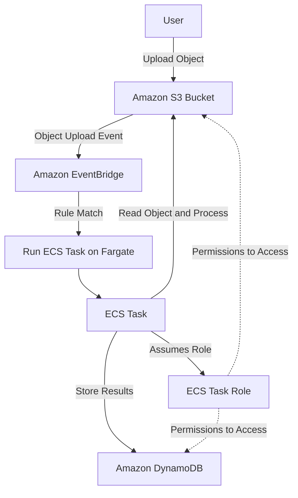
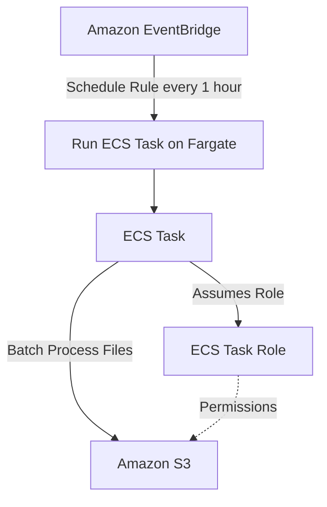
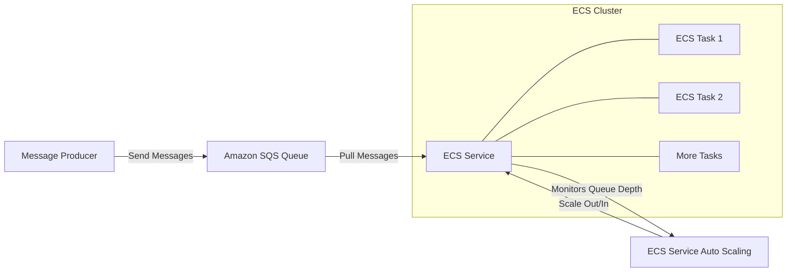
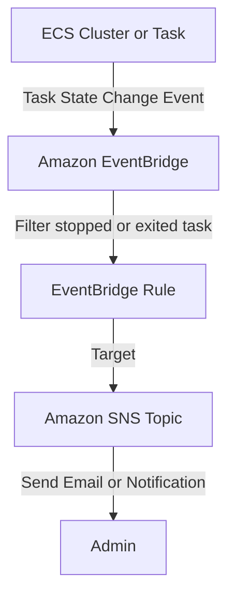

# 💡 AWS ECS Solution Architectures Learning Guide

This guide explores common serverless solution architectures you can implement using **Amazon Elastic Container Service (ECS)**, often utilizing **AWS Fargate** for serverless compute and **Amazon EventBridge** or **Amazon SQS** for event-driven orchestration.

-----

## 1\. Event-Driven Task Invocation (S3 to ECS) 🖼️

This architecture is ideal for **asynchronous, serverless object processing**, where a new file upload triggers a dedicated ECS task to handle it.

  * **Flow:**
    1.  **User uploads an object** (e.g., an image) into an **Amazon S3 Bucket**.
    2.  The S3 Bucket is **integrated with Amazon EventBridge** to send an event upon object creation.
    3.  **EventBridge** has a **Rule** that matches the S3 event pattern.
    4.  The Rule's target is configured to **run an ECS Task** in the **Fargate** launch type.
    5.  The newly created ECS Task starts running a Docker container.
    6.  The container uses its **ECS Task Role** (IAM Role) to:
          * **Get the object** from the S3 bucket.
          * **Process the object** (e.g., resize, analyze).
          * **Send the results** to a backend service like **Amazon DynamoDB**.
  * **Key Concept:** This achieves a **fully serverless architecture** for image or object processing using containers, only paying for the Fargate resources while the task is running.

<!-- end list -->

-----

## 2\. Scheduled Batch Processing (EventBridge Schedule) ⏰

This pattern is used for **recurring batch jobs** or maintenance tasks that need to run at fixed intervals.

  * **Flow:**
    1.  An **Amazon EventBridge Rule** is configured with a **Schedule Expression** (e.g., a cron expression like `rate(1 hour)`).
    2.  The scheduled Rule is set to **run an ECS Task** on **Fargate**.
    3.  **Every 1 hour** (or the defined interval), a **new ECS Task** is created.
    4.  The container in the Task executes its program.
    5.  The Task uses its **ECS Task Role** to access resources like **Amazon S3** to perform **batch processing** (e.g., data aggregation, report generation) against files.
  * **Key Concept:** Provides a **serverless cron job** capability using containers.

<!-- end list -->

-----

## 3\. Worker Service with Queue-Based Scaling (ECS Service & SQS) 🚀

This is a classic asynchronous processing pattern for **decoupling components and handling variable load**.

  * **Flow:**
    1.  Messages are sent into an **Amazon SQS Queue**.
    2.  An **Amazon ECS Service** is deployed with multiple tasks (e.g., two tasks initially).
    3.  The containers within the ECS tasks are **continuously polling** the SQS Queue for new messages.
    4.  Tasks **process the messages** and then delete them from the queue.
    5.  **ECS Service Auto Scaling** is enabled, using the SQS Queue depth (e.g., `ApproximateNumberOfMessagesVisible`) as the scaling metric.
    6.  **If the number of messages increases**, the service will **automatically scale out** (add more tasks) to handle the load.
    7.  **If the number of messages decreases**, the service will **automatically scale in** (remove tasks) to save cost.
  * **Key Concept:** **Decoupling** the message producer from the message consumer and achieving **dynamic scalability** based on actual backlog.

<!-- end list -->

-----

## 4\. Monitoring Container Lifecycle (ECS Events to EventBridge) 🚨

This architecture allows you to **react in real-time** to changes in your ECS tasks and service state.

  * **Flow:**
    1.  Any change in the **lifecycle of your containers** or tasks (e.g., a task starting, a task stopping) generates an event.
    2.  These events are automatically sent to **Amazon EventBridge** (specifically, the default event bus).
    3.  An **EventBridge Rule** is set up to filter for a specific event pattern, such as:
          * `source: aws.ecs`
          * `detail-type: ECS Task State Change`
          * `detail.lastStatus: STOPPED`
          * `detail.stoppedReason: Essential container in task exited`
    4.  The Rule's target can be an **Amazon SNS Topic** to **send alerts** (e.g., email notifications) to administrators.
  * **Key Concept:** **Event-driven monitoring** and management of the container lifecycle within the ECS cluster, enabling immediate action or alerting.

<!-- end list -->

-----

## Missing Concepts in the Transcript

While the provided content covers four great architecture examples, a few core related concepts were only mentioned in passing or not at all, which are essential for a complete learning guide:

  * **Load Balancing and Ingress:** The guide focuses on worker/batch architectures. A very common ECS architecture is an **API/Web Service** exposed via an **Application Load Balancer (ALB)**, which is crucial for handling HTTP/HTTPS traffic.
  * **Task Execution Role vs. Task Role:**
      * **Task Role** (mentioned): Grants permissions *to the containers* to access AWS resources (like S3 and DynamoDB).
      * **Task Execution Role** (implied but not named): Grants permissions *to the ECS agent* to pull the container image from **Amazon ECR** and publish logs to **Amazon CloudWatch Logs**.
  * **Networking (VPC, Subnets, Security Groups):** While Fargate is serverless compute, it still requires **VPC, Subnet, and Security Group** configuration, which is a fundamental part of the ECS/Fargate deployment model.