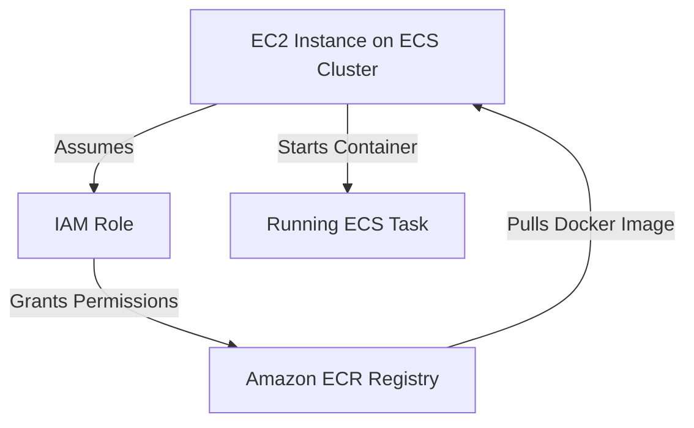

## 🐳 AWS Elastic Container Registry (ECR) Learning Guide

This guide summarizes the core functionalities and best practices for using **Amazon Elastic Container Registry (ECR)** to store and manage your container images on AWS.

-----

## 1\. ECR: The Docker Image Repository 💾

**Amazon ECR** is a fully managed Docker container registry that makes it easy for developers to store, manage, and deploy their container images.

  * **Core Purpose:** To store and manage **Docker images** on AWS, serving as a private or public repository, similar to Docker Hub but integrated directly with AWS services.
  * **Storage Backend:** Your images are stored securely behind the scenes using **Amazon S3**.
  * **Key Features:**
      * **Image Vulnerability Scanning:** ECR can scan your images for known software vulnerabilities.
      * **Versioning:** Supports image versioning to keep track of changes.
      * **Image Tags:** Allows you to use descriptive tags (e.g., `latest`, `v1.2.0`) to label your images.
      * **Image Lifecycle Management:** Enables you to set rules to automatically clean up old or unused image versions, saving storage costs.
  * **Access Options:**
      * **Private Repository:** Images are restricted to your AWS account(s). This is the standard choice for application deployment.
      * **Public Repository (ECR Public Gallery):** Allows you to publish images for public consumption.

-----

## 2\. ECR and ECS Integration 🤝

ECR is designed to work seamlessly with **Amazon ECS (Elastic Container Service)**. This integration is crucial for deploying your containerized applications.

### The Image Pull Process

When an ECS task needs to run a container, the underlying compute resource (e.g., an **EC2 instance** in an ECS cluster) must first **pull** the required Docker image from ECR.

  * **Steps for Image Pull (ECS on EC2 Launch Type):**
    1.  An **EC2 instance** is launched as part of the ECS Cluster.
    2.  An **IAM Role** is assigned to the EC2 instance (this is the **ECS Container Instance IAM Role**).
    3.  This **IAM Role** must have the necessary **IAM Policies** to authorize the instance to **authenticate with ECR** and **pull the Docker image** from your repository.
    4.  The ECS Agent on the EC2 instance pulls the image.
    5.  The container is started on the EC2 instance using the pulled image.
  * **Security:** **All access to ECR is protected by IAM.** If you encounter permission errors during image pull, the first place to check is the attached IAM policies.

<!-- end list -->

-----

## 3\. Missing/Implied Concepts and Best Practices 🎯

The transcript accurately covers the basics but omits or only implies a few critical concepts for a full understanding of ECR:

  * **IAM Permissions Granularity:** The specific permissions required are `ecr:GetAuthorizationToken` (to authenticate) and repository-level actions like `ecr:BatchCheckLayerAvailability` and `ecr:GetDownloadUrlForLayer` (to pull the image layers).
  * **ECR Repository Policies:** You can attach resource-based policies directly to an ECR repository to control access, often used for cross-account or cross-service access.
  * **Image Building and Pushing:** The process of taking your code, building a Docker image locally, and then **pushing** it to ECR (e.g., via **AWS CLI** commands like `docker push`) is the crucial preceding step to deployment.
  * **ECR and Fargate:** While the example focuses on EC2, ECR integration with **Fargate** is even simpler as you only need the **Task Execution IAM Role** (not the instance role) to pull the image and write logs.

By mastering ECR, you ensure a secure, scalable, and manageable foundation for your containerized applications on AWS.