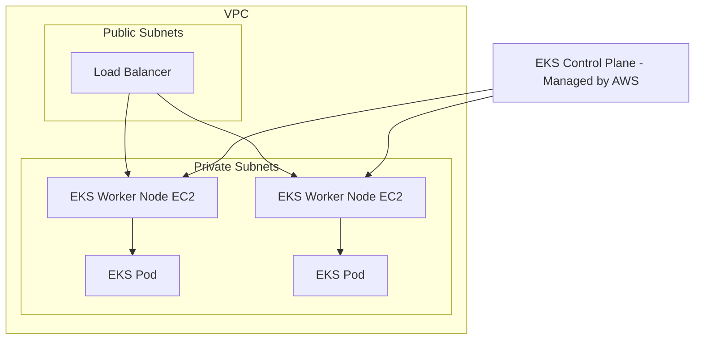

## 🚀 Amazon EKS: The Managed Kubernetes Service (Learning Guide)

This guide summarizes the key features and architecture of **Amazon Elastic Kubernetes Service (EKS)**, AWS's managed platform for running **Kubernetes** clusters.

-----

## 1\. Kubernetes and EKS Fundamentals 🌐

**Kubernetes (K8s)** is an **open-source system** for the automated deployment, scaling, and management of containerized applications.

  * **Amazon EKS** manages the Kubernetes control plane for you, providing a stable, highly available environment to run your K8s clusters on AWS.
  * **Goal:** Provides a platform for container orchestration, serving as an **alternative to ECS** but using the industry-standard K8s API.
  * **Key Kubernetes Terminology:**
      * **Pod:** The smallest deployable unit in Kubernetes, typically containing one or more containers (similar to an ECS Task).
      * **Node:** The worker machine (EC2 instance) that runs the Pods.

### **Cloud Agnostic Advantage**

Kubernetes is **cloud agnostic** and used across Azure, Google Cloud, and on-premises environments.

  * **Use Case:** Ideal if your company is already using Kubernetes elsewhere or desires the **standardization** and **portability** offered by the K8s API, simplifying potential **migration between clouds**.

-----

## 2\. EKS Architecture and Launch Modes

An EKS cluster consists of the managed **Control Plane** (handled by AWS) and the **Worker Nodes** (where your applications run).

### **Worker Node Launch Modes**

EKS supports two launch modes for the worker nodes:

1.  **EC2 Launch Type (Node Groups):** Uses EC2 instances as worker nodes.
2.  **Fargate Launch Type:** Uses serverless compute, allowing you to run Pods without managing the worker nodes.

### **Visualizing the EKS Environment**

-----

## 3\. Worker Node Management Options

EKS provides flexibility in how you manage your worker nodes (EC2 instances):

| Node Type | Management | AWS Tools | Use Case |
| :--- | :--- | :--- | :--- |
| **Managed Node Groups** | **AWS Managed:** AWS creates and manages the EC2 instances and the backing **Auto Scaling Group (ASG)**. | EKS Service | **Recommended** for simplicity and ease of operations. Supports On-Demand and Spot Instances. |
| **Self-Managed Nodes** | **User Managed:** You create the EC2 instances, register them with the cluster, and manage the ASG. | User/Custom Scripts | Needed for high levels of **customization** or specific OS requirements. You can use the EKS Optimized AMI as a base. |
| **Fargate** | **Serverless Compute:** No nodes to manage at all. | EKS Service | **Recommended** when you want to run containers without worrying about server provisioning, scaling, or patching. |

-----

## 4\. Data Persistence (StorageClass)

In Kubernetes, persistent storage is defined using a **StorageClass manifest**, which leverages the **Container Storage Interface (CSI)** compliant drivers.

  * **Mechanism:** Uses the CSI driver to attach AWS storage resources as persistent data volumes to your Pods.
  * **Supported Storage Types:**
      * **Amazon EBS (Elastic Block Store)**
      * **Amazon EFS (Elastic File System):** **Crucial**—this is the **only** persistent storage type that works with **Fargate** Pods.
      * **Amazon FSx for Lustre**
      * **Amazon FSx for NetApp ONTAP**

-----

## 5\. Missing Concept: Control Plane (Master Nodes)

While the transcript mentions the EKS Control Plane is managed, it's worth highlighting that this is the core value proposition of EKS:

  * **EKS Control Plane:** Consists of the Kubernetes master components (API server, etcd, scheduler, etc.).
  * **Managed By AWS:** AWS runs this plane across multiple Availability Zones for high availability, handles patching, and manages its underlying EC2 instances. **You only pay for the Control Plane management and the Worker Nodes** (EC2 or Fargate).