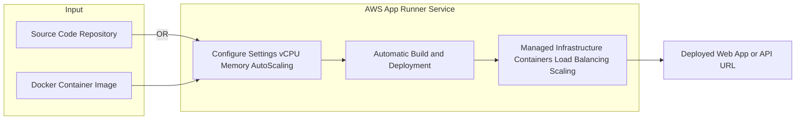

# 🏃‍♂️ AWS App Runner: Simplified Web App Deployment (Learning Guide)

This guide summarizes the core features and benefits of **AWS App Runner**, a fully managed service designed for quick and easy deployment of containerized web applications and APIs.

-----

## 💡 Core Concept: Serverless Container Deployment

AWS App Runner abstracts away all infrastructure, container orchestration, and scaling complexity, allowing developers to go from **source code or a container image directly to a running web service** with minimal configuration. It is designed to be the simplest path to deploying apps on AWS.

### **The App Runner Workflow**

1.  **Input Source:** Start with either your **Source Code** (e.g., from a GitHub repository) or a **Docker Container Image** (e.g., from ECR).
2.  **Basic Configuration:** Set simple requirements like **vCPU**, **Memory**, and **Autoscaling** rules, along with basic **Health Checks**.
3.  **Automatic Deployment:** App Runner automatically handles the container build, deployment, and underlying infrastructure setup.
4.  **Live Service:** Your web app or API is instantly available via a public **URL**.

<!-- end list -->

-----

## 🌟 Key Features and Benefits

App Runner is a powerful tool for rapid deployment because it includes essential cloud features by default:

| Feature | Benefit |
| :--- | :--- |
| **Fully Managed** | **Zero infrastructure knowledge required.** No need to manage EC2, ECS, or Kubernetes. |
| **Automatic Scaling** | Handles fluctuations in traffic by scaling containers up and down automatically. |
| **High Availability** | Built-in design for resilience across multiple Availability Zones. |
| **Load Balancing** | Automatically provisions and manages a load balancer in front of your containers. |
| **Encryption** | Traffic is secured by default. |
| **VPC Access** | Your application can securely connect to **private resources** (like RDS databases, ElastiCache, or SQS queues) residing within your Amazon VPC. |
| **Continuous Integration** | Supports automatic deployment when changes are pushed to the source code or image repository (implied in the "very quick" and "rapid production deployment" context). |

-----

## 🎯 Ideal Use Cases

App Runner is specifically designed for developers and teams who prioritize speed and simplicity for specific workloads:

  * **Quick Deployment:** Deploying functional web apps or APIs with minimal AWS experience.
  * **Microservices:** Hosting small, independent services that require HTTP/HTTPS endpoints.
  * **Rapid Prototypes/Production:** Setting up staging or production environments quickly while adhering to AWS best practices for scaling and security.

### **Where App Runner Fits**

App Runner is the "easy button" for web applications, sitting between AWS Lambda (best for short-lived functions) and AWS Fargate/ECS/EKS (best for complex orchestration and custom control).