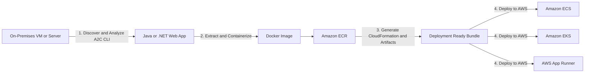

## 📦 AWS App2Container (A2C): Lift-and-Shift Modernization (Learning Guide)

This guide summarizes **AWS App2Container (A2C)**, a command-line interface (CLI) tool designed to simplify the migration and modernization of traditional Java and .NET web applications to Docker containers on AWS.

-----

## 🎯 A2C: The Modernization Accelerator

A2C is a powerful tool for executing **"lift-and-shift" migrations**—moving existing applications to the cloud without changing their code—while simultaneously modernizing them by packaging them into containers.

### **Core Functionality**

  * **Supported Applications:** **Java** and **.NET** web applications.
  * **Goal:** Migrates legacy applications running on bare metal, virtual machines, or on-premises servers directly into containerized services on AWS.
  * **Key Benefit:** **No code changes required**, accelerating the modernization process.

### **A2C Output and Artifacts**

A2C generates all necessary deployment components for AWS:

1.  **Docker Container Images:** The core modernized asset, containing your application.
2.  **Container Registry:** Automatically registers the generated images into **Amazon ECR**.
3.  **Deployment Artifacts:** Generates **CloudFormation templates** for infrastructure, including:
      * **Compute:** Definitions for **ECS Tasks** or **EKS Pods**.
      * **Networking** and other necessary infrastructure.
      * **CI/CD Pipelines** (pre-built for rapid deployment).

-----

## 🪜 The App2Container Migration Process

The A2C CLI tool guides you through a four-stage process from discovery to deployment:

1.  **Discover and Analyze:**
      * Use the CLI tool on your source server (on-premises/VM) to **discover** eligible Java or .NET applications.
      * Analyze which applications are suitable for containerization.
2.  **Extract and Containerize:**
      * The tool **extracts** the application and its dependencies.
      * A **Dockerfile** and the final **Docker image** are generated.
      * The image is stored in **Amazon ECR**.
3.  **Generate Deployment Artifacts:**
      * A2C automatically creates the necessary **CloudFormation templates** and container definitions (ECS Task/EKS Pod).
      * **CI/CD pipeline** configurations can also be generated.
4.  **Deploy to AWS:**
      * You select the target AWS compute service for final deployment.

<!-- end list -->

-----

## ☁️ Deployment Targets

A2C supports deployment to the three main AWS container services, allowing flexibility based on your target architecture:

  * **Amazon ECS (Elastic Container Service)**
  * **Amazon EKS (Elastic Kubernetes Service)**
  * **AWS App Runner**

-----

## ❓ Missing Concept: A2C vs. Modernization

While A2C is a great tool for the initial **migration (lift-and-shift)**, it's important to understand it doesn't perform deep application modernization:

  * **A2C Focus:** Gets a working application onto a modern platform (containers). It automates the **packaging and deployment setup**.
  * **Post-A2C Modernization:** True modernization (e.g., refactoring the application to use microservices, serverless databases, or cloud-native features) is a separate step the development team would undertake *after* the initial A2C migration.