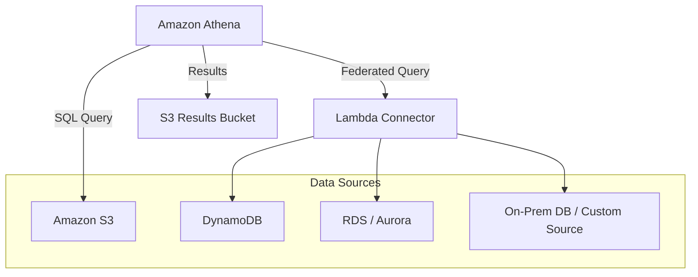

## 🔍 Amazon Athena: Serverless Analytics on S3 (Learning Guide)

This guide summarizes **Amazon Athena**, the interactive query service that makes it easy to analyze data directly in **Amazon S3** using standard SQL.

-----

## 1\. Core Concept and Architecture 💡

Athena is a **serverless** query engine built on the **Presto** engine, allowing you to run powerful SQL queries directly against your data files in S3 without provisioning any infrastructure.

  * **Serverless:** No databases or servers to manage.
  * **Query Language:** Uses standard **SQL**.
  * **Data Location:** Queries data **in place** in S3; you do not need to move or load the data into a database first.
  * **Supported Formats:** Supports common file formats like **CSV, JSON, ORC, Avro, and Parquet**.
  * **Use Cases:** **Ad hoc queries, Business Intelligence (BI), reporting, and analyzing logs** (VPC Flow Logs, ALB logs, CloudTrail).
  * **Integration:** Commonly used with **Amazon QuickSight** for creating reports and dashboards.

### **Pricing**

  * You pay only for the amount of **data scanned** per query (fixed amount per terabyte).

-----

## 2\. Performance and Cost Optimization 💸

Since pricing is based on data scanned, optimizing queries often means reducing the amount of data Athena needs to read from S3.

### **A. Columnar Data Formats (Cost Savings)**

  * **Goal:** Only scan the columns you need.
  * **Recommended Formats:** **Apache Parquet** and **ORC (Optimized Row Columnar)**. These formats provide significant performance improvements and cost reduction because Athena can skip reading entire rows of data you don't need.
  * **ETL:** You typically use a service like **AWS Glue** to convert raw data (like CSV or JSON) into Parquet or ORC format.

### **B. Data Partitioning**

  * **Mechanism:** Organizing your data in S3 using specific folder structures where the folder names represent the data columns being queried frequently.
      * Example: `s3://bucket/data/year=1991/month=01/day=01/`
  * **Benefit:** When you query the data with a `WHERE` clause (e.g., `WHERE year = 1991`), Athena only scans the specific folders/paths that match the criteria, drastically reducing the data scanned.

### **C. Compression and File Size**

  * **Compression:** Compressing your files (using GZIP, Snappy, etc.) results in **smaller retrievals**, saving cost and time.
  * **File Size:** Using **fewer, larger files** (e.g., 128 MB or over) is better than many tiny files. Larger files minimize the overhead associated with opening and processing each individual file in S3.

-----

## 3\. Federated Query (Querying Beyond S3) 🚀

**Federated Query** extends Athena's capabilities beyond S3, allowing you to query data stored in various other databases and data sources.

  * **Mechanism:** Athena uses **Data Source Connectors**, which are **AWS Lambda functions**. These Lambda functions contain the logic to run queries against external data sources.
  * **Supported Sources:** Relational databases (RDS, Aurora, SQL Server, MySQL), NoSQL databases (DynamoDB, DocumentDB), object stores, and even **on-premises databases**.
  * **Process:** Athena sends a query request $\rightarrow$ the Data Source Connector (Lambda) translates and executes the query against the external source $\rightarrow$ the results are returned to Athena.
  * **Output:** The results of a Federated Query are typically stored in an S3 bucket for further analysis.

<!-- end list -->

