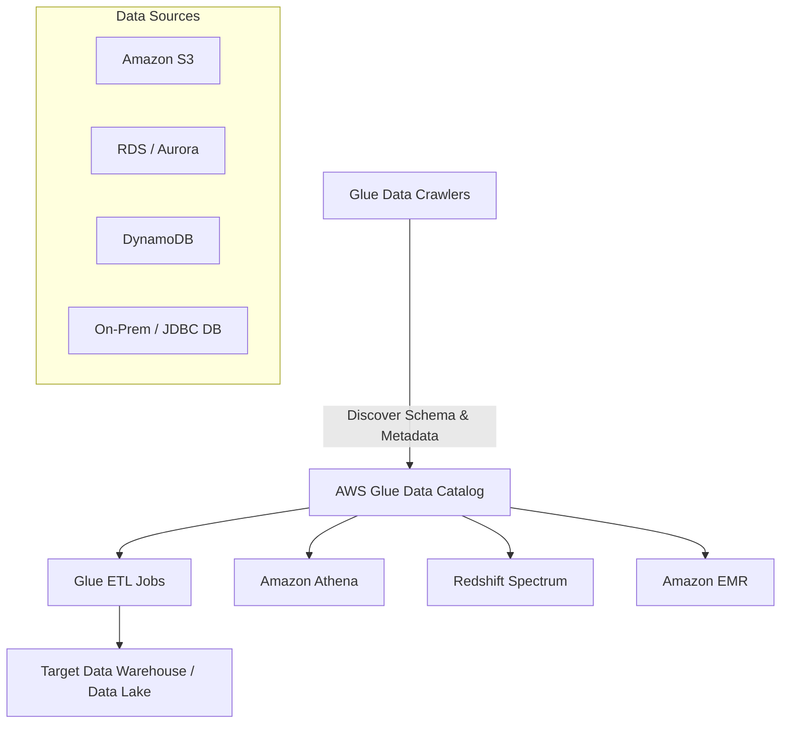

## 💧 AWS Glue: The Serverless ETL Service (Learning Guide)

**AWS Glue** is a fully managed, **serverless** Extract, Transform, and Load (**ETL**) service designed to prepare and transform vast amounts of data for analytics. It handles the provisioning, configuration, and scaling of the compute resources needed to run your ETL jobs.

-----

## 1\. Core ETL Functionality ⚙️

Glue uses the **Apache Spark** environment under the hood to perform distributed data processing, making it highly scalable for big data workloads.

  * **ETL Flow:** Glue can extract data from sources, transform it according to custom logic (e.g., filtering, mapping, aggregating), and load the final, transformed data into a target destination.

      * *Example:* **Extract** data from an S3 bucket or RDS $\rightarrow$ **Transform** (cleanse/enrich) $\rightarrow$ **Load** into an Amazon **Redshift** data warehouse.

  * **Key Transformation Use Case: Format Conversion**

      * A common exam pattern is using Glue to convert data from less efficient formats (like **CSV** or JSON) into **columnar data formats** like **Parquet** or ORC.
      * This conversion optimizes the data for analytical services like **Athena** and **Redshift Spectrum**, leading to better performance and lower query costs.
      * 
  * **Job Triggering:** ETL jobs can be automated:

      * An event (e.g., a file landing in an S3 bucket) $\rightarrow$ can trigger a **Lambda Function** $\rightarrow$ which then triggers the **Glue ETL job**.
      * **Amazon EventBridge** can also be used as an alternative to the Lambda function to trigger the job.

-----

## 2\. AWS Glue Data Catalog: The Central Metadata Store 📚

The Glue Data Catalog is a **centralized metadata repository** that is critical to the entire AWS analytics ecosystem.

  * **Function:** It stores the structural and operational metadata for all your data assets, regardless of their physical location. This metadata includes the **databases, table definitions, column names, and data types (schema)**.
  * **Data Crawlers:** **Glue Data Crawlers** are automated programs that connect to various data sources (**S3, RDS, DynamoDB, JDBC compatible databases**) to **infer the schema** and automatically populate the Data Catalog.
  * **Service Integration (Hub of Analytics):** The Data Catalog serves as the Hive Metastore for multiple AWS services:
      * **AWS Glue Jobs** (to know the source and target schema).
      * Amazon **Athena** (for data discovery and querying data in S3).
      * Amazon **Redshift Spectrum** (for querying external data in S3).
      * Amazon **EMR** (to manage data definitions for Hadoop/Spark clusters).

<!-- end list -->

-----

## 3\. Advanced Features (High-Level Overview) ✨

| Feature | Purpose | Key Benefit |
| :--- | :--- | :--- |
| **Glue Job Bookmarks** | Persists state information for a job run, using metadata (like record ID or timestamp) to track which data has already been processed. | **Prevents reprocessing old data** on subsequent job runs, saving time and cost (crucial for incremental loads). |
| **Glue DataBrew** | A visual data preparation tool (GUI) that allows analysts and data scientists to **clean and normalize data** using hundreds of pre-built transformations **without writing code**. | Simplifies data preparation and increases data quality. |
| **Glue Studio** | A **visual interface (GUI)** to create, run, and monitor complex Spark-based ETL workflows using a drag-and-drop editor. | Lowers the barrier to entry for developing ETL jobs. |
| **Glue Streaming ETL** | Built on **Apache Spark Structured Streaming** to perform ETL on data streams in near real-time. | Can read data from sources like **Kinesis Data Streams** or **Managed Streaming for Apache Kafka (MSK)** for continuous data processing. |