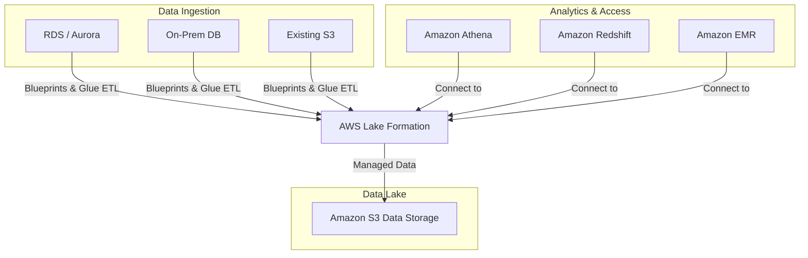

## 🏞️ AWS Lake Formation: Simplified Data Lake Creation

**AWS Lake Formation** is a fully managed service that significantly simplifies the process of setting up, securing, and managing a **data lake** on AWS, reducing a process that typically takes months down to a few days.

-----

## 1\. What is a Data Lake? 🌊

A **data lake** is a centralized repository that allows you to store **all your data** (structured and unstructured) at any scale. Its primary purpose is to serve as a single source for analytics.

### **Lake Formation Benefits**

  * **Speed of Setup:** Accelerates data lake creation from months to days.
  * **Automation:** Automates complex and manual steps like data collection, cleansing, cataloging, and moving data.
  * **Cleansing:** Uses **Machine Learning Transforms** for tasks like data de-duplication.
  * **Data Ingestion Blueprints:** Provides out-of-the-box workflows (blueprints) to migrate data from various sources (S3, RDS, Aurora, on-premises SQL/NoSQL databases) into the central data lake.

## 2\. Lake Formation Architecture and Glue Integration 🔗

Lake Formation functions as a **high-level, simplified layer** on top of existing AWS data services, primarily **AWS Glue**.

  * **Data Storage:** The data lake is physically stored in **Amazon S3**.
  * **Underlying Services:** Lake Formation automatically leverages the capabilities of AWS Glue:
      * **Source Crawlers**
      * **ETL and Data Preparation Tools**
      * **Data Cataloging Tool**
  * **Analytical Access:** Services that need to analyze the data (like **Athena, Amazon Redshift, Amazon EMR**, and **Apache Spark**) connect to **Lake Formation**.

<!-- end list -->

-----

## 3\. Centralized Fine-Grained Access Control 🛡️

This is the **most crucial feature** and a key exam topic for Lake Formation. It solves the problem of security sprawl across multiple analytics tools.

  * **The Problem:** Without Lake Formation, managing security requires setting permissions in multiple places (S3 bucket policies, RDS user permissions, Athena security settings, QuickSight user permissions). This is complex and prone to error.
  * **The Solution:** Lake Formation provides a single, central place to manage permissions for the entire data lake.
  * **Granularity:** It enforces **fine-grained access controls**, including:
      * **Row-Level Security (RLS):** Users only see the rows of data they are authorized for.
      * **Column-Level Security (CLS):** Users only see the columns they are authorized for (e.g., hiding a 'Salary' column from certain analysts).
  * **Enforcement:** When an analytical service (like Athena or QuickSight) connects to the data lake via Lake Formation, the service only receives the data subset (rows and columns) that the user is authorized to see, ensuring consistent security regardless of the tool used.

-----