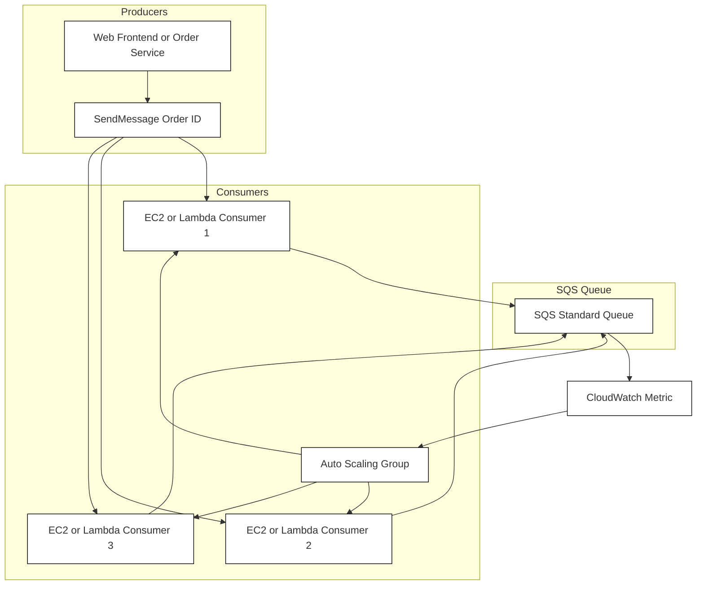

# 📜 Amazon SQS Standard Queues: The Decoupling Backbone (Learning Guide)

This guide provides an interesting and structured overview of **Amazon SQS (Simple Queue Service) Standard Queues**, focusing on its core concepts, architecture, and common use cases, based on the provided transcript.

-----

## 🏗️ SQS Core Concept: The Simple Queuing Service

At its heart, **SQS** is a **fully managed queuing service** used primarily to **decouple applications**. When you need to separate the components of your application so they can operate and scale independently, think SQS.

### **The Producer-Consumer Model**

| Component | Role | Action | API |
| :--- | :--- | :--- | :--- |
| **Queue** | **Buffer** between applications. | Holds messages until processed. | - |
| **Producer(s)** | Application component sending data. | Sends a message into the queue. | `SendMessage` |
| **Consumer(s)** | Application component processing data. | **Pulls** messages from the queue, processes them, and then deletes them. | `ReceiveMessage`, `DeleteMessage` |

-----

## ⚡ Key Characteristics of SQS Standard

SQS Standard is the oldest offering on AWS and is designed for high-throughput, high-volume workloads where message order and delivery duplication are tolerable.

| Feature | Detail | Impact / Key Takeaway |
| :--- | :--- | :--- |
| **Throughput & Capacity** | **Unlimited throughput** and **unlimited number of messages** in the queue. | Highly scalable and robust under heavy load. |
| **Message Size** | Messages must be small: **Less than 1024 KB** (1 MB). | Use for metadata or small payloads; for larger data, store in S3 and send the S3 reference in the message. |
| **Message Retention** | Messages are short-lived. **Default is 4 days**, **maximum is 14 days**. | Messages *must* be processed and deleted within this window or they are **lost**. |
| **Latency** | **Low latency:** Typically **\< 10ms** for publish and receive operations. | Enables near real-time interaction between decoupled components. |
| **Delivery Guarantee** | **"At Least Once Delivery"** (Duplicate messages are possible). | Consumers **must be idempotent** (processing the same message twice has no harmful side effects). |
| **Ordering** | **"Best Effort Ordering"** (Messages can be delivered out of order). | Order is not strictly guaranteed. (A different SQS type handles strict ordering). |

-----

## 🔄 Consumer Processing Flow

The consumer application (running on EC2, Lambda, or on-premises) is responsible for a three-step cycle:

1.  **Pull:** The consumer polls the SQS queue for messages. It can receive up to **10 messages at a time**.
2.  **Process:** The consumer's code handles the message (e.g., processes an order, updates a database).
3.  **Delete:** Once processing is confirmed successful (e.g., inserted into an RDS database), the consumer calls the `DeleteMessage` API to remove it from the queue, preventing other consumers from seeing it.

> ⚠️ **Critical Note:** If a message is received but not deleted, it will eventually become visible to other consumers, leading to the "at least once delivery" guarantee.

-----

## ⚙️ The Scaling Architecture (SQS + Auto Scaling Group)

A very common and effective pattern is to use SQS to drive the scaling of your consumer fleet.

  * **Consumers on Auto Scaling Group (ASG):** The consumer applications run on EC2 instances managed by an ASG.
  * **Scaling Metric:** The ASG is configured to scale based on a **CloudWatch Metric** from SQS: the **Approximate Number of Messages Visible (Queue Length)**.
  * **The Logic:**
      * **High Queue Length** (Surge of orders/requests) $\rightarrow$ CloudWatch Alarm triggers $\rightarrow$ ASG **increases capacity** (adds more EC2 consumers).
      * **Low Queue Length** (Work is processed) $\rightarrow$ ASG **decreases capacity** (removes EC2 consumers).

This pattern allows you to **horizontally scale** your processing capacity to match the incoming message volume perfectly.

-----

## 🔒 Security Summary

| Feature | Mechanism | Detail |
| :--- | :--- | :--- |
| **Encryption in Flight** | **HTTPS API** | Use the API over HTTPS to ensure messages are encrypted while being sent or received. |
| **Encryption at Rest** | **AWS KMS** | Messages are encrypted in the queue using **KMS keys**. |
| **Access Control** | **IAM Policies** | Regulate access to SQS API actions (e.g., `SendMessage`, `DeleteMessage`). |
| **Resource Policies** | **SQS Access Policies** | Similar to S3 Bucket Policies, helpful for: **Cross-Account Access** or allowing **other AWS Services** (like SNS or S3 Events) to write messages. |

-----

## 🧐 Missing Concept: Visibility Timeout

The transcript mentions that if a message isn't processed fast enough, it will be received by other consumers. The mechanism that controls this is the **Visibility Timeout**.

  * **Visibility Timeout:** When a consumer receives a message, the message is **hidden** (invisible) from other consumers for a specific period of time (the Visibility Timeout).
  * **Consumer Responsibility:** The consumer **must** process the message and **delete** it *before* the Visibility Timeout expires.
  * **Timeout Expiration:** If the timeout expires, SQS makes the message visible again, and another consumer can retrieve and process it (potentially resulting in a duplicate).
  * **Default/Maximum:** The default is often 30 seconds, with a maximum of **12 hours**. Consumers can extend the timeout if processing takes longer using the `ChangeMessageVisibility` API.