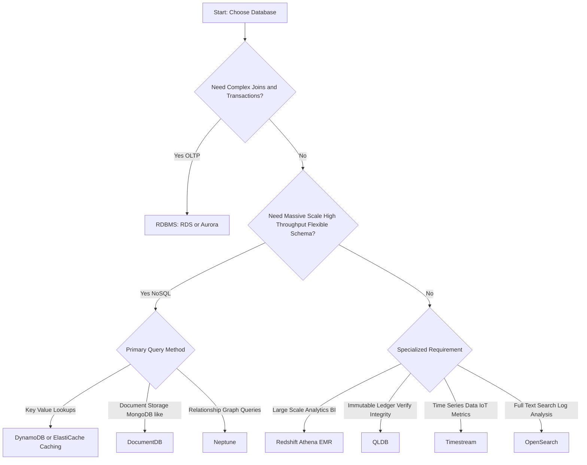

## 🧠 Choosing the Right AWS Database: A Workload Guide

Selecting the appropriate database is one of the most critical design decisions in AWS. The choice depends entirely on the specific **workload pattern**, **data model**, and **performance requirements** of the application.

This guide summarizes the different database and data store categories available on AWS to help match your needs to the right service.

-----

## ⚖️ Key Decision Dimensions

When evaluating database options, consider these primary factors:

| Dimension | Questions to Ask |
| :--- | :--- |
| **Workload Type** | Is it **Read-Heavy**, **Write-Heavy**, or **Balanced**? Does the load **fluctuate** (elasticity)? |
| **Data Model & Query** | Do you need **Joins**? Is the data **Structured** (strong schema) or **Semi-structured** (flexible)? Do you need full **SQL**? |
| **Scale & Durability** | How much data will be stored, and how long will it grow? What are the **durability** and **latency** requirements? |
| **Operational** | Do you prefer a **relational** or **NoSQL** model? Are there licensing cost concerns (managed vs. cloud-native)? |

-----

## 🗄️ AWS Managed Database Categories

AWS offers a comprehensive suite of databases tailored for different application needs.

### 1\. Relational Database Management Systems (RDBMS) / OLTP

These are best for Online Transaction Processing (OLTP) where **joins, complex queries, and ACID compliance** are necessary. They use the SQL query language.

| Service | Focus |
| :--- | :--- |
| **Amazon RDS** | Managed relational databases (PostgreSQL, MySQL, Oracle, SQL Server, MariaDB). |
| **Amazon Aurora** | AWS Cloud-Native, MySQL and PostgreSQL compatible, high-performance, and high-durability relational database. |

### 2\. NoSQL Databases (Flexible & Scale)

NoSQL databases are generally designed for **high flexibility, massive scale, and fast key-value lookups**, often at the expense of complex join capabilities.

| Service | Focus |
| :--- | :--- |
| **Amazon DynamoDB** | Key-value and document database for high-performance applications at **massive scale**. |
| **Amazon ElastiCache** | **In-memory caching** (Redis/Memcached) for microsecond latency access to frequently used data. |
| **Amazon DocumentDB** | Managed **MongoDB-compatible** document database for semi-structured data. |
| **Amazon Keyspaces** | Managed **Apache Cassandra-compatible** database service. |
| **Amazon Neptune** | Graph database for highly connected datasets (relationships). |

### 3\. Analytics & Data Warehousing (OLAP)

These are optimized for **Online Analytical Processing (OLAP)**, Business Intelligence (BI), and running complex queries over vast amounts of data for reporting.

| Service | Focus |
| :--- | :--- |
| **Amazon Redshift** | Petabyte-scale, fully managed **cloud data warehouse** for SQL analytics. |
| **Amazon Athena** | Serverless interactive query service that runs standard **SQL directly against data in S3**. |
| **Amazon EMR** | Managed **Hadoop/Spark** platform for big data processing and analytics. |

### 4\. Specialized Databases

AWS provides purpose-built databases for specific use cases that traditional RDBMS or NoSQL databases don't handle efficiently.

| Service | Focus |
| :--- | :--- |
| **Amazon OpenSearch Service** | **Search** and analytics engine (successor to Elasticsearch) for free text search, unstructured data, and log analysis. |
| **Amazon QLDB** | **Quantum Ledger Database** for immutable, cryptographically verifiable transaction logs and ledgers (e.g., financial or supply chain transactions). |
| **Amazon Timestream** | **Time Series** database optimized for ingesting, storing, and analyzing time-stamped data (e.g., IoT sensor data, application metrics). |
| **Amazon S3 & Glacier** | **Object Storage** for storing large binary objects (e.g., images, videos, large datasets) and **archiving** (Glacier). |

-----

## 📊 Database Selection Flowchart

The following diagram illustrates a high-level approach to selecting the right AWS database based on your primary need.

-----

## 📝 Missing Concepts

The overview is quite comprehensive but could be enhanced with a mention of these related services:

  * **AWS Migration Hub:** A central service to track the progress of migrations (including databases) to AWS.
  * **AWS Database Migration Service (DMS):** A service dedicated to migrating databases (homogeneous or heterogeneous) with minimal downtime.
  * **Amazon Aurora Serverless:** The on-demand, auto-scaling configuration of Aurora, which is a critical consideration for elastic or unpredictable workloads.