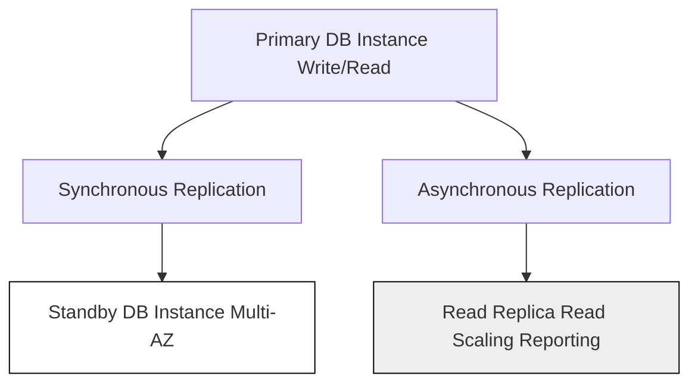

## 📋 Amazon RDS: Essential Summary Guide

Amazon Relational Database Service (RDS) is AWS's fully **managed service** for deploying and operating relational databases (RDBMS) in the cloud. It is primarily used for **Online Transaction Processing (OLTP)** workloads requiring standard SQL, complex **joins**, and transactional integrity.

-----

### ⚙️ Provisioning & Scaling

  * **Managed Engines:** Supports popular database engines, including **PostgreSQL, MySQL, Oracle, SQL Server, DB2, and MariaDB**.
  * **Provisioned Resources:** You must explicitly select the **RDS instance size** (compute) and the **EBS volume type and size** (storage).
  * **Storage Auto-Scaling:** While initial storage is provisioned, RDS supports **auto-scaling capability** for the storage layer.

| Feature | Purpose | Key Takeaway |
| :--- | :--- | :--- |
| **Read Replicas** | **Scale Read Capacity**. Offload read-heavy tasks (like **analytics or reporting**) from the primary instance. | **Asynchronous Replication.** Can be promoted to a standalone instance. |
| **Multi-AZ** | **High Availability (HA)**. Creates a synchronous standby instance in a different Availability Zone (AZ). | **Disaster Recovery Only.** The standby instance **cannot** be used for queries. |

-----

### 🛡️ Security and Compliance

  * **Network Security:** Controlled via **Security Groups**, which act as a virtual firewall for the database instance.

  * **Authentication:**

      * Traditional **Username and Password**.
      * **IAM Authentication** (supported for some engines) for access control integrated with AWS IAM users/roles.

  * **Encryption:**

      * **At Rest:** Data encrypted using **KMS** (Key Management Service).
      * **In Transit:** Encryption using **SSL/TLS** (intrinsic encryption).

  * **RDS Proxy:** A fully managed, highly available database proxy that enhances **security** (enforcing IAM auth) and **resiliency** (connection pooling and faster failovers).

  * **Secrets Manager Integration:** Used to manage and rotate database credentials securely, removing the need to hard-code them in application code.

-----

### 🔄 Backups and Maintenance

| Feature | Type | Retention & Use Case |
| :--- | :--- | :--- |
| **Automated Backups** | Continuous (log-based) + Snapshots | Up to **35 days**. Allows **Point-In-Time Restore (PITR)** to any second within the retention window (creates a new DB instance). |
| **Manual Snapshots** | User-initiated Full Backup | **Longer-term retention** for disaster recovery or archival purposes. |
| **Maintenance** | Managed and Scheduled | Requires **downtime** for engine patches, security updates, and underlying EC2 instance updates. |

-----

### 🛠️ Customization Option: RDS Custom

  * **Purpose:** Provides a managed RDS experience but grants **access to the underlying EC2 instance and operating system**.
  * **Use Case:** Ideal for **legacy applications** or packaged software that requires granular control, customization, and access to the OS/DB environment.
  * **Availability:** Currently available for **Oracle** and **SQL Server** database engines.

-----

### 🚀 Next Step

The transcript summarized core features of Amazon RDS. An important related service not explicitly covered is **Amazon Aurora**, which is AWS's cloud-native relational database that significantly improves performance, scalability, and availability over traditional RDS.