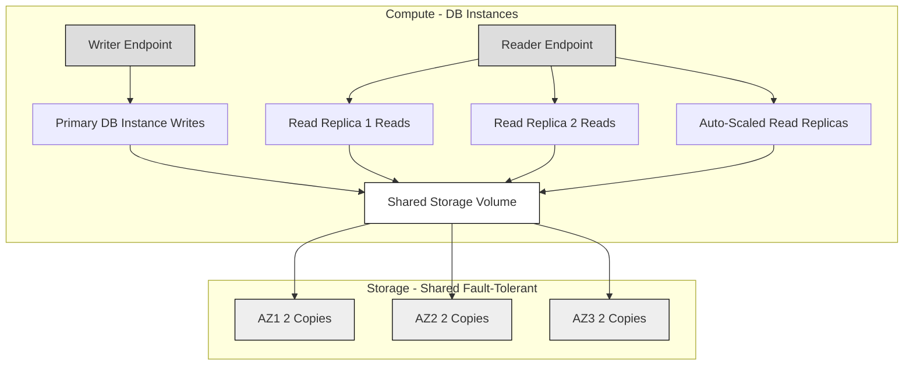

# 🚀 AWS Aurora: A Cloud-Native Database Learning Guide

Amazon Aurora is a highly performant, scalable, and fully managed relational database service compatible with **PostgreSQL** and **MySQL**. It distinguishes itself from traditional database setups (including standard RDS instances) through its cloud-native architecture.

-----

## 🏗 Architecture: Storage and Compute Separation

A key architectural difference is the separation of storage and compute layers, allowing independent scaling and enhanced durability.

### **💾 Storage Layer**

  * **High Availability:** Data is stored in **six replicas** across **three Availability Zones (AZs)** by default. This configuration is fixed and ensures high fault tolerance.
  * **Durability and Self-Healing:** The storage layer is **self-healing**; it automatically detects and repairs issues in the background.
  * **Auto-Scaling Storage:** Storage capacity **automatically scales** as your data grows.
  * **Missing Concept:** While the replication is across 3 AZs for durability, the maximum storage size for an Aurora cluster is up to **128 TB** (though this limit can be higher depending on the engine version and type), which is a crucial detail for capacity planning.

### **🖥 Compute Layer (Database Instances)**

  * **Clustering:** Database instances are grouped in a **cluster** and can be deployed across multiple AZs for high availability.
  * **Read Replica Auto-Scaling:** You can configure read replicas to **auto-scale** based on increasing read load.
  * **Custom Endpoints:**
      * **Writer Endpoint:** Used for all **write** operations (points to the primary instance).
      * **Reader Endpoint:** Used for all **read** operations (distributes traffic across all available read replicas).
  * **Security & Management:** It shares the same security, monitoring, and maintenance features as **Amazon RDS**.

-----

## 🌟 Key Features and Use Cases

Aurora provides specialized features for demanding workloads and global operations:

| Feature | Use Case / Description | Key Benefit |
| :--- | :--- | :--- |
| **Aurora Serverless** | For **unpredictable** and **intermittent** workloads where manual capacity planning is undesirable. | **No Capacity Planning**; compute automatically scales up and down. |
| **Aurora Global Database** | For global applications requiring fast local reads and disaster recovery across regions. | **Fast Cross-Region Replication** (typically **less than one second** lag) and fast failover. |
| **Aurora Machine Learning** | To perform machine learning directly on your data using services like **SageMaker** and **Comprehend**. | Seamless ML integration without moving data. |
| **Database Cloning** | To quickly create a testing or staging database from a production cluster. | **Faster** than the traditional snapshot and restore process. |

-----

## 📈 Performance and Flexibility Advantage

Aurora provides the same use cases as RDS but delivers superior performance, flexibility, and reduced operational overhead:

  * **Less Maintenance**
  * **More Flexibility**
  * **More Performance** (up to 5x the throughput of standard MySQL and 3x the throughput of standard PostgreSQL)
  * **More Features** (Serverless, Global Database, etc.)

-----

## 📊 High-Level Aurora Cluster Architecture (Mermaid Diagram)

Here's a conceptual diagram of an Aurora cluster with its endpoints and storage layer:

