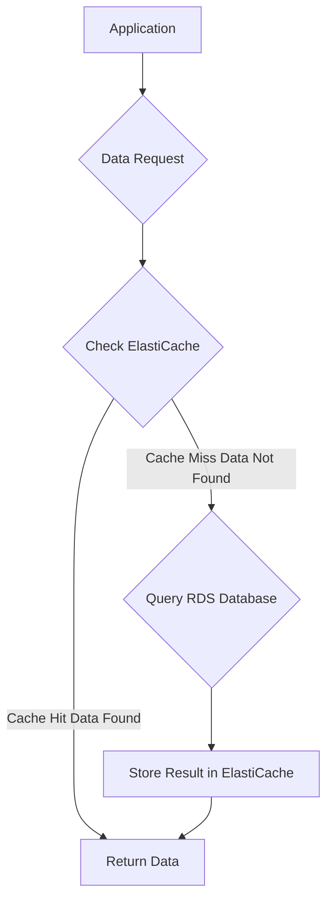

# 🧠 Amazon ElastiCache Learning Guide

## 📝 Quick Summary

**Amazon ElastiCache** is a **fully managed in-memory data store and cache service** provided by AWS. It offers managed versions of the popular open-source caching technologies, **Redis** and **Memcached**.

It acts as a high-speed data access layer, significantly improving application performance by providing **sub-millisecond latency** for read operations, offloading work from slower, disk-based databases like Amazon RDS.

-----

## 🔑 Key Concepts & Features

| Concept | Description | Notes |
| :--- | :--- | :--- |
| **Managed Service** | AWS handles the administrative tasks like provisioning, patching, scaling, and failure recovery. | Similar to **RDS** but for cache technologies. |
| **In-Memory Store (Cache)** | Data is stored in RAM, enabling extremely fast access. | Achieves **sub-millisecond latency**. |
| **Engines Supported** | **Redis** and **Memcached** are the two supported engines. | Choose based on required features (see Redis vs. Memcached section). |
| **Provisioning** | You must provision a specific **ElastiCache instance type** for your cache. | Similar to provisioning an EC2 or RDS instance. |
| **Security** | Supports **IAM**, **Security Groups**, and **KMS** at-rest encryption. | **Redis Authentication** is available for Redis engine. |
| **Operational Features** | Includes **backups**, **snapshots**, **point-in-time restore**, and **managed/scheduled maintenance**. | Provides the same kind of reliability features as RDS. |

-----

## 🎯 Critical Exam Point: Code Change Requirement

| Requirement | Details |
| :--- | :--- |
| **Application Code Modification** | **Required** to use ElastiCache. Your application must be written to check the cache first (a "cache-aside" strategy) before querying the primary database. |
| **Exam Alert ⚠️** | If a question asks for a caching solution that **does not require a code change**, **ElastiCache is NOT the correct choice**. |

-----

## 🛠️ Use Cases

ElastiCache is a great fit for:

  * **Key/Value Store:** Simple, fast lookups.
  * **Frequent Database Reads:** Caching the results of common or expensive database queries (often combined with RDS).
  * **Session Data Storage:** Storing user session information for web applications, enabling high availability and scalability.
  * **Leaderboards and Counters (Redis specific):** Leveraging Redis's advanced data structures.

> **Important Note:** You **cannot** use **SQL** on ElastiCache. It is a key-value store, not a relational database.

-----

## 🧠 Missing Concept: ElastiCache Engine Comparison

The transcript mentions both Redis and Memcached. For a complete learning experience, the key differences are vital:

| Feature | AWS ElastiCache for Redis | AWS ElastiCache for Memcached |
| :--- | :--- | :--- |
| **Persistence/Durability** | Supports persistence to disk (snapshots) | **Non-durable** (data is lost on node failure/restart) |
| **Data Types** | Rich data types (Strings, Hashes, Lists, Sets, Sorted Sets) | Simple **String** key-value storage only |
| **High Availability** | **Replication**, **Multi-AZ**, and **Auto-Failover** support | Multi-AZ only for distribution/sharding, no built-in replication or failover |
| **Clustering/Sharding** | Built-in Clustering support | Client-side sharding only (application manages distribution) |
| **Advanced Features** | Transactions, Pub/Sub, Lua Scripting | Simplistic, multi-threaded design for basic caching |

-----

## 📊 Caching with ElastiCache & RDS (Cache-Aside Pattern)

The most common way ElastiCache is used with RDS is via the **Cache-Aside** (or Lazy Loading) strategy, which requires application code changes.

