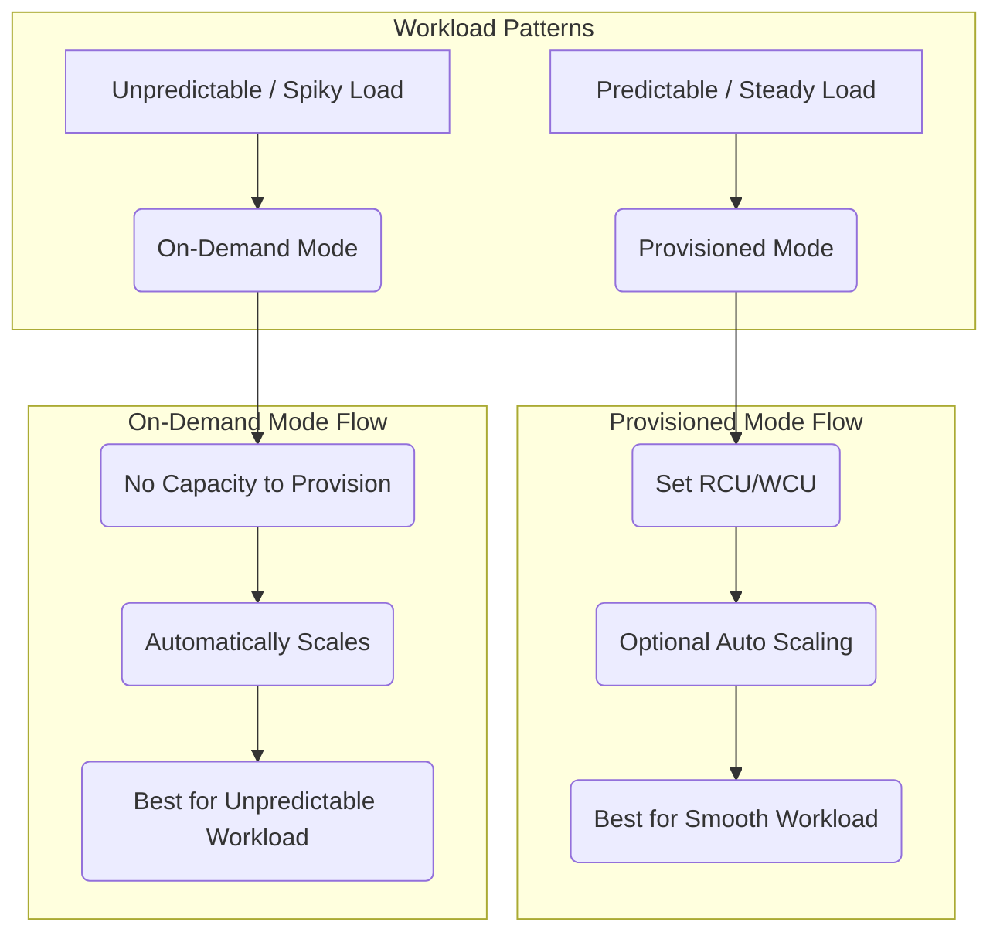
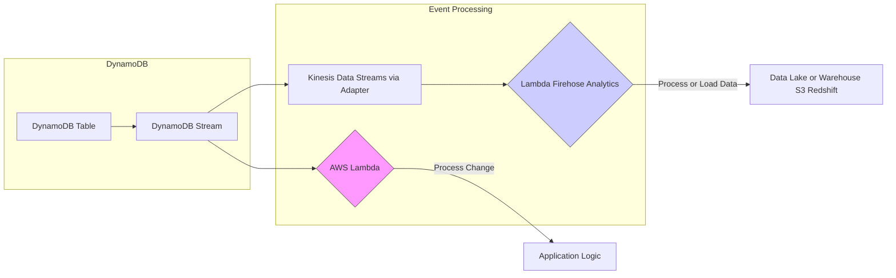

## 🚀 DynamoDB: Serverless NoSQL Database Learning Guide

This guide summarizes the core concepts and features of **Amazon DynamoDB**, a high-performance, fully managed, proprietary NoSQL database service from AWS. It's designed for scale and millisecond-latency performance.

-----

### Key Concepts

  * **Proprietary AWS Service:** A managed, serverless, NoSQL key-value and document database.
  * **Default Latency:** Provides **millisecond latency** out of the box.
  * **Core Use Cases:**
      * Serverless application development with small documents (up to hundreds of kilobytes).
      * Distributed serverless cache (can replace ElastiCache).
      * Data storage with a rapidly evolving or flexible schema.
  * **Data Lifecycle:** Includes a **Time-To-Live (TTL)** feature to automatically expire and delete rows after a specific time, perfect for session data.

-----

### Capacity Modes (The Throughput Choice)

You must choose one of two capacity modes, which dictates how you manage and pay for throughput.

| Capacity Mode | Workload Profile | Scaling Behavior | Billing Model | Key Feature |
| :--- | :--- | :--- | :--- | :--- |
| **Provisioned** | **Smooth, predictable** workload that increases or decreases gradually. | You specify Read Capacity Units (RCU) and Write Capacity Units (WCU), with **optional auto-scaling** to adjust. | Billed for **provisioned capacity** (even if unused). | Most **cost-effective** for steady or predictable load. |
| **On-Demand** | **Unpredictable** workload with sudden, steep spikes in demand. | **Scales automatically** up and down immediately based on actual traffic. No capacity provisioning needed. | Billed for **actual read and write requests** consumed. | **Worry-free scaling** for highly variable traffic. |

#### Capacity Modes Visual Comparison

-----

### Advanced Performance & Availability

#### DynamoDB Accelerator (DAX)

  * A fully compatible **read cache** for DynamoDB.
  * Enables **microsecond read latency** for cached items (significantly faster than DynamoDB's native millisecond latency).
  * Look for **DAX** on the exam when the question mentions a need for **microsecond** performance on read-heavy workloads.

#### High Availability & Replication

  * **High Availability (HA):** DynamoDB is highly available across **multiple Availability Zones (AZs)** by default.
  * **Global Tables:** Provides **active-active replication** across multiple AWS regions, allowing reads and writes from **any region**.

-----

### Security, Backup, and Export

#### Security

  * **Authentication & Authorization:** Everything is controlled through **AWS IAM** policies.

#### Backup Options

1.  **Automated Backup (Point-in-Time Recovery - PITR):**
      * Must be enabled.
      * Allows restoring your table to a new DynamoDB table at **any point in time** up to **35 days** ago.
2.  **On-Demand Backups:**
      * Used for **longer-term retention** of backups.
      * Restores to a new table.

#### Data Import/Export

  * **Export to S3:** You can export your table data to **Amazon S3** using the Point-in-Time Recovery window (up to 35 days). This process **does not consume Read Capacity Units (RCUs)**.
  * **Import from S3:** You can import data from S3 into a new table. This process **does not consume Write Capacity Units (WCUs)**.

-----

### Event Processing (DynamoDB Streams)

DynamoDB captures all item-level changes (Create, Update, Delete) in a stream, which can be processed by other services.

| Streaming Option | Key Consumer/Feature | Data Retention | Advantage |
| :--- | :--- | :--- | :--- |
| **DynamoDB Streams** | Direct integration with **AWS Lambda** (invokes a Lambda for every change). | **24 hours** | **Simple, serverless** integration for immediate reaction to changes. Records are delivered in order, with no duplicates. |
| **Kinesis Data Streams** | Integration with a wider suite of services like **Kinesis Data Firehose** for data loading or other Kinesis tools. | Up to **one year** | **Longer-term retention** and greater integration flexibility (e.g., streaming to S3, Redshift, or Elastic Search via Firehose). |

#### Event Processing Architecture

