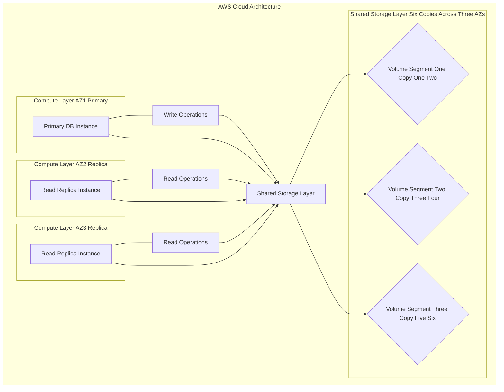

# 💻 AWS Database Deep Dive: DocumentDB Learning Guide

This guide is an interesting learning experience for the AWS DocumentDB service, comparing it to Amazon Aurora and its relationship with MongoDB.

-----

## 🎯 Core Concept: "Aurora for MongoDB"

The foundational idea to remember is that **Amazon DocumentDB** is AWS's cloud-native, highly available, and fully managed version of a **NoSQL document database**, similar to how **Amazon Aurora** serves the same role for PostgreSQL and MySQL (relational databases).

| Feature | Amazon DocumentDB | Amazon Aurora |
| :--- | :--- | :--- |
| **Database Model** | Document Store (NoSQL) | Relational DBMS (SQL) |
| **Compatibility** | MongoDB-compatible API | PostgreSQL & MySQL compatible |
| **Data Format** | JSON data | Tables, Rows, Columns |
| **Primary Use Case** | Flexible schema, indexing on any field, dynamic data models (e.g., product catalogs, user profiles). | Structured data, complex joins, strong ACID compliance. |
| **Exam Key Phrase** | "MongoDB," "**NoSQL** databases" (along with DynamoDB). | "MySQL," "PostgreSQL," "**Relational** databases." |

-----

## ⚙️ Key Architectural and Scaling Features

DocumentDB is built on the same underlying distributed, fault-tolerant storage system as Aurora, providing significant benefits over self-managed databases.

### 1\. **Full Management & High Availability (HA)**

  * **Fully Managed:** AWS handles tasks like hardware provisioning, patching, backups, and failure detection.
  * **High Availability:** Data is automatically replicated **six ways** across **three Availability Zones (AZs)**, ensuring high durability and fault tolerance.
  * **Automatic Failover:** In case of a primary instance failure, it automatically fails over to one of the up to 15 Read Replicas, typically in **less than 120 seconds** (often less than 60 seconds).

### 2\. **Scaling Mechanisms**

  * **Storage Auto Scaling:** Storage automatically grows in **10 GiB increments** as your data volume increases, up to a maximum of **128 TiB** (Tebibytes), with no impact on performance. You don't need to pre-provision storage.
  * **Read Scaling:** You can scale out read capacity by adding up to **15 low-latency Read Replicas**. The compute and storage layers are decoupled, meaning replicas share the same underlying storage volume. This allows the system to scale to workloads with **millions of requests per second**.
  * **Compute Scaling:** You can scale the compute and memory resources up or down by modifying the instance class (**"push-button" scaling**).
  * **DocumentDB Serverless (Concept Missing in Transcript):** For variable or unpredictable workloads, DocumentDB Serverless automatically scales the compute capacity up or down based on load, which can offer significant cost savings compared to provisioning for peak capacity.
  * **DocumentDB Elastic Clusters (Concept Missing in Transcript):** A newer feature designed to handle millions of writes and petabytes of data, providing a horizontal scale-out option that can be a better fit for extremely large or write-heavy applications than the traditional DocumentDB cluster architecture.

-----

## 🧠 Exam Pointers

1.  **MongoDB $\rightarrow$ DocumentDB.** If a question mentions using MongoDB or migrating a MongoDB workload to AWS, the answer is likely DocumentDB.
2.  **NoSQL Options.** Remember the two key managed NoSQL options:
      * **DocumentDB:** For **Document** data (JSON).
      * **DynamoDB:** For **Key-Value** and **Document** data, known for its sheer speed and scale-out (linear scalability at any size).
3.  **Core Architecture:** DocumentDB's storage system automatically replicates six copies across three AZs and scales in 10 GiB increments, a fundamental commonality with Aurora.

-----

## 📈 Diagram: DocumentDB Architecture (Mermaid)

