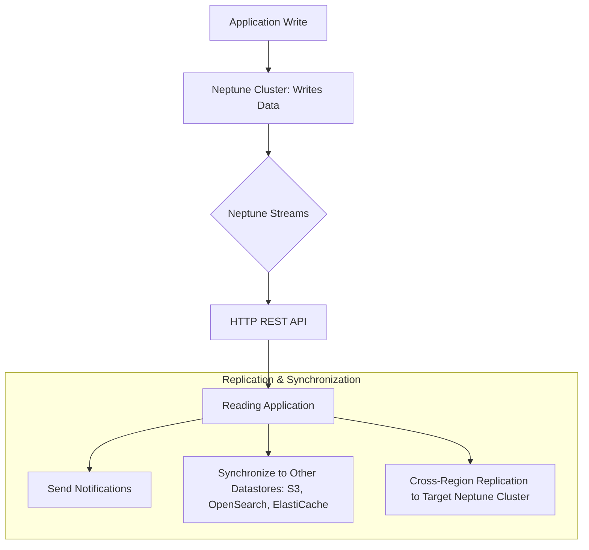

# 🧠 Amazon Neptune: The Graph Database Learning Guide

Amazon Neptune is a **fully managed graph database service** that's optimized for storing and querying highly connected datasets. When you encounter a need for a graph database in an exam context, **think Neptune**\!

-----

## 🎯 Core Concepts: Graph Databases

A graph dataset models data as **nodes** (entities) and **edges** (relationships), making it perfect for data with complex interconnections.

  * **Social Network Example:**

      * **Nodes** could be Users and Posts.
      * **Edges** could be `FRIENDS_WITH`, `LIKES`, `CONNECTS`, `READS`, or `COMMENTS`.
      * This interconnected structure is what makes it a "graph."

  * **Key Use Cases for Graph Datasets (and Neptune):**

      * **Social Networking** (finding friends-of-friends).
      * **Knowledge Graphs** (like the Wikipedia interconnection of articles).
      * **Fraud Detection** (finding non-obvious connections between suspicious accounts/transactions).
      * **Recommendations Engines** (suggesting products or people based on graph traversal).

-----

## 🌟 Neptune Key Features & Performance

Neptune is designed for high performance and availability on highly connected datasets.

| Feature | Description |
| :--- | :--- |
| **Availability** | Highly available with replication across **multiple Availability Zones (AZ)**, specifically **3 AZs**. |
| **Read Scalability** | Supports up to **15 read replicas**. |
| **Performance** | Optimized to run **complex, hard queries** on graph datasets with **millisecond latency**. |
| **Capacity** | Can store up to **billions of relations**. |
| **Management** | **Fully managed** service, reducing operational overhead. |

-----

## 💻 Missing Concept: Query Languages

A crucial part of any database is how you query it. The transcript did not mention the specific query languages used with Neptune.

Neptune supports **three open-source, industry-standard graph query languages**:

1.  **Gremlin (Apache TinkerPop):** A graph traversal language used for **Property Graphs**.
2.  **openCypher:** A declarative, SQL-like query language also used for **Property Graphs**.
3.  **SPARQL:** A query language used for **RDF (Resource Description Framework) graphs** and knowledge graphs.

-----

## 🌊 Neptune Streams: Real-Time Change Data

Neptune Streams is a feature that provides a real-time, ordered log of every change (write) that occurs in your Neptune graph data.

### Streams Characteristics

  * **Real-Time:** Changes are available immediately after writing to the database.
  * **Ordered Sequence:** Maintains a **strict ordering** of changes.
  * **No Duplicates:** Ensures the log is a reliable record of writes.
  * **Access:** Stream data is accessible using an **HTTP REST API**.

### Stream Architecture (Conceptual Flow)

### Streams Use Cases

  * **Sending Notifications:** Alerting other systems or users when a graph change occurs.
  * **Data Synchronization:** Maintaining a synchronized copy of your graph data in **other data stores** (e.g., Amazon S3, OpenSearch, ElastiCache).
  * **Cross-Region Replication:** Replicating data to a Neptune cluster in a different AWS region for disaster recovery or global scaling.
