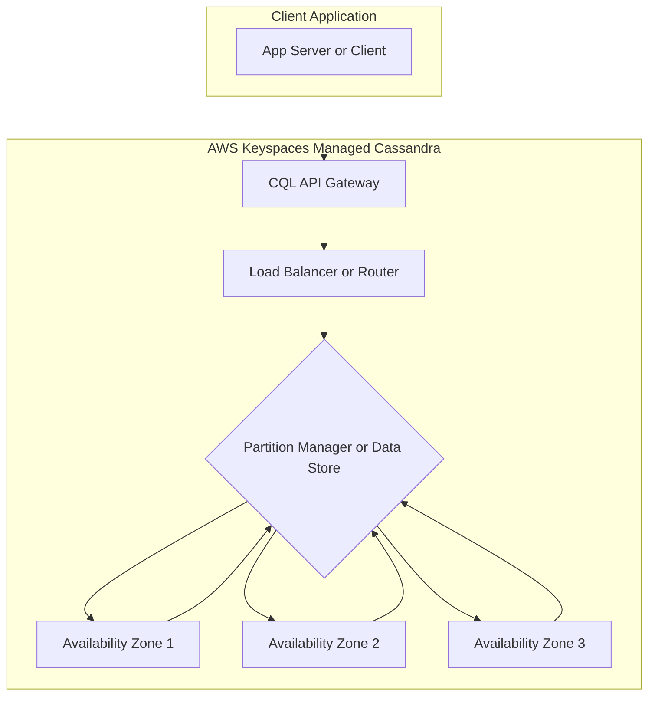

# 📚 Amazon Keyspaces: Managed Apache Cassandra on AWS (Learning Guide)

This guide summarizes the key features and concepts of **Amazon Keyspaces (for Apache Cassandra)** based on the provided transcript, offering an organized reference for later review.

-----

## 💡 Core Concept: Serverless Cassandra on AWS

**Amazon Keyspaces** is a fully **managed** and **serverless** database service that is compatible with **Apache Cassandra**, an open-source, NoSQL, distributed database. It allows you to run your Cassandra workloads on AWS without the operational overhead of managing servers.

| Feature | Description | Key Benefit |
| :--- | :--- | :--- |
| **Foundation** | Managed **Apache Cassandra** on AWS. | Compatibility with existing Cassandra tools and code. |
| **Management** | **Fully managed** and **Serverless**. | No provisioning, patching, or managing servers. |
| **Scaling** | **Automatically scales** tables up and down based on application traffic. | Virtually unlimited throughput and storage with zero downtime. |
| **Availability** | **Highly Available**; tables' data is replicated **three times** across **multiple Availability Zones (AZ)**. | High durability and resilience. |
| **Performance** | **Single-digit millisecond latency** at any scale, supporting **thousands of requests per second**. | Fast, consistent performance for high-volume applications. |

-----

## 🛠️ Operational Details

### **Query Language**

  * You interact with Keyspaces using the **Cassandra Query Language (CQL)**. This ensures compatibility for developers familiar with native Cassandra.

### **Capacity Modes (Like DynamoDB)**

Keyspaces offers two capacity modes for managing throughput, mirroring the options available in DynamoDB:

1.  **On-Demand Mode:** Pay-per-request for read and write throughput. Excellent for unpredictable or bursty workloads.
2.  **Provisioned Mode** (with Auto-Scaling): Specify the read/write capacity units (RCUs/WCUs) your application needs, with the option for auto-scaling to adjust capacity automatically within defined limits. Suitable for predictable workloads.

### **Security and Backups**

  * **Encryption Features:** Data is encrypted both at rest and in transit.
  * **Backup and Recovery:** Includes **Point-In-Time Recovery (PITR)**, allowing you to restore a table to any point in time within the preceding **35 days**.

-----

## 🎯 Use Cases (Exam Tip)

The ideal use cases for Amazon Keyspaces involve applications that require the high throughput and linear scalability of Cassandra.

  * **IoT Device Information:** Handling massive streams of data from connected devices.
  * **Time-Series Data:** Storing large volumes of data indexed by time (e.g., log files, sensor readings).
  * **General Exam Tip:** Anytime an exam question mentions a requirement for **Apache Cassandra**, or a need to **migrate Cassandra workloads to AWS**, the answer is almost certainly **Amazon Keyspaces**.

-----

## ➕ Missing Concepts (for a Complete Picture)

While the transcript covers the major benefits, a complete understanding should also include:

  * **Data Model Basics:** The fundamental Cassandra data model uses **Keyspaces** (like a relational database schema) that contain **Tables**. Tables are structured around a **Primary Key** composed of a **Partition Key** and optional **Clustering Columns**, which dictates data distribution and query efficiency.
  * **Consistency Levels:** Cassandra, and by extension Keyspaces, allows for tunable consistency. You can specify a consistency level (like `LOCAL_QUORUM`) to balance data consistency against latency and availability based on your application needs.
  * **Multi-Region Replication:** Keyspaces supports fully managed, active-active multi-Region replication for even higher availability and disaster recovery, and to provide low latency local reads/writes for global applications.
  * **Change Data Capture (CDC):** Keyspaces offers CDC streams that record row-level changes, allowing integration with other services for real-time processing and analytics.

-----

## 🧠 Keyspaces Architecture Visualization

**Explanation:** The client application uses the CQL API to send queries. These queries are handled by the Keyspaces gateway and load balancer, which routes them to the correct underlying storage partitions. The data is transparently replicated across three Availability Zones for high durability and availability, all while Keyspaces manages the scaling and infrastructure.