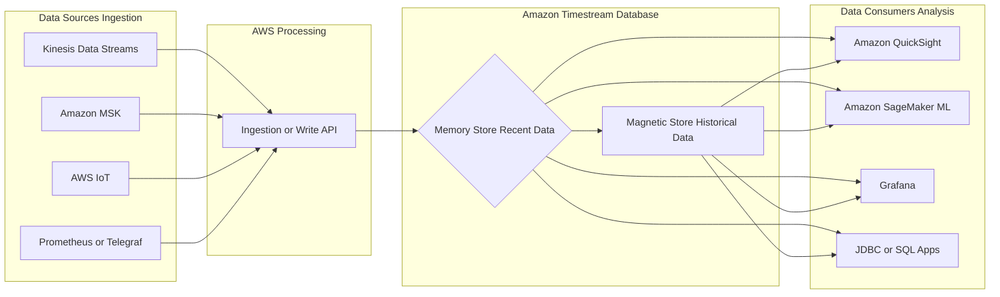

# ⏱️ Amazon Timestream: The Serverless Time-Series Database (Learning Guide)

This guide summarizes the essential concepts, features, and use cases of **Amazon Timestream**, a purpose-built time-series database on AWS, based on the provided transcript.

-----

## 🎯 What is a Time-Series Database?

A **Time-Series** is a sequence of data points, each associated with a **timestamp**. The data changes over time (e.g., CPU utilization, stock prices, sensor readings).

  * **Timestream's Advantage:** It is **faster** and **cheaper** than using traditional relational databases for storing and analyzing time-series data due to its specialized architecture.

-----

## ☁️ Core Features & Architecture

| Feature | Description | Key Benefit |
| :--- | :--- | :--- |
| **Management** | **Fully managed** and **Serverless**. | No need to provision, patch, or manage servers. |
| **Scalability** | **Automatically scales** capacity up and down; can handle **trillions of events per day**. | Effortlessly handles massive and variable data ingestion rates. |
| **Querying** | **Full SQL compatibility** and **Time Series Analytics Functions**. | Familiar query language with specialized functions for pattern analysis in near real-time. |
| **Data Storage** | **Two-Tier Storage Architecture** (Automated Data Lifecycle Management). | Cost-optimized storage and query performance based on data age. |
| **Security** | Supports **encryption in transit and at rest**. | Enterprise-level data protection. |

### **Dual-Tier Storage Breakdown**

Timestream automatically manages the lifecycle of your data across two storage tiers:

1.  **Memory Store (Recent Data):**
      * **Purpose:** Keeps the most recent data.
      * **Performance:** Optimized for **fast point-in-time queries** and real-time use cases.
2.  **Historical/Magnetic Store (Historical Data):**
      * **Purpose:** Stores older data transferred automatically via configurable retention policies.
      * **Performance:** Optimized for **cost-effective storage** and **fast analytical queries** over large data sets.

-----

## 🔗 Integrations & Ecosystem

Timestream is designed to integrate seamlessly with various AWS and open-source tools for both data ingestion and consumption.

### **Data Ingestion Sources** (The "Ins")

  * **AWS IoT:** Direct ingestion from Internet of Things devices.
  * **Kinesis Data Streams:** Real-time data streams, often processed via AWS Lambda or Kinesis Data Analytics for Apache Flink.
  * **Amazon MSK (Managed Streaming for Apache Kafka):** Streaming data processed via Kinesis Data Analytics for Apache Flink.
  * **Open Source Tools:** Integrations available for tools like **Prometheus** and **Telegraf**.

### **Data Analysis & Visualization** (The "Outs")

  * **Amazon QuickSight:** Building interactive dashboards for visualization.
  * **Amazon SageMaker:** Using the data for **machine learning** tasks.
  * **Grafana:** A popular open-source platform for operational dashboards.
  * **Any JDBC/SQL Compatible Application:** Standard JDBC connection allows virtually any tool or application that supports SQL to connect and query the data.

-----

## 📈 Missing Key Concepts

For a more complete learning experience, a few underlying concepts are important:

  * **Scheduled Queries:** The transcript mentions these, but it's important to know they **pre-aggregate** and **downsample** data automatically. This moves computational load from the main query to a background job, significantly **reducing query cost** and **improving dashboard latency** by querying a much smaller destination table.
  * **Dimensions and Measures:** Timestream structures data using **Dimensions** (metadata/attributes of the time-series, e.g., device ID, location) and **Measures** (the actual values being recorded, e.g., temperature, pressure). This schema-flexible design is key to its performance.
  * **SQL Time-Series Functions:** Timestream extends standard SQL with powerful functions specifically for time-series data, such as `INTERPOLATE` (to fill in missing data points) and `APPROX_DISTINCT` (for cost-optimized approximate counts).

-----

## 📐 Timestream Data Flow Architecture

