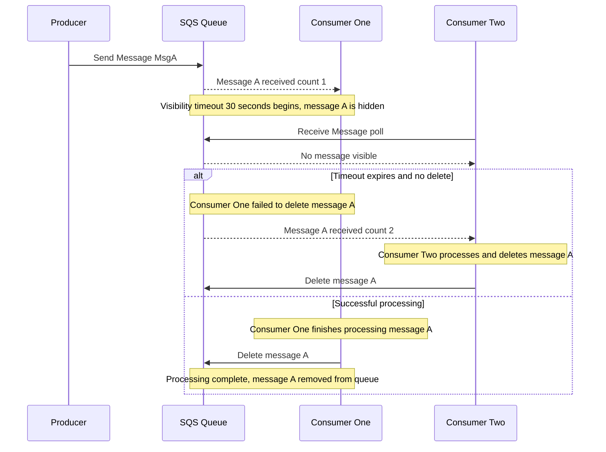

# 👻 SQS Visibility Timeout: How Consumers Claim Messages (Learning Guide)

This guide focuses on the critical concept of **Visibility Timeout** in Amazon SQS Standard Queues, which is fundamental to understanding the "at least once delivery" guarantee and preventing duplicate processing.

-----

## 🧐 What is the Visibility Timeout?

The **Visibility Timeout** is the period of time during which a message is hidden from all other consumers after one consumer receives it. It's the mechanism SQS uses to give a consumer time to process a message without interference.

  * **Default Value:** **30 seconds**.
  * **Maximum Value:** **12 hours** (set at the queue level).

### **The Message Lifecycle with Visibility Timeout**

1.  **Consumer Polls:** A consumer calls the `ReceiveMessage` API.
2.  **Message Delivery:** The message is returned to the consumer.
3.  **Timeout Starts:** The **Visibility Timeout** period begins.
4.  **Invisibility:** During this timeout, if any other consumer (or the same consumer) calls `ReceiveMessage`, that specific message **will not be returned**.
5.  **Successful Processing:** The consumer must **process the message** and call the `DeleteMessage` API **before** the timeout expires.
6.  **Timeout Expires (Failure Scenario):** If the consumer fails to delete the message before the timeout expires (e.g., due to a crash, or slow processing), the message is effectively "put back into the queue" and becomes **visible** again to all consumers. This leads to **duplicate processing** and explains the "at least once delivery" guarantee.

-----

## ⏰ Managing Processing Time

If a consumer is actively processing a message but anticipates it will take longer than the current Visibility Timeout, it can request more time to prevent a duplicate from being processed by another consumer.

  * **API for Extension:** **`ChangeMessageVisibility`**
  * **How it Works:** The consumer calls this API to tell SQS, "I'm still working on this message; increase its current timeout so it doesn't reappear yet."

### **The Timeout Dilemma**

Setting the default Visibility Timeout requires a careful balance:

| Scenario | Visibility Timeout Setting | Consequence |
| :--- | :--- | :--- |
| **Too High (e.g., hours)** | If the consumer crashes immediately, the message will be **invisible for hours**, causing a huge delay before another consumer can pick it up. | **Slow Recovery** from failures. |
| **Too Low (e.g., a few seconds)** | If the consumer takes slightly longer to process the message, it will be received repeatedly by different consumers. | **Duplicate Processing** and wasted resources. |

> **Best Practice:** Set the default timeout to a reasonable value for most messages, and program consumers to use `ChangeMessageVisibility` to extend the timeout for complex messages.

-----

## 🌊 Visualizing the Timeout

-----

## ➕ Missing Concept: Dead-Letter Queues (DLQ)

While the transcript covers what happens when a message is **not processed and times out**, it does not cover the service that handles *permanently* failing messages: the **Dead-Letter Queue (DLQ)**.

  * **Received Count:** Every time a message is received (after its visibility timeout expires), its `Receive Count` attribute increases.
  * **DLQ Mechanism:** You can configure an SQS queue to move a message to a separate **Dead-Letter Queue** if its `Receive Count` exceeds a maximum threshold (e.g., 5 times).
  * **Purpose:** A DLQ prevents a perpetually failing message from clogging the main queue and wasting consumer resources. It provides a place for failed messages to be analyzed and safely re-ingested later.