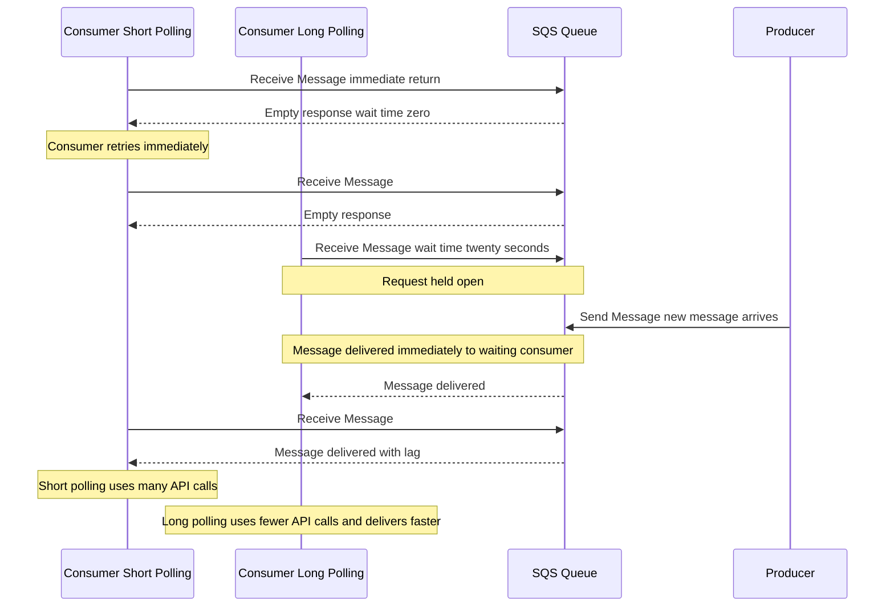

# ⏱️ SQS Long Polling: The Efficient Wait (Learning Guide)

This guide dives into the concept of **Long Polling** in Amazon SQS, a crucial feature for improving both the cost-efficiency and performance of your consumer applications.

-----

## 👂 What is Long Polling?

**Long Polling** is a technique where a consumer making a `ReceiveMessage` API call will **wait** for a message to arrive in the SQS queue if one is not immediately available. The consumer does not immediately return an empty response; instead, it holds the connection open until a message arrives or a specified **Wait Time** expires.

### **The Mechanics**

1.  **Consumer Polls:** A consumer sends a `ReceiveMessage` request to the SQS queue.
2.  **Queue is Empty:** If there are no messages ready, the consumer's request is held open for a specific duration (**Wait Time**).
3.  **Message Arrives:** As soon as a message is sent to SQS, it is immediately sent to the waiting consumer.
4.  **Response:** The consumer's request successfully returns the message, concluding the long poll. If the **Wait Time** expires before a message arrives, the request returns an empty response.

| Parameter | Range | Recommendation |
| :--- | :--- | :--- |
| **WaitTimeSeconds** | **1 second to 20 seconds** | **20 seconds** is generally preferred for maximum efficiency. |

-----

## ⚡ Why Use Long Polling?

Long polling offers significant advantages over the older method, **Short Polling** (where the consumer requests messages and immediately returns if none are present, potentially making many empty calls).

### **Key Benefits**

  * **Cost Reduction (Fewer API Calls):**
      * A consumer under short polling might make 10 requests per second, with 9 of them being empty.
      * With long polling, the consumer waits up to 20 seconds for a single request, drastically decreasing the number of empty `ReceiveMessage` calls and therefore **reducing SQS costs** (since you pay per request).
  * **Reduced Latency (Faster Delivery):**
      * The message is delivered **as soon as it arrives** in the queue.
      * There is less delay (lag) between the producer sending the message and the consumer receiving it, because a consumer is always waiting.
  * **Improved Message Retrieval:**
      * Long polling increases the chances of receiving a successful message, leading to fewer empty responses.

> **Principle:** **You should prefer Long Polling to Short Polling.**

-----

## 🛠️ How to Enable Long Polling

You can enable long polling using one of two methods:

1.  **At the Queue Level:**
      * Configure the **Wait Time** on the SQS queue itself. This setting applies to all consumers unless they override it.
2.  **At the API Level:**
      * Set the **`WaitTimeSeconds`** parameter when making a `ReceiveMessage` API call. This overrides the queue-level setting for that specific call.

-----

## 📊 Long Polling vs. Short Polling

The following diagram illustrates the difference between the two methods:

-----