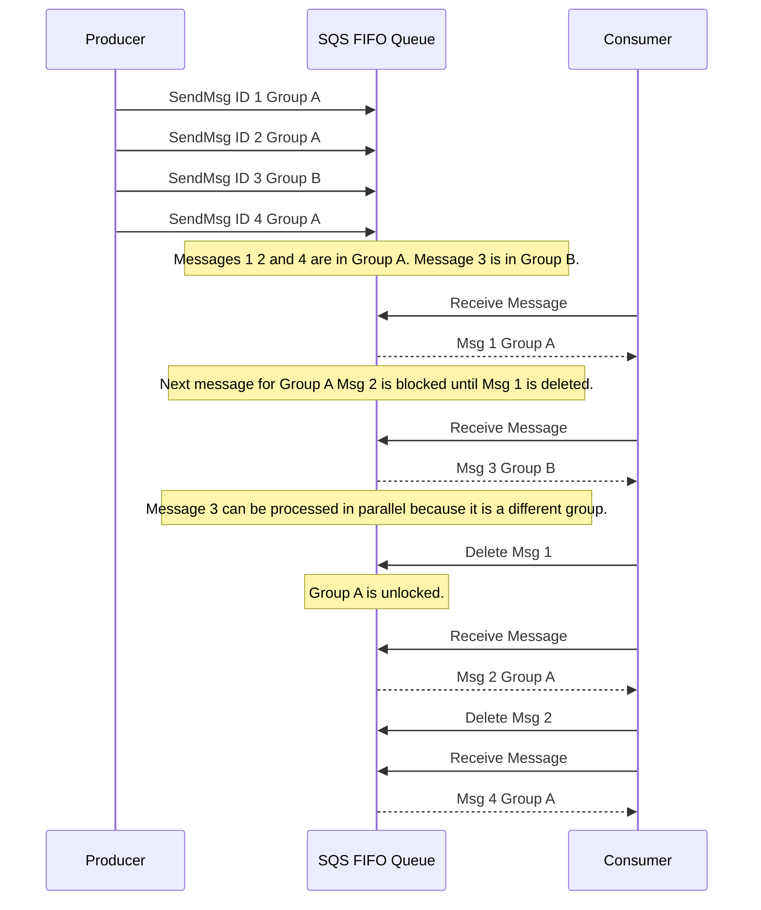

# 🔄 Amazon SQS FIFO Queues: Guaranteed Order and Delivery

This guide details the features and operation of **Amazon SQS FIFO (First-In, First-Out) Queues**, which were designed to overcome the ordering and duplication limitations of SQS Standard Queues.

-----

## 🎯 What is an SQS FIFO Queue?

A FIFO queue guarantees that messages are processed **in the exact order** they are sent and ensures that a message is delivered to a consumer **exactly once** within a short window.

### **Core Guarantees**

1.  **Strict Ordering:** The order in which messages are sent by the producer is the order in which they are received by the consumer.
2.  **Exactly-Once Processing:** Duplicates are automatically removed by the queue, ensuring no more than one successful delivery.

-----

## ⚙️ Key Requirements and Constraints

Due to the strict ordering guarantee, FIFO queues have specific requirements and limits that do not apply to Standard Queues:

| Constraint/Requirement | Detail | Impact |
| :--- | :--- | :--- |
| **Naming Convention** | The queue name **must end with `.fifo`**. | A simple name like `MyQueue` will not work; it must be `MyQueue.fifo`. |
| **Ordering Scope** | Ordering is guaranteed at the **Message Group ID** level. | All messages sent with the same **Message Group ID** will be processed in order. Messages with *different* Group IDs may be processed in parallel. |
| **Throughput Limits** | Throughput is limited (unlike Standard Queues). | **Without Batching:** Up to 300 messages per second.   **With Batching:** Up to 3,000 messages per second. |
| **Deduplication** | Requires a **Deduplication ID** for exactly-once send. | This ID is used to remove duplicates for a **5-minute window**. |

-----

## 🔑 Ordering and Deduplication Mechanisms

### **1. Message Group ID (Ordering)**

For a FIFO queue to enforce ordering, every message must be associated with a **Message Group ID**.

  * Messages belonging to the same group ID are delivered to the consumer **sequentially**.
  * This allows the queue to enforce strict ordering for related tasks (e.g., all commands for a specific user ID) while still processing messages from *different* groups in parallel, thus maximizing overall throughput.

### **2. Deduplication ID (Exactly-Once Send)**

To achieve the "exactly-once send" feature, a producer must supply a **Deduplication ID** with every message.

  * SQS tracks these IDs. If a message with the same Deduplication ID is received within a **5-minute deduplication interval**, the duplicate message is automatically rejected and removed from the queue.
  * **Content-Based Deduplication (Optional):** As an alternative, you can enable a queue setting called **Content-Based Deduplication**. If enabled, SQS automatically generates the deduplication ID based on a SHA-256 hash of the message body, eliminating the need for the producer to provide a unique ID.

-----

## 📝 FIFO Message Flow

The following diagram illustrates how the message group ID enforces sequential processing for related messages:

