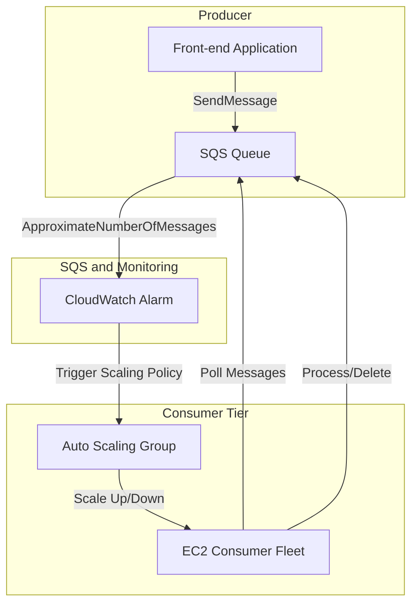

# 🎯 Advanced SQS Patterns: Decoupling and Elastic Scaling (Learning Guide)

This guide explores advanced patterns for leveraging **Amazon SQS** with **Auto Scaling Groups (ASG)** to build elastic, robust, and decoupled applications, addressing common architectural challenges.

-----

## 📈 Pattern 1: SQS Queue Driven Auto Scaling

This is the fundamental pattern for using SQS to manage the processing capacity of your consumer fleet. The goal is to ensure you have just enough EC2 instances to process the messages in the queue efficiently.

### **The Mechanism**

1.  **Metric:** The ASG is scaled using a **CloudWatch Alarm** based on the SQS metric: **`ApproximateNumberOfMessages`** (often called "queue length").
2.  **Alarm Trigger:** If the queue length exceeds a set threshold (e.g., **1,000 messages**), it signals that message processing is lagging.
3.  **Scaling Action:** The alarm triggers the ASG to **scale up** (add more EC2 instances).
4.  **Result:** More consumers process messages faster, the queue size decreases, and the application keeps up with the incoming load.

> **Benefit:** This mechanism enables true **elastic scaling**—the application automatically adjusts its processing power based purely on the workload (messages in the queue).

### **Visualizing Queue-Driven Scaling**

-----

## 💳 Pattern 2: SQS as a Database Buffer

This is a critical pattern for handling sudden, massive spikes in write traffic that could overwhelm a relational database (like RDS/Aurora) or a high-throughput NoSQL database (like DynamoDB).

### **The Problem**

During peak events (e.g., a massive sale), a sudden surge of transactions can overload databases, leading to connection timeouts, errors, and **lost customer transactions**—which is bad for business.

### **The Solution (SQS as a Buffer)**

1.  **Decoupling Write and Store:** The front-end application **stops** writing directly to the database.
2.  **Enqueuing:** The front-end application immediately sends the transaction request (e.g., order details) as a message into an **SQS Queue**. Since SQS has virtually **unlimited throughput** and is durable, the transaction is immediately secured and not lost.
3.  **Dequeuing:** A separate, dedicated **Auto Scaling Group** of consumer instances polls the SQS queue.
4.  **Database Write:** The consumer reads the message and performs the database write/insert.
5.  **Confirmation:** The consumer only **deletes the message** from SQS after the database write is confirmed successful.

> **Key Guarantee:** This architecture guarantees that **every single transaction** will eventually be written to the database, eliminating the risk of lost transactions due to database overload.

### **Limitations**

  * This pattern works best when the **client does not require immediate, synchronous confirmation** that the write has been committed to the database (an "eventual consistency" model).

-----

## 🧩 Pattern 3: Decoupling Application Tiers

This is the primary use case for SQS, allowing different parts of your application to operate and scale independently.

| Component | Function | Advantage |
| :--- | :--- | :--- |
| **Front-end Tier** | Receives user requests and **sends a message** to SQS. | Can use optimal EC2 instance types for quick response/API handling. It's never slowed down by the processing job. |
| **SQS Queue** | Acts as an **unlimited buffer** and communication channel. | Handles sudden load spikes without dropping requests. |
| **Back-end Processing Tier** | **Receives messages** and performs heavy lifting (e.g., video encoding, report generation). | Can use different, optimized instance types (e.g., GPU instances for video processing) and scale independently based on its own workload. |

### **General Exam Principle**

Any time an exam question involves:

  * **Decoupling** components.
  * Handling **sudden spike load** (bursts).
  * Dealing with **time-outs** between application tiers.
  * Needing to ensure **durability** and eventual processing of requests.

...then **Amazon SQS** is the correct answer to introduce into the architecture.