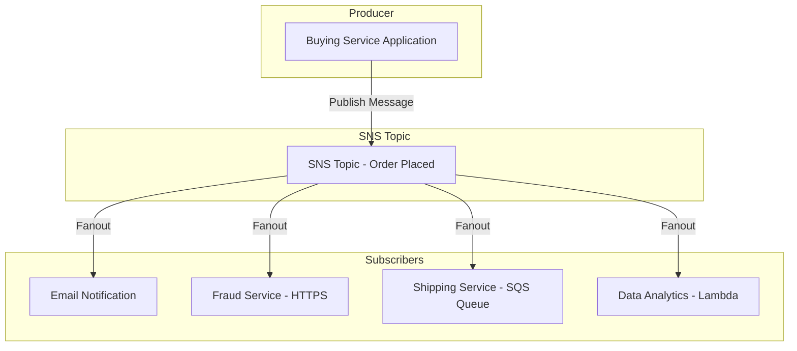

# 📣 Amazon SNS: The Publish-Subscribe (Pub/Sub) Notification Service (Learning Guide)

This guide summarizes the core functionality, architecture, and features of **Amazon SNS (Simple Notification Service)**, a highly scalable, fully managed service for sending messages to multiple subscribers simultaneously.

-----

## 💡 Core Concept: Publish-Subscribe (Pub/Sub)

SNS enables you to **decouple** message production from message consumption, allowing one message to be efficiently broadcast to many different endpoints.

  * **Producer:** Sends the message **once** to the SNS Topic.
  * **SNS Topic:** Acts as the central communication channel.
  * **Subscribers:** Are registered to the Topic and automatically **receive a copy** of every message published.

This is much more efficient than the "direct integration" method, where the producer has to manage and write code for every single receiving service.

### **The Pub/Sub Flow**

-----

## 🔗 Key Features and Integrations

### **1. Subscriber Endpoints (The Fanout)**

An SNS topic can send a message to many different types of endpoints, often called the "fanout" pattern:

  * 📧 **User Notifications:**
      * **Email:** Direct email sending.
      * **SMS:** Text messages.
      * **Mobile Notifications:** Push notifications to mobile devices (via platform endpoints like Google GCM, Apple APNS, etc.).
  * ☁️ **AWS Service Integration:**
      * **SQS:** Send messages to a queue for asynchronous, reliable processing.
      * **AWS Lambda:** Trigger a Lambda function to execute code upon message receipt.
      * **HTTP/S:** Send notifications to any specified web endpoint.
      * **Kinesis Data Firehose:** Send data streams to destinations like S3 or Redshift.

### **2. Integration with AWS Services (The Event Source)**

SNS is the central notification hub for many other AWS services, which use SNS to broadcast operational events:

  * **CloudWatch Alarms:** Notify operations teams of threshold breaches.
  * **Auto Scaling Groups:** Notify of instance launches or terminations.
  * **S3 Buckets:** Notify about new object creation or deletion events.
  * **RDS Events, DynamoDB Events, Budgets, and more...**

### **3. Scalability and Limits**

  * **Subscriptions per Topic:** Can handle over **12.5 million** subscriptions per topic.
  * **Topics per Account:** Up to **100,000 topics** per account (limits are soft and can be increased).

### **4. Message Filtering (Missing Concept)**

The transcript mentions filtering is possible. This is a powerful feature where subscriptions can define a **filter policy** to only receive a subset of messages published to the topic based on message attributes. This prevents services from receiving messages they don't care about, reducing traffic and simplifying consumer logic.

-----

## 🔒 Security and Access Control

SNS employs strong security measures similar to other core AWS services like SQS and S3.

| Security Feature | Mechanism | Detail |
| :--- | :--- | :--- |
| **Encryption In-flight** | **Default** | Uses secure protocols (e.g., HTTPS). |
| **Encryption At-rest** | **AWS KMS** | Messages are encrypted in the SNS topic using KMS keys. |
| **Client-side Encryption** | **Client Responsibility** | If the producer encrypts the message before publishing, it is responsible for the encryption and the subscriber is responsible for the decryption. |
| **Access Control (APIs)** | **IAM Policies** | Regulates who can perform SNS API actions (e.g., `Publish`, `Subscribe`, `CreateTopic`). |
| **Resource Policies** | **SNS Access Policies** | Similar to S3 Bucket Policies; allows for: **Cross-Account Access** or permitting other **AWS services** (like S3) to publish messages to the topic. |

-----

## 📱 Mobile Direct Publish

SNS supports a specific workflow for mobile applications to receive notifications, separating it from the general "fanout" model:

1.  **Create Platform Application:** Register the platform (e.g., Google FCM, Apple APNS) with SNS.
2.  **Create Platform Endpoint:** Register individual devices (mobile app instances) as endpoints.
3.  **Direct Publish:** Publish a message directly to the individual **Platform Endpoint** for targeted notifications.

-----