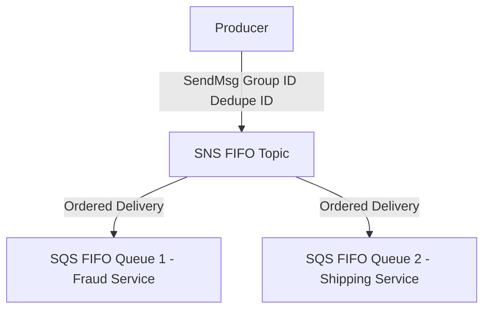

# 🤝 SQS & SNS: The Fan-Out Architecture (Learning Guide)

This guide explores the powerful **Fan-Out Pattern** using Amazon SNS and SQS together, demonstrating how this combination creates highly durable, flexible, and scalable decoupled systems.

-----

## 🔁 The SNS + SQS Fan-Out Pattern

The primary goal of the SNS + SQS Fan-Out pattern is to reliably deliver a single message (published once) to **multiple SQS queues**.

### **Why use this pattern?**

  * **Decoupling:** The producer (e.g., Buying Service) only needs to know about **one** destination (the SNS Topic).
  * **Reliability & Durability:** The message is secured by the SNS topic and reliably delivered to SQS queues, which provide **data persistence, delayed processing, and retries of work**.
  * **Flexibility:** You can easily add new receiving services (new SQS queues, Lambda, Email) simply by **subscribing** them to the topic, without changing the producer's code.
  * **Problem Avoidance:** Solves issues associated with direct, sequential sending (application crashes, delivery failures, high maintenance).

### **Access Policy Requirement**

For the SNS topic to successfully push messages into a subscribed SQS queue, the **SQS Queue Access Policy** must be configured to explicitly **allow** the SNS topic to write messages.

### **Cross-Region Delivery**

The Fan-Out pattern supports **cross-region delivery**, meaning an SNS topic in one region can deliver messages to SQS queues in different AWS regions, provided the security policies allow it.

-----

## 📂 Advanced Fan-Out Use Cases

### **1. S3 Events to Multiple Destinations**

S3 event rules have a limitation: for a specific event type and prefix combination (e.g., `ObjectCreated` in the `images/` prefix), you can only configure **one** destination.

  * **The Solution:** Configure the S3 event rule to send the notification to an **SNS Topic**.
  * **The Benefit:** The SNS topic can then fan out the S3 event message to multiple SQS queues, Lambda functions, or other endpoints, overcoming the S3 event limitation.

### **2. SNS to Amazon S3 via Kinesis Data Firehose (KDF)**

SNS has direct integration with **Kinesis Data Firehose (KDF)**. This allows messages published to an SNS topic to be seamlessly streamed and persisted in Amazon S3 (or other KDF-supported destinations).

  * **Flow:** Producer $\rightarrow$ **SNS Topic** $\rightarrow$ Kinesis Data Firehose $\rightarrow$ **Amazon S3** (or Redshift, Elastic Search, etc.)
  * **Purpose:** Persisting all events for long-term analytics or archiving.

-----

## 🔒 Message Filtering in SNS

**Message Filtering** is a powerful feature that allows subscribers to only receive messages that match a specific criteria.

  * **Default Behavior:** If a subscription has **no filter policy**, it receives **every message** published to the topic.
  * **Filter Policy:** A subscription defines a **JSON policy** based on attributes of the message. Only messages with attributes that match the policy are delivered to that specific subscriber.

| Service | Filter Policy Example | Result |
| :--- | :--- | :--- |
| **SQS Queue A (Placed)** | `{"State": ["Placed"]}` | Receives **only** messages where the `State` attribute is "Placed". |
| **SQS Queue B (Canceled)** | `{"State": ["Canceled"]}` | Receives **only** messages where the `State` attribute is "Canceled". |
| **Email Subscription** | `{"OrderValue": [ {"numeric": [">", 1000]} ]}` | Sends an email only for large orders. |

This enables a single SNS topic to act as a hub for many different event types, with each subscriber selectively pulling only the events relevant to its function.

-----

## 🗄️ SNS FIFO Topics (Fan-Out with Order)

Amazon SNS offers **FIFO (First-In, First-Out) Topics** to extend the ordering and deduplication guarantees of SQS FIFO to the fan-out model.

  * **Guarantees:** Provides **ordering by Message Group ID** and **deduplication** (via Deduplication ID or content hash) across the fan-out.
  * **Subscriber Limitation:** Currently, SNS FIFO topics can **only** fan out to **SQS FIFO Queues**.
  * **Use Case:** Necessary when you need both **fan-out** *and* **strict sequential processing** (e.g., for processing updates to a bank account ledger).

<!-- end list -->

