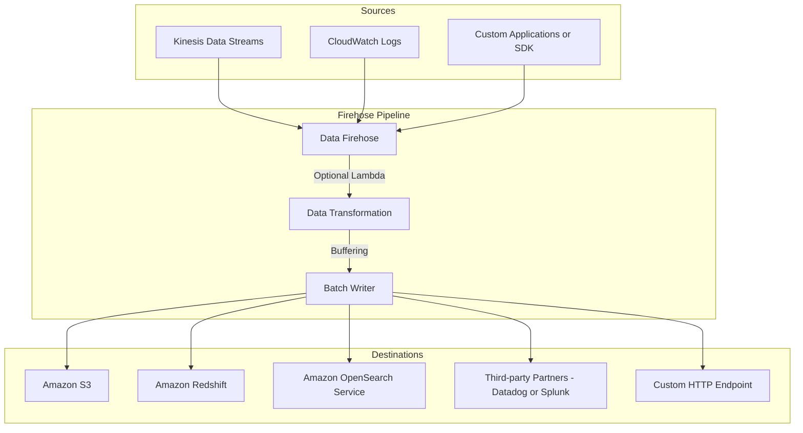

# 🚒 Amazon Data Firehose: Near Real-Time Data Delivery (Learning Guide)

This guide provides an overview of **Amazon Data Firehose**, a fully managed, serverless service designed to simplify the process of loading streaming data into data stores and analytics services.

-----

## 🚀 Core Concept: Near Real-Time Data Loader

Amazon Data Firehose (formerly Kinesis Data Firehose) is a service used to **send data from sources into target destinations**. It is a **near real-time** service because it buffers data before writing it in batches.

### **The Data Flow**

1.  **Sources (Producers):** Data is sent into Firehose via:
      * **Push:** Producers (applications, clients) use the SDK or **Kinesis Agent**.
      * **Pull:** Firehose can pull directly from sources like **Kinesis Data Streams**, **CloudWatch Logs and Events**, and **AWS IoT**.
2.  **Buffering:** Records are received and temporarily held in an internal **buffer** (based on size or time).
3.  **Optional Transformation:** Data can be optionally transformed using a **Lambda function** (e.g., format conversion from CSV to JSON) before delivery.
4.  **Batch Writing:** The buffer is flushed to perform **batch writing** to the target destination.
5.  **Destinations:** Data is delivered to the specified targets.

### **Visualizing the Firehose Pipeline**

-----

## 🎯 Key Characteristics

| Feature | Detail | Key Implication |
| :--- | :--- | :--- |
| **Operational Model** | **Fully Managed** and **Serverless**. You only pay for what you use. | **Automatic Scaling** is built-in; no need to manage servers or scale capacity manually. |
| **Real-Time Type** | **Near Real-Time** | Due to the **internal buffer**, there is a small delay before data reaches the destination. |
| **Transformation** | Optional, via **AWS Lambda**. | Allows for data conversion (e.g., CSV to JSON) or custom processing before delivery. |
| **Data Formats** | Supports input like **CSV, JSON, Text, Binary**. | Can convert data formats to **Parquet or ORC** and apply compression (**GZIP, Snappy**) before writing to S3. |
| **Backup** | Option to write **all data or just failed records** to an **S3 bucket** for backup/archiving. | Ensures data is never lost, even if target delivery fails. |

-----

## 🌐 Supported Destinations

Firehose is designed to deliver data directly to services commonly used for persistence and analytics:

  * **AWS Services:**
      * **Amazon S3:** For data lake and archival storage.
      * **Amazon Redshift:** For data warehousing and business intelligence.
      * **Amazon OpenSearch Service:** For log analytics and full-text search.
  * **External Targets:**
      * **Third-party Partners:** Pre-built integrations for services like **Datadog, Splunk, New Relic, and MongoDB**.
      * **Custom HTTP Endpoint:** Use this for any destination not explicitly supported by sending data over HTTP.

-----

## ⚖️ Kinesis Data Streams vs. Amazon Data Firehose

It's critical for the exam to distinguish between the two primary Kinesis services:

| Feature | Kinesis Data Streams (KDS) | Amazon Data Firehose |
| :--- | :--- | :--- |
| **Primary Goal** | **Streaming Data Collection** (Storage and Processing) | **Streaming Data Loading** (Delivery to Targets) |
| **Real-Time Type** | **Real-Time** (data available immediately) | **Near Real-Time** (due to buffering) |
| **Management** | Requires **provisioned or on-demand capacity** (shards). | **Fully Managed and Serverless** (automatic scaling). |
| **Consumer Model** | **Pull-based** (Requires custom consumer code/KCL to read). | **Push-based** (Pushes data to target destinations). |
| **Data Storage** | Stores data for up to **365 days**; supports **replay/reprocessing**. | **No data storage** or replay capability. |
| **Target Destinations** | Not a destination loader; consumers decide where data goes. | Built-in integrations for **S3, Redshift, OpenSearch**, etc. |

Data is often sent from a producer to **KDS** for real-time processing, and then **KDS** is used as a source for **Data Firehose** to batch-load the data into S3 for long-term analytics.