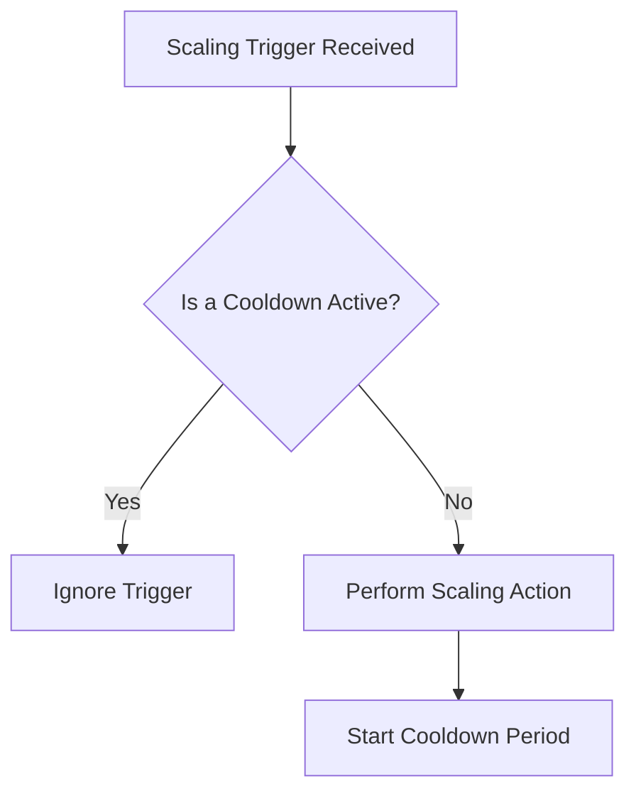

-----

# 🧠 Mastering AWS Auto Scaling: Policies, Metrics, and Cooldowns

This guide dives into the "brain" of an Auto Scaling Group (ASG)—the policies that tell it *when* and *how* to scale. Understanding these strategies is key to creating a truly responsive and cost-efficient application.

-----

## \#\# ⚖️ Types of Auto Scaling Policies

AWS provides several strategies for scaling, ranging from simple to sophisticated. You can choose the one that best fits your application's traffic patterns.

### \#\#\# 1. Dynamic Scaling

This is the most common type, reacting in real-time to changes in load.

  * #### **Target Tracking Scaling (The Thermostat Approach)** 🔥

    This is the simplest and most recommended method. You pick a metric (like Average CPU Utilization) and set a target value (e.g., 40%). The ASG then automatically calculates how many instances to add or remove to keep the metric at or near your target. It's like setting a thermostat in your house; you just set the desired temperature, and the system handles the rest.

  * #### **Simple and Step Scaling (The "If-Then" Approach)** ⚙️

    This method gives you more direct control. You create specific **CloudWatch Alarms** that trigger scaling actions.

      * **Simple Scaling**: "IF CPU is \> 70% for 5 minutes, THEN add 1 instance." (A cooldown period starts after the action).
      * **Step Scaling**: This is a more advanced version. "IF CPU is between 70-80%, add 1 instance. BUT IF CPU is \> 80%, add 3 instances." It allows for more aggressive scaling when the load is significantly higher.

### \#\#\# 2. Scheduled Scaling

This is for predictable traffic patterns. You know your website gets a surge of traffic every Friday at 5:00 PM. You can create a scheduled action to proactively increase your ASG's minimum capacity to 10 instances just before the rush hits, ensuring you're prepared.

### \#\#\# 3. Predictive Scaling

This is the most advanced method, using machine learning to analyze your application's historical traffic data (up to the last 14 days) to forecast future needs. It's ideal for applications with complex, cyclical traffic patterns that aren't on a simple daily or weekly schedule. AWS automatically creates scheduled scaling actions based on its forecast.

-----

## \#\# 📊 Choosing the Right Scaling Metric

The effectiveness of your dynamic scaling policy depends entirely on choosing the right metric to watch. Here are some of the best ones:

  * **CPU Utilization**: The classic choice. If the average CPU across your instances is high, it's a clear sign they are working hard and you might need more of them. This is a great starting point for most applications.

  * **RequestCountPerTarget**: An excellent metric for web applications behind an Application Load Balancer (ALB). You can determine the optimal number of simultaneous requests a single instance can handle (e.g., 1,000). You then set this as your target, and the ASG will scale to ensure no single instance is overwhelmed with requests.

    ```mermaid
    graph TD
        subgraph "Before Scaling (High Load)"
            ALB1(ALB)
            ALB1 -- 3000 requests --> TG1{Target Group}
            TG1 --> EC2_1A(Instance 1 - 1000 req)
            TG1 --> EC2_1B(Instance 2 - 1000 req)
            TG1 --> EC2_1C(Instance 3 - 1000 req)
            subgraph Metric
                M1["RequestCountPerTarget = 1000"]
            end
        end

        subgraph "After Scaling Out"
            ALB2(ALB)
            ALB2 -- 3000 requests --> TG2{Target Group}
            TG2 --> EC2_2A(Instance 1 - 500 req)
            TG2 --> EC2_2B(Instance 2 - 500 req)
            TG2 --> EC2_2C(Instance 3 - 500 req)
            TG2 --> EC2_2D(Instance 4 - 500 req)
            TG2 --> EC2_2E(Instance 5 - 500 req)
            TG2 --> EC2_2F(Instance 6 - 500 req)
            subgraph Metric
                M2["RequestCountPerTarget = 500"]
            end
        end

        M1 -- "Alarm Triggered!" --> M2
    ```

  * **Network In/Out**: If your application is network-bound (e.g., it streams video or handles large file uploads/downloads), scaling based on network traffic can be more effective than CPU.

  * **Custom Metric**: You can instrument your application to push any metric you want to CloudWatch—like the number of jobs in a processing queue—and have your ASG scale based on that application-specific value.

-----

## \#\# ⏳ Giving it a Breather: The Scaling Cooldown

After a scaling activity (adding or removing an instance), the ASG enters a **cooldown period** (default is 300 seconds). During this time, it will not initiate another scaling activity.

**Why is this important?**
It prevents the ASG from overreacting. A newly launched instance needs time to start up, begin handling traffic, and contribute to the overall metrics. The cooldown period lets the "dust settle" and allows the metrics to stabilize before the ASG makes another scaling decision.



### \#\#\# Pro Tip: Shorten Your Cooldown

You can make your ASG more responsive by shortening the cooldown period. To do this safely, you must reduce the time it takes for a new instance to become fully operational. The best way to achieve this is by using a **"Golden" or "pre-baked" AMI**. This is an Amazon Machine Image where you have already pre-installed your application, its dependencies, and any necessary configurations. This way, the instance can start serving traffic almost immediately, allowing for a much shorter and more aggressive cooldown setting.