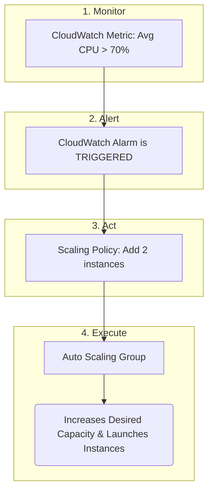

-----

# 🤖 AWS Auto Scaling Groups (ASG): Your Elastic Infrastructure

This guide explains AWS Auto Scaling Groups (ASGs), a fundamental service for building resilient, cost-effective, and scalable applications in the cloud. Think of an ASG as an elastic waistband for your server fleet—it automatically expands when demand is high and contracts when it's low.

-----

## \#\# 🎯 The Core Goal of an ASG

The primary purpose of an Auto Scaling Group is to ensure you have the correct number of EC2 instances available to handle your application's load. It achieves this through two main actions:

  * **Scale Out 📈**: Automatically **adding** new EC2 instances to match an increase in load.
  * **Scale In 📉**: Automatically **removing** EC2 instances to match a decrease in load.

By doing this, you only pay for the compute capacity you actually need, while ensuring your application remains responsive for your users.

-----

## \#\# ❤️‍🩹 The Superpowers of an ASG

Beyond just scaling, ASGs have two critical features that make them indispensable for robust architectures.

### \#\#\# 1. Self-Healing

An ASG constantly monitors the health of its EC2 instances. If an instance is ever marked as **unhealthy** (often determined by an associated Load Balancer's health checks), the ASG will automatically:

1.  **Terminate** the faulty instance.
2.  **Launch** a brand new, healthy instance to replace it.

This process ensures your application maintains its desired capacity and recovers from instance failures without any manual intervention.

### \#\#\# 2. Load Balancer Integration

ASGs work seamlessly with Elastic Load Balancers (ELB). When you associate an ASG with an ELB:

  * When the ASG **scales out**, the new EC2 instances are automatically registered with the load balancer and begin receiving traffic.
  * When the ASG **scales in**, the instances are gracefully deregistered from the load balancer before being terminated.

This powerful combination provides a single, stable endpoint for your users while the backend fleet scales dynamically.

-----

## \#\# ⚙️ How an ASG is Built and Configured

To create an ASG, you need to define two main components: a blueprint for your instances and the rules for scaling.

### \#\#\# 1. The Blueprint: Launch Templates

You can't have an ASG without telling it *what kind* of EC2 instances to launch. This is the job of a **Launch Template**. It's a reusable template that contains all the configuration details for your instances, including:

  * **AMI (Amazon Machine Image)**: The operating system and pre-installed software.
  * **Instance Type**: The CPU, memory, and storage (e.g., `t3.micro`, `m5.large`).
  * **Security Groups**: The virtual firewall rules.
  * **Key Pair**: For SSH access.
  * **User Data**: Scripts to run on instance launch.
  * **IAM Role**: Permissions for the instance.
  * **EBS Volumes**: Attached storage disks.

> **Note:** Launch Templates are the modern standard. The older "Launch Configurations" are deprecated but served the same purpose.

### \#\#\# 2. The Boundaries: Capacity Settings

Every ASG requires you to set three crucial capacity limits:

  * **Minimum Size**: The smallest number of instances the ASG will ever have. It will not scale in below this number.
  * **Maximum Size**: The largest number of instances the ASG will ever have. It will not scale out beyond this number.
  * **Desired Capacity**: The number of instances the ASG should have at this moment. The ASG will always work to maintain this number. You can set this manually, but it's most powerful when controlled automatically by scaling policies.

-----

## \#\# 🤖 The "Auto" in Auto Scaling: Scaling Policies

This is where the magic happens. An ASG doesn't just guess when to scale. It reacts to real-time data using a simple, powerful feedback loop involving **Amazon CloudWatch**, a monitoring service.

Here's the flow:

1.  **Metric**: CloudWatch collects performance data from your instances, like `Average CPU Utilization`.
2.  **Alarm**: You create a **CloudWatch Alarm** that "watches" this metric. For example: "Trigger this alarm if the Average CPU Utilization across all instances goes above 70% for 5 minutes."
3.  **Policy**: The alarm triggers a **Scaling Policy** attached to your ASG. This policy tells the ASG *what to do*. For example: "Add 2 instances."
4.  **Action**: The ASG executes the policy, increasing its **Desired Capacity** and launching new instances from its Launch Template.

The same logic applies in reverse for scaling in (e.g., "If CPU is below 20%, remove 1 instance").

This automated, metric-driven scaling is what makes ASGs so powerful for handling unpredictable traffic while optimizing costs. Best of all, **the Auto Scaling Group service itself is free**; you only pay for the EC2 instances and other resources it launches.