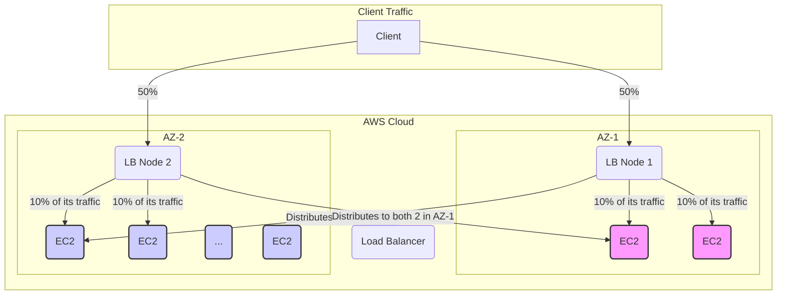

-----

# 🚀 AWS Cross-Zone Load Balancing: A Deep Dive

This guide explains the concept of Cross-Zone Load Balancing within AWS Elastic Load Balancing (ELB). We'll explore what it is, how it works, and how its behavior and cost differ across various load balancer types.

-----

## \#\# 🎯 The Core Concept

At its heart, **Cross-Zone Load Balancing** is a feature that determines the scope of how a load balancer distributes incoming traffic.

  * When **enabled**, each load balancer node distributes traffic evenly across *all* registered instances in *all* enabled Availability Zones (AZs). It ignores AZ boundaries.
  * When **disabled**, each load balancer node only distributes traffic to the registered instances located within its *own* Availability Zone. It respects AZ boundaries.

To understand the practical impact, let's use a clear, imbalanced scenario.

-----

## \#\# ⚖️ An Imbalanced Scenario

Imagine we have a single load balancer deployed across two Availability Zones with a very uneven number of EC2 instances.

  * **Total Instances**: 10
  * **Availability Zone 1 (AZ-1)**: Contains a load balancer node and **2 EC2 instances**.
  * **Availability Zone 2 (AZ-2)**: Contains a load balancer node and **8 EC2 instances**.
  * **Client Traffic**: DNS round-robin sends 50% of traffic to the load balancer node in AZ-1 and 50% to the node in AZ-2.

Now let's see how traffic is handled with and without cross-zone load balancing.

-----

### \#\#\# ✅ With Cross-Zone Load Balancing (Enabled)

When enabled, each load balancer node is aware of *all 10 instances* across both AZs and treats them as a single pool.

  * The load balancer node in **AZ-1** receives 50% of the total traffic and distributes it evenly across all **10 instances**.
  * The load balancer node in **AZ-2** receives the other 50% of the total traffic and also distributes it evenly across all **10 instances**.

#### **Traffic Calculation**

Each instance receives traffic from both load balancer nodes. The total traffic per instance is:

$$(\frac{50\% \text{ traffic from AZ-1}}{10 \text{ instances}}) + (\frac{50\% \text{ traffic from AZ-2}}{10 \text{ instances}}) = 5\% + 5\% = 10\%$$

**Outcome**: Every single EC2 instance, regardless of its AZ, receives an **equal 10%** of the total traffic. This prevents the two instances in AZ-1 from being overwhelmed.

-----

### \#\#\# ❌ Without Cross-Zone Load Balancing (Disabled)

When disabled, each load balancer node is only aware of the instances within its own AZ. Traffic is contained within the AZ it first arrives in.

  * The load balancer node in **AZ-1** receives 50% of the total traffic and distributes it *only* among the **2 instances** in AZ-1.
  * The load balancer node in **AZ-2** receives the other 50% of the total traffic and distributes it *only* among the **8 instances** in AZ-2.

#### **Traffic Calculation**

  * **For an instance in AZ-1**:
    $$\frac{50\% \text{ of total traffic}}{2 \text{ instances}} = \textbf{25\% of total traffic per instance}$$
  * **For an instance in AZ-2**:
    $$\frac{50\% \text{ of total traffic}}{8 \text{ instances}} = \textbf{6.25\% of total traffic per instance}$$

**Outcome**: The instances in AZ-1 receive **4 times more traffic** than the instances in AZ-2. This can lead to overloading, poor performance, and potential failure in the smaller AZ.

-----

## \#\# 💡 When to Use Which? A Missing Piece of the Puzzle

The transcript explains the "what," but it's crucial to understand the "why." There is no right or wrong answer; it always depends on your use case.

| Use Case | Recommended Setting | Why? |
| :--- | :--- | :--- |
| **General Purpose / Stateless Web Apps** | ✅ **Enable** | Prevents traffic imbalance due to uneven instance counts or AZ failures. Ensures smooth, even performance and improves fault tolerance. This is the most common scenario. |
| **High-Performance Computing (HPC) / Low Latency** | ❌ **Disable** | For applications sensitive to nanoseconds of latency (like high-frequency trading), keeping traffic within an AZ avoids the network hop and potential latency of inter-AZ communication. |
| **Stateful Applications / Session Affinity** | ❌ **Disable** | If you need to maintain application state on a specific set of servers, you might want to contain traffic within an AZ to ensure requests from a session consistently hit the same group of instances. |
| **Data Sovereignty / Compliance** | ❌ **Disable** | In rare cases where data is not allowed to cross specific network boundaries (even within a region), disabling cross-zone ensures traffic is strictly contained. |

-----

## \#\# 💰 Behavior & Cost by Load Balancer Type

The default behavior and cost implications are different for each ELB type. This is a critical point for certification exams and real-world architecture.

| Load Balancer Type | Default State | Inter-AZ Data Charges? | Configuration Level |
| :--- | :--- | :--- | :--- |
| **Application (ALB)** | ✅ **Enabled** | **No Charge** | Target Group |
| **Network (NLB)** | ❌ **Disabled** | **Yes, if enabled** | Load Balancer |
| **Gateway (GLB)** | ❌ **Disabled** | **Yes, if enabled** | Load Balancer |
| **Classic (CLB)** | ❌ **Disabled** | **No Charge**, if enabled | Load Balancer |

**Key Takeaway**: For **ALB** and **Classic LB**, enabling cross-zone is free. For the higher-performance **NLB** and **GLB**, you pay for the convenience of cross-zone balancing because you are charged for inter-AZ data transfer.

> **Note on Classic Load Balancer (CLB)**: As mentioned in the transcript, the CLB is a previous generation service and is being retired. While it's good to know its behavior, focus your learning on ALB and NLB for modern applications.

-----

## \#\# ⚙️ Configuration in AWS

  * For an **Application Load Balancer (ALB)**, this setting is managed at the **Target Group** level. Go to `EC2 > Target Groups > [Your Target Group] > Attributes > Edit`. You can turn it off for a specific target group even though it's on by default for the ALB.

  * For a **Network Load Balancer (NLB)** and **Gateway Load Balancer (GLB)**, this is a direct attribute of the load balancer itself. Go to `EC2 > Load Balancers > [Your NLB/GLB] > Attributes > Edit`. A warning will appear about potential charges when you enable it.