-----

# 🔐 Demystifying SSL, TLS, and SNI on AWS Load Balancers

This guide breaks down how SSL/TLS certificates work with AWS Elastic Load Balancers (ELB) to secure your applications. We'll cover the basics of encryption, how load balancers handle it, and the crucial role of Server Name Indication (SNI) for modern web hosting.

-----

## \#\# 🔒 What are SSL/TLS Certificates?

At its core, an **SSL/TLS certificate** is a digital file that enables encrypted communication between a client (like a web browser) and a server (like your load balancer). This is often called **in-flight encryption**.

  * **SSL (Secure Sockets Layer)**: The original protocol for encrypting connections.
  * **TLS (Transport Layer Security)**: The modern, more secure successor to SSL.

> **Heads Up\!** 💡
> While **TLS** is the current standard, the term **SSL** is still widely used in conversation and even in some product names. For the most part, when people say "SSL certificate," they are referring to a TLS certificate.

When you visit a website and see the padlock icon 🔒 in your browser's address bar, it means your connection is secured by an SSL/TLS certificate. This certificate ensures that any data you send—like passwords or credit card information—is scrambled and unreadable to anyone who might try to intercept it.

These certificates are issued by trusted **Certificate Authorities (CAs)** like GoDaddy, DigiCert, and Let's Encrypt. In AWS, you can easily manage your certificates using the **AWS Certificate Manager (ACM)**.

-----

## \#\# 🚦 How Load Balancers Use SSL/TLS: SSL Termination

Your load balancer acts as the secure entry point for your application. A common and efficient pattern is **SSL Termination**. Here’s how it works:

1.  **Encrypted Connection (Client to ELB)**: The user connects to your load balancer using **HTTPS** (the 'S' stands for secure). This traffic is fully encrypted using the SSL certificate installed on the load balancer.
2.  **Decryption at the ELB**: The load balancer *terminates* (ends) the SSL connection. It decrypts the incoming traffic.
3.  **Unencrypted Connection (ELB to EC2)**: The load balancer then forwards the request to your backend EC2 instances using standard **HTTP** over your private Virtual Private Cloud (VPC).

This process is secure because the traffic between the load balancer and your instances never leaves the private, controlled AWS network.

**The main benefit**: You only need to manage the complex SSL/TLS certificate on the load balancer itself, not on every individual EC2 instance.

```mermaid
graph TD
    Client[💻 User's Browser] -- "1. Encrypted HTTPS Traffic" --> ELB[🚀 Load Balancer];
    subgraph "Your Private VPC"
        ELB -- "3. Unencrypted HTTP Traffic" --> EC2_A[EC2 Instance];
        ELB -- "3. Unencrypted HTTP Traffic" --> EC2_B[EC2 Instance];
    end
    subgraph Legend
        ELB -- "2. SSL Termination (Decryption)" --> Decrypt(( ))
    end

    style Decrypt fill:#fff,stroke:#fff
```

-----

## \#\# 🤔 The Problem: One Server, Multiple Secure Websites

In the past, if you wanted to host multiple HTTPS-enabled websites (e.g., `mycorp.com` and `example.com`), you had a big problem. A server could only present **one SSL certificate** per IP address. This meant you needed a separate load balancer (and a separate IP) for each secure website, which was expensive and inefficient.

How can a single load balancer know which certificate to show if it receives requests for different domains?

-----

## \#\# ✨ The Solution: Server Name Indication (SNI)

**Server Name Indication (SNI)** is the modern solution to this problem. It's an extension to the TLS protocol that allows the client to specify the **hostname** (e.g., `www.mycorp.com`) it's trying to connect to at the very beginning of the secure handshake.

With SNI, the process looks like this:

1.  A client wants to connect to `www.mycorp.com` and sends a request to the load balancer's IP address.
2.  As part of the initial handshake, the client says, "Hey, I'm looking for `www.mycorp.com`."
3.  The load balancer, which holds certificates for both `www.mycorp.com` and `example.com`, sees this request.
4.  It selects the **correct certificate** (`www.mycorp.com`) and presents it to the client to establish the encrypted connection.
5.  Finally, it routes the request to the appropriate backend target group for that domain.

SNI allows a single load balancer to host hundreds of secure websites, each with its own SSL/TLS certificate.

-----

## \#\# 📊 Load Balancer Support Summary

SNI support is a key differentiator between the different types of AWS load balancers.

| Load Balancer Type | SSL/TLS Support | SNI Support (Multiple Certificates) | Key Takeaway |
| :--- | :--- | :--- | :--- |
| **Classic (CLB)** | Yes | ❌ **No** | Old generation. Can only handle **one** SSL certificate. To host multiple secure domains, you need multiple CLBs. |
| **Application (ALB)** | Yes | ✅ **Yes** | Modern and flexible. It's the standard choice for hosting multiple secure websites or microservices on a single load balancer. |
| **Network (NLB)** | Yes | ✅ **Yes** | Designed for extreme performance at the transport layer (TCP/TLS). Also supports SNI for high-throughput multi-domain applications. |