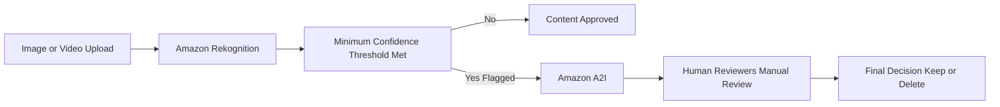

## 👁️ Amazon Rekognition: Machine Learning for Visual Analysis

**Amazon Rekognition** is a serverless machine learning-powered service that automatically analyzes **images and videos** to find objects, people, text, scenes, and activities. It allows you to build sophisticated visual search and content moderation features into your applications without requiring machine learning expertise.

-----

## 1\. Core Capabilities and Use Cases 💡

Rekognition enables real-time visual analysis across a broad range of applications, providing high-level information about visual content.

| Feature Category | Description & Examples |
| :--- | :--- |
| **Object & Scene Labeling** | Identifies elements in images and videos, such as objects (a person, a rock, a mountain bike), and scenes (outdoors, a crest). |
| **Face Analysis** | Detects faces and extracts attributes like **gender, age range, emotions** (e.g., happy, smiling), and eye status (open/closed). |
| **Face Search & Verification** | Performs **user verification** in security applications. You can create a database of familiar faces, or search images against a database of celebrities. |
| **Text Detection** | Reads and extracts text from images (e.g., reading a runner's number during a sports event). |
| **Celebrity Recognition** | Identifies thousands of well-known public figures. |
| **Pathing (Video Analysis)** | Tracks the **movement and paths** of objects or people within a video (e.g., monitoring player movement in a soccer game for analytics). |
| **Content Moderation** | Detects inappropriate, unwanted, or offensive content. |

-----

## 2\. Advanced Feature: Content Moderation and Human Review 🛡️

Content moderation is a critical use case for platforms like social networks, media broadcasters, or e-commerce sites to maintain a safe user experience and comply with regulations.

### **How Content Moderation Works**

1.  **Analysis:** Amazon Rekognition analyzes an image or video to identify sensitive content (e.g., racism, pornography).
2.  **Confidence Threshold:** You set a **Minimum Confidence Threshold** (a percentage).
      * If Rekognition's confidence score for inappropriate content exceeds this threshold, the item is **flagged**.
      * A lower threshold will flag more items (increasing false positives), while a higher threshold will only flag content it is very confident about.
3.  **Optional Manual Review (A2I):** To improve accuracy and address borderline cases, flagged images can be sent for a **human manual review** using **Amazon Augmented AI (A2I)**. This ensures compliance and removes false positives before content is deleted or hidden.

<!-- end list -->

----