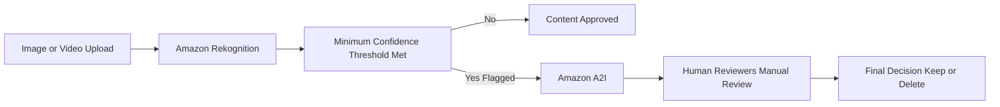

## 📸 Amazon Rekognition: Image and Video Analysis (ML Service)

**Amazon Rekognition** is a machine learning-powered service that automates the analysis of images and videos to identify objects, people, text, scenes, and activities. It is a key service for adding computer vision capabilities to applications without needing deep ML expertise.

-----

## 1\. Core Capabilities and Use Cases 🧠

Rekognition provides APIs for various high-level analysis tasks on both still images and streaming/stored video.

  * **Labeling and Scene Detection:** Identifying elements, objects, and scenes within images and videos (e.g., "person," "rock," "mountain bike," "outdoors").
  * [cite\_start]**Content Moderation:** Detecting content that is inappropriate, unwanted, or offensive (e.g., racist content, pornography) to ensure a safe user experience[cite: 552].
      * [cite\_start]**Use Cases:** Social networks, broadcast media, e-commerce, and advertising, often used to comply with regulations[cite: 552].
  * [cite\_start]**Face Analysis:** Finding faces and determining attributes like **gender, age range, emotions** (e.g., happy, smiling), and specific features (e.g., eyes open)[cite: 552].
  * [cite\_start]**Face Search and Verification:** Searching against a custom database of faces for user verification in security applications[cite: 552].
  * [cite\_start]**Celebrity Recognition:** Comparing faces against a database of known celebrities[cite: 552].
  * [cite\_start]**Text Detection:** Reading text within images, useful for recognizing runner numbers in a race[cite: 552].
  * [cite\_start]**Pathing:** Monitoring the movement of people or objects in a video (e.g., analyzing player movement in a soccer game video)[cite: 552].

-----

## 2\. Deep Dive: Content Moderation Workflow 🛡️

Content moderation is a critical use case, especially for user-generated content platforms.

1.  [cite\_start]**Image Analysis:** Amazon Rekognition analyzes the image or video for offensive or inappropriate content[cite: 552].
2.  [cite\_start]**Minimum Confidence Threshold:** You set a **Minimum Confidence Threshold** (a percentage)[cite: 552].
      * [cite\_start]The confidence percentage reflects how sure Rekognition is that the flagged content is indeed offensive[cite: 552].
      * [cite\_start]A **lower percentage** will result in **more potential matches** being flagged[cite: 552].
3.  [cite\_start]**Optional Manual Review (A2I):** To improve accuracy and handle edge cases, flagged items can be sent for a **human manual review** using **Amazon Augmented AI (A2I)**[cite: 552]. [cite\_start]This hybrid workflow ensures both automated speed and human accuracy[cite: 552].

<!-- end list -->

