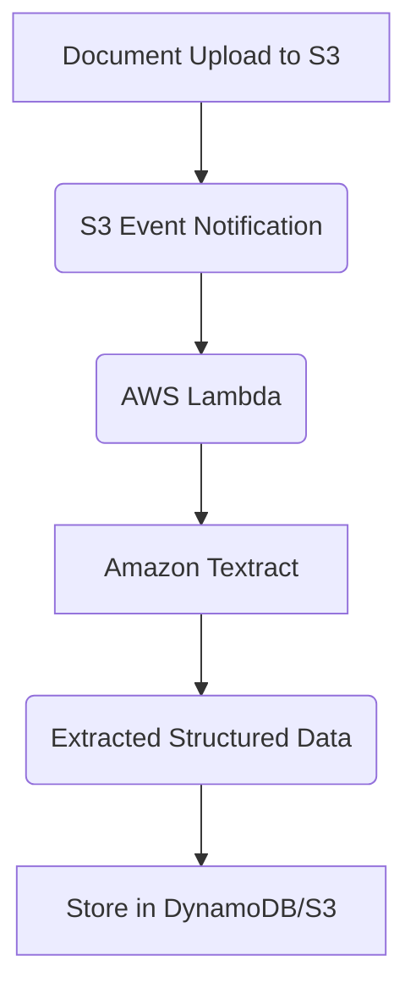

## 📄 Amazon Textract: Document Analysis with Machine Learning

**Amazon Textract** is a machine learning-powered service designed to automatically extract **text, handwriting, and data** from scanned documents, images, and PDFs. It goes beyond simple Optical Character Recognition (OCR) by understanding the context and structure of the document, including forms and tables.

-----

## 1\. Core Capabilities and Functionality 🧠

Textract uses artificial intelligence to read and analyze various document types and return the extracted data in a structured format.

  * **Extraction Types:** Extracts three main things:
    1.  **Text:** Any printed text.
    2.  **Handwriting:** Text written by hand.
    3.  **Data:** Structured information contained in **forms** and **tables**.
  * **Input Formats:** Works with scanned documents, image files, and PDF documents.
  * **Output:** Returns the analysis results as a structured data file (e.g., JSON), making it easy to integrate the extracted information into applications, databases, or workflows.
  * **Example:** Uploading a **driver's license** allows Textract to automatically analyze the document and extract structured data like the **date of birth** and **document ID**.

-----

## 2\. Common Use Cases and Industries 🏭

Textract is primarily used to automate data entry and processing that traditionally required manual review.

  * **Financial Services:** Processing high volumes of documents like **invoices**, **financial reports**, and statements.
  * **Healthcare:** Digitizing and processing **medical records** and **insurance claims**.
  * **Public Sector:** Handling various official documents, such as **tax forms**, **ID documents**, and **passports**.

-----

## 3\. Missing Concept: Integration in a Pipeline

The transcript describes what Textract does, but in a solution architecture context, it's vital to understand its placement within a larger data pipeline.

  * **Architecture Pattern (Document Processing):** Textract rarely works in isolation. A typical pipeline would involve:
    1.  **Storage:** Documents are uploaded to an **Amazon S3 bucket**.
    2.  **Trigger:** The S3 upload triggers a **Lambda function**.
    3.  **Processing:** The Lambda function calls **Amazon Textract** to analyze the document.
    4.  **Notification:** The results are sent to **Amazon Simple Notification Service (SNS)** upon completion.
    5.  **Storage/Analytics:** The extracted structured data file is written back to S3 or directly into a database like **Amazon DynamoDB** or **Amazon Aurora** for downstream analytics.

<!-- end list -->

