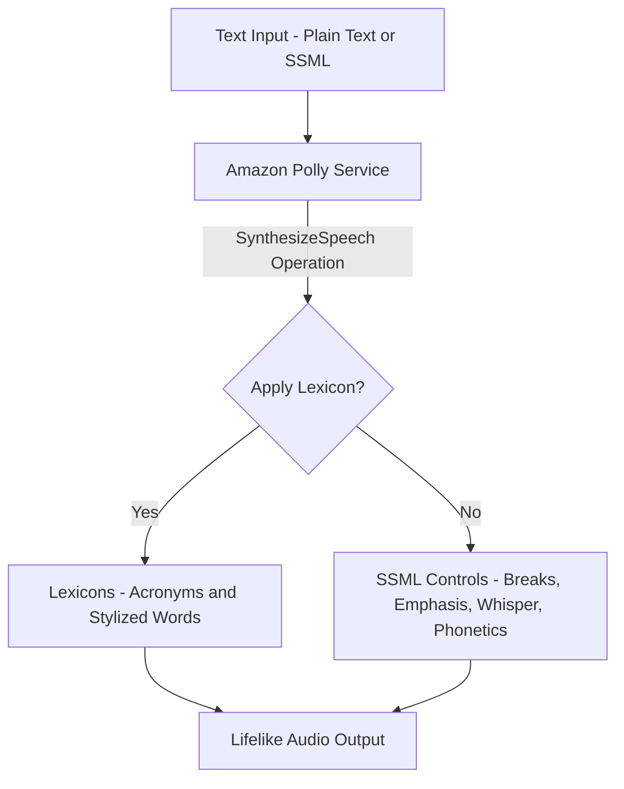

## 🗣️ Amazon Polly: Text-to-Speech Service (Learning Guide)

**Amazon Polly** is a fully managed AWS service that uses deep learning to convert text into lifelike speech. It allows developers to create talking applications and is a key service for voice-enabled solutions.

-----

## 1\. Core Functionality and Technology 🎙️

Polly is a **Text-to-Speech (TTS)** service that generates audio from plain text input.

  * **Speech Quality:** It uses **neural networks** to produce the most natural and human-like speech possible.
  * **Core Operation:** The primary operation is **SynthesizeSpeech**, which takes the text, applies custom settings, and generates an audio file.

-----

## 2\. Speech Customization Features ✨

Polly offers two primary methods for customizing how the synthesized speech sounds: **Pronunciation Lexicons** and **SSML**.

### **A. Pronunciation Lexicons**

  * **Purpose:** To **customize the pronunciation** of specific words, acronyms, or stylized text.
  * **Mechanism:** You create and upload a lexicon file that contains rules for custom pronunciation.
      * **Acronyms:** Convert "AWS" to the full "Amazon Web Services."
      * **Stylized Text:** Correctly pronounce a stylized word like "S-T-3-P-H-4-N-E" as "Stephane."
  * **Application:** Lexicons are applied during the `SynthesizeSpeech` operation.

### **B. Speech Synthesis Markup Language (SSML)**

  * **Purpose:** To enable **more granular control and customization** over the *speech itself* (how words are delivered).
  * **Mechanism:** Instead of passing plain text, you pass an XML-based markup string containing SSML tags.
  * **Customizations Include:**
      * **Breaks/Pauses:** Inserting pauses of a specific duration (e.g., `<break time="3s"/>`).
      * **Emphasis:** Emphasizing specific words or phrases.
      * **Phonetics:** Using phonetic pronunciation to ensure accuracy.
      * **Acoustics:** Including sounds like **whispering** or **breathing sounds**.
      * **Speaking Style:** Applying specific styles like the **Newscaster speaking style**.

<!-- end list -->

-----

You should know that Polly is the correct solution when a question requires **turning text into speech or voice output** for an application.