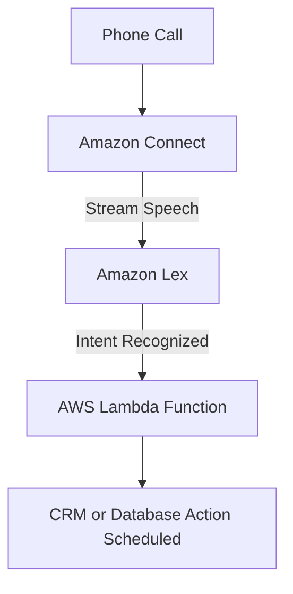

## 📞 Amazon Lex & Amazon Connect: Building Smart Contact Centers

**Amazon Lex** and **Amazon Connect** are specialized AWS services that combine to create powerful, cloud-based, and intelligent customer service solutions. They leverage Machine Learning to understand human language and orchestrate call flows.

-----

## 1\. Amazon Lex: The Conversational AI Engine 🤖

**Amazon Lex** is the technology that powers **Amazon Alexa** devices, providing a complete service for building conversational interfaces into any application.

  * **Automatic Speech Recognition (ASR):** Converts the spoken word (speech) from the caller into text.
  * **Natural Language Understanding (NLU):** Interprets the **intent** of the text (what the user *wants* to do) by understanding sentences and conversational context.
  * **Purpose:** Building sophisticated **chatbots** and **call center bots** that can engage in natural conversation to fulfill user requests.

-----

## 2\. Amazon Connect: The Cloud Contact Center ☁️

**Amazon Connect** is a self-service, **cloud-based contact center** service that makes it easy for businesses to set up and manage a customer contact center.

  * **Operational Model:** It is a **visual contact center** that allows you to define contact flows graphically.
  * **Cost Advantage:** No upfront payment is required, and it is significantly cheaper (approximately **80% less**) than traditional contact center solutions.
  * **Integration:** It integrates seamlessly with other services, including **Customer Relationship Management (CRM) systems** and other **AWS services** (most notably Lex and Lambda).

-----

## 3\. Smart Contact Center Architecture (The Integration Flow) 🧩

The true power of these services is revealed when they are integrated to automate customer interactions. This is a crucial **event-driven, serverless pattern** on AWS.

The flow to handle a call, like "schedule an appointment," is:

1.  **Phone Call:** A customer calls a number managed by **Amazon Connect**.
2.  **Contact Flow:** Connect receives the call and directs it to a flow.
3.  **Stream to Lex:** Connect uses Lex to stream the conversation, which performs **ASR** (speech to text) and **NLU** (intent recognition).
4.  **Lambda Invocation:** Once the intent (e.g., "Schedule an Appointment") is understood, Lex invokes the appropriate **AWS Lambda function** with the details (or *slots*) of the request (e.g., "tomorrow at 3 PM with Tom").
5.  **Business Logic:** The Lambda function runs custom code to execute the desired action (e.g., writing the appointment details into an external **CRM** or a **DynamoDB** table).

<!-- end list -->

-----

### **Missing Concept: Service Quotas**

The transcript details the functionality, but in a real-world context and for the SAA exam, you must consider **service quotas** and scaling. High-volume call centers must plan for the concurrent call capacity and the number of parallel Lambda function executions to prevent throttling and service disruption.