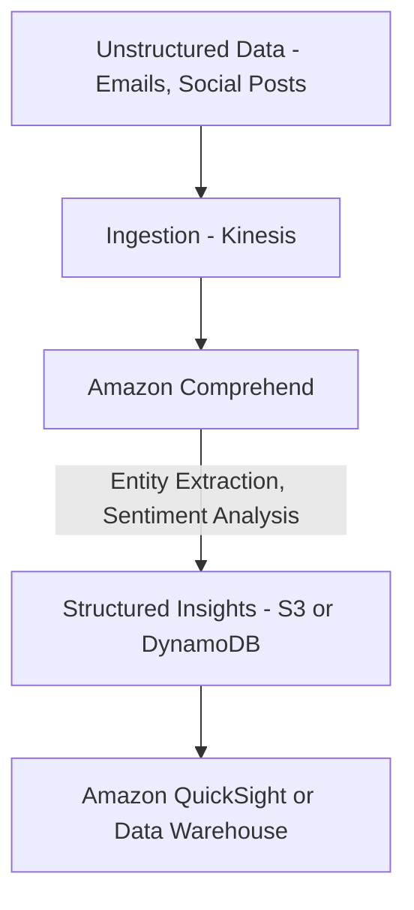

## 🧠 Amazon Comprehend: Natural Language Processing (Learning Guide)

**Amazon Comprehend** is a fully managed, serverless Natural Language Processing (NLP) service that uses machine learning to find insights and relationships in text. For the AWS Certified Solutions Architect - Associate exam (SAA-C03), it's essential to recognize Comprehend as the go-to service for any task involving **NLP** or understanding unstructured text.

-----

## 1\. Core Capabilities and Use Cases 📜

Comprehend transforms unstructured text data into usable insights without requiring you to build and train your own machine learning models.

  * **Key Services (What it does):**

      * **Language Detection:** Identifies the dominant language of the text.
      * **Entity Recognition:** Extracts key information like **key phrases, places, people, brands, or events** from the text.
      * **Sentiment Analysis:** Determines how **positive or negative** the analyzed text is (e.g., classifying customer feedback).
      * **Key Phrasing and Tokenization:** Analyzes text using **tokenization** and **parts of speech**.
      * **Topic Modeling:** Organizes a collection of text files by automatically uncovering and finding relevant **topics**.

  * **Sample Use Cases:**

      * **Customer Interaction Analysis:** Analyzing customer emails or support transcripts to understand what leads to **positive or negative experiences** and gain business insights.
      * **Content Organization:** Feeding a large volume of articles into Comprehend to automatically **group them by topic**.

### **Conceptual Diagram for NLP Pipeline**

Comprehend fits seamlessly into an analytical pipeline, often following ingestion and preceding visualization.

-----

## 3\. Missing Concept: Integration with Custom ML

The transcript focuses only on the pre-built capabilities, but for a comprehensive understanding, note that Comprehend can be extended:

  * **Customization:** While it's serverless and uses pre-trained models, Comprehend also allows you to train **Custom Entity Recognizers** and **Custom Classification Models** using your own industry-specific data. This is useful when the default models don't adequately recognize specialized terms (e.g., unique product codes or domain-specific jargon).