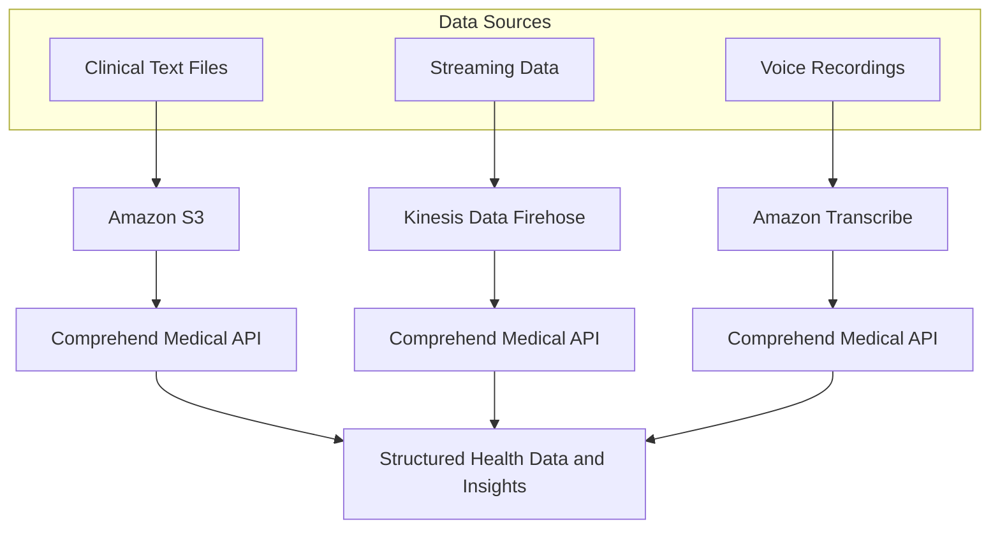

## 🏥 Amazon Comprehend Medical: Unstructured Clinical Text Analysis

**Amazon Comprehend Medical** is a specialized, managed **Natural Language Processing (NLP)** service that uses machine learning to accurately and quickly extract health data and insights from unstructured clinical text.

-----

## 1\. Core Purpose and Features ✨

Comprehend Medical takes text-based clinical documents and transforms them into structured data that can be used for analytics, electronic health record (EHR) systems, or clinical trial matching.

  * **Input Data:** Unstructured clinical text such as **doctor's notes, discharge summaries, test results, and case notes**.
  * **Process:** Applies **Natural Language Processing (NLP)** to detect various **medical entities** (e.g., medications, diagnoses, treatments, protected health information).
  * **Output:** Structured data, allowing organizations to run analytics on previously siloed, textual information (e.g., identifying medication names, strength, dosage, frequency, and route).

### **Key Security Feature**

  * **Protected Health Information (PHI) Detection:** The service includes a dedicated API, **`DetectPHI`**, which specifically identifies and returns the location of **Protected Health Information** within the text, aiding in compliance and anonymization efforts.

-----

## 2\. Architectural Integration Patterns 🔗

Comprehend Medical integrates into AWS data pipelines to analyze both batch and real-time clinical data.

### **A. Batch Analysis (S3)**

This is the standard approach for analyzing large volumes of existing files:

  * Documents (e.g., patient records, PDFs converted to text) are stored in an **Amazon S3** bucket.
  * The **Comprehend Medical API** is invoked to process the documents in the S3 bucket.

### **B. Real-Time Streaming Analysis**

Used for continuous analysis of live data feeds:

  * Data streams are ingested via **Kinesis Data Firehose**, which then passes the data for real-time analysis by Comprehend Medical.

### **C. Voice-to-Text Analysis**

This pattern is used to analyze spoken clinical interactions:

  * **Amazon Transcribe** converts recorded voice (e.g., doctor-patient interactions) into text format.
  * The resulting **text form** is then passed to the **Amazon Comprehend Medical** service for entity extraction.

<!-- end list -->

-----