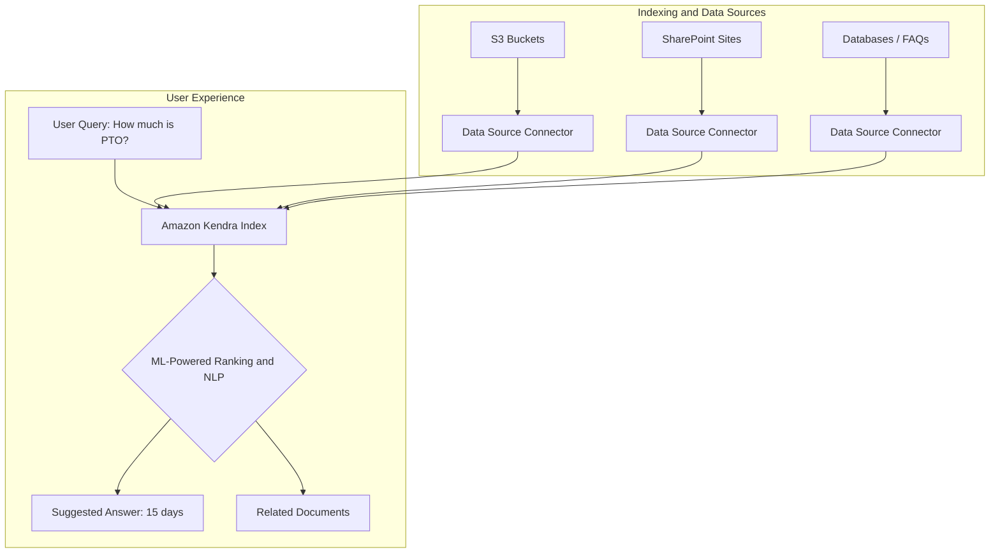

## 🧠 Amazon Kendra: Intelligent Document Search 🔍

**Amazon Kendra** is a fully managed, machine learning (ML)-powered search service designed to help organizations find answers hidden within vast amounts of unstructured enterprise data. It moves beyond traditional keyword search to provide **natural language query capabilities** and highly accurate answers, significantly enhancing knowledge retrieval.

-----

## 1\. Core Functionality and ML Power 🤖

Kendra builds an internal **knowledge index** powered by machine learning, allowing users to ask questions in plain English, just like interacting with a search engine.

| Feature | Description | Example |
| :--- | :--- | :--- |
| **Intelligent Answer Extraction** | The service extracts **specific answers** or relevant passages from within documents rather than just returning a list of links. | If a user asks, "Where is the IT support desk?", Kendra can reply, **"1st floor"**. |
| **Natural Language Search** | Users can pose questions using conversational language instead of needing to formulate specific keywords. | "How long is maternity leave?" (Kendra returns "14 weeks"). |
| **Multi-Source Indexing** | Kendra can index various document types and repositories, including **text, PDF, HTML, PowerPoint, Microsoft Word, and FAQs**. |  |
| **Incremental Learning** | Kendra uses ML to continuously **optimize search results** based on end-user interactions and feedback, promoting the most preferred documents to the top. | When multiple documents compete for a top spot, Kendra learns from user clicks to promote the most relevant one. |
| **Result Fine-Tuning** | Search results can be customized and fine-tuned based on various attributes like **document importance, freshness (date)**, or any other custom filter. | Filter results to only show documents from the 'Legal' department. |

-----

## 2\. Architectural Placement and Exam Context 🏛️

In a solution architecture, **Amazon Kendra** is the go-to service for building an enterprise search application.

### **Exam Focus (AWS Certified Solutions Architect - Associate)**

The AWS Certified Solutions Architect - Associate (SAA-C03) exam validates a candidate's ability to design solutions using the **AWS Well-Architected Framework**. While Amazon Kendra is a Machine Learning service, the exam requires a high-level understanding of which purpose-built AWS service to recommend for specific workloads.

  * **When to Use Kendra:** You should select Kendra when the primary business requirement is **document search and intelligent answer extraction** from a corpus of unstructured or semi-structured data.
      * *Mnemonic for the exam:* If the scenario involves **document search** (especially internal, proprietary documents) or **natural language query** to get **specific answers**, think **Amazon Kendra**.

### **Missing Concept: Data Connectors**

The transcript mentioned that documents come from various data sources, but a key feature of Kendra that enables this is the use of **Data Source Connectors**.

  * **Data Source Connectors:** Kendra provides out-of-the-box connectors for a wide variety of enterprise data repositories, including Amazon S3, SharePoint, databases (RDS, Aurora), Salesforce, ServiceNow, and Confluence. This allows the index to automatically synchronize with source systems, keeping the search results fresh without manual intervention.

<!-- end list -->

