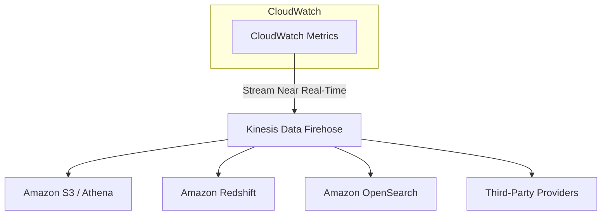

## 📊 Amazon CloudWatch Metrics: The Monitoring Backbone

**Amazon CloudWatch Metrics** is a fundamental service within CloudWatch used to monitor the performance of your AWS resources and applications. It provides time-series data for virtually every service in your AWS account, helping you monitor everything that's happening.

-----

## 1\. Core Concepts of a Metric 📈

A **metric** is essentially a variable you want to monitor, measured over time.

  * **Metric:** A variable to monitor (e.g., `CPUUtilization`, `NetworkIn`, `BucketSizeBytes`).
  * **Time-Based:** Every data point for a metric must have a **timestamp**.
  * **Namespaces:** Metrics are grouped into **namespaces**, which act as containers. Typically, there is one namespace per AWS service (e.g., `AWS/EC2`, `AWS/S3`).
  * **Dimensions:** These are **attributes** of a metric used for filtering and identifying the data. For example, a `CPUUtilization` metric might have an `InstanceId` or `Environment` dimension.
      * You can have up to **30 dimensions** per metric.

### **Monitoring Frequency**

The frequency at which metrics are collected depends on the service and monitoring configuration:

  * **Standard Monitoring:** Metrics are collected every **5 minutes**.
  * **Detailed Monitoring:** If enabled (e.g., for EC2), metrics are collected every **1 minute**.

-----

## 2\. Custom Metrics and Dashboards 📝

Beyond the metrics AWS automatically provides, you can define your own.

  * **Custom Metrics:** You can create your own metrics to monitor specific application variables or information not natively exposed by AWS.
      * *Classic Use Case:* Extracting **memory usage** from an EC2 instance, as this is not a default EC2 metric.
  * **CloudWatch Dashboards:** Once you have your metrics, you can create dashboards to visualize them all at once using various formats like **Line charts, Stacked area charts, Number widgets, or Pie charts**.

-----

## 3\. Streaming Metrics Outside of CloudWatch ➡️

CloudWatch Metrics can be continuously streamed in near real-time to external destinations for advanced analytics, archiving, or integration with third-party tools.

### **Streaming Architecture (Kinesis Data Firehose)**

The primary method for streaming metrics within the AWS ecosystem is via **Amazon Kinesis Data Firehose**.

1.  **CloudWatch Metrics $\rightarrow$ Kinesis Data Firehose (Near Real-Time Delivery):** Metrics are streamed with **low latency** to a configured Kinesis Data Firehose delivery stream.
2.  **Firehose Destinations:** From Firehose, the metrics can be sent to various analytical destinations:
      * **Amazon S3:** For archiving and analysis using **Amazon Athena**.
      * **Amazon Redshift:** For centralized data warehousing of metrics.
      * **Amazon OpenSearch:** To build dashboards and perform analytics on the metrics data.

### **Streaming Options**

  * You can choose to stream **all metrics** from all namespaces or **filter a subset** of metrics/namespaces to send to Firehose.
  * Metrics can also be sent directly to **third-party service providers** like Datadog, Dynatrace, New Relic, Splunk, or Sumo Logic.

<!-- end list -->

-----

## 4\. Missing Concept: CloudWatch Alarms

The transcript thoroughly covers metrics but omits the critical follow-up action: **Alerting**.

  * **CloudWatch Alarms:** Alarms are used to automatically initiate an action when a metric crosses a user-defined threshold.
  * **Functionality:** You define an alarm based on a metric (e.g., `CPUUtilization` \> 80% for 5 minutes) and link it to an action, such as sending a notification via **SNS** or executing an **Auto Scaling** action. Alarms are fundamental for turning monitoring data into operational intelligence.