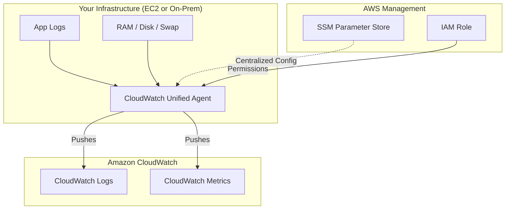

## 🛰️ AWS CloudWatch Agent: The Observability Level-Up

This guide covers the transition from basic AWS monitoring to deep, system-level visibility using **CloudWatch Agents**. While AWS provides basic metrics out of the box, the Agent is your "boots on the ground" for logs and memory tracking.

---

## 1. The Monitoring Gap: Default vs. Agent 📊

By default, Amazon EC2 is "blind" to what happens *inside* your operating system. It can see the virtual machine from the outside, but it can't read your files or check your RAM.

| Metric Category | Default EC2 Monitoring | With CloudWatch Agent |
| --- | --- | --- |
| **CPU** | High-level (Utilization) | Granular (Guest, Idle, System, User) |
| **Network** | Bytes In/Out | Netstats, TCP/UDP connections |
| **Disk** | Read/Write Ops (EBS level) | Disk Used/Free, IOPS, specific partitions |
| **Memory (RAM)** | ❌ **No** | ✅ **Yes** (Used, Free, Cached) |
| **Swap Space** | ❌ **No** | ✅ **Yes** (Used, Free) |
| **Logs** | ❌ **No** | ✅ **Yes** (Any `.log` file) |

---

## 2. Agent Face-Off: Old vs. Unified ⚔️

There are two versions you might encounter, but for 99% of use cases (and the exam), the **Unified Agent** is the winner.

* **CloudWatch Logs Agent (Legacy):**
* **Scope:** Logs only.
* **OS Support:** Primarily Linux.
* **Config:** Managed locally on the instance.

* **CloudWatch Unified Agent (Recommended):**
* **Scope:** Logs **AND** System-level Metrics.
* **OS Support:** Linux, Windows, and On-Premises servers.
* **SSM Integration:** Can pull configuration from **SSM Parameter Store** for centralized management.

---

## 3. High-Level Architecture 🏗️

The agent acts as a bridge, pushing data from your instances (AWS or On-Prem) to the CloudWatch central hub.

---

## 4. Deep Dive: The Unified Agent’s "Superpowers" 🦸‍♂️

When you install the Unified Agent, you unlock granular metrics grouped by these categories:

* **CPU:** Detailed states like `active`, `guest`, `steal`, and `user`.
* **Disk:** Total, used, and free space; Disk IO (reads/writes/bytes/iops).
* **Memory (RAM):** The most common reason to install the agent. Tracks `free`, `inactive`, `used`, and `total`.
* **Netstats:** Number of established TCP/UDP connections and packet data.
* **Processes:** Monitoring the state of your processes (`running`, `sleeping`, `dead`, `blocked`).
* **Swap Space:** Essential for spotting memory leaks that spill over onto the disk.

---

## 5. Setup Checklist & Pro-Tips 🛠️

To get the agent running successfully, follow these key steps:

1. **IAM Role:** Attach a role to your EC2 instance with the `CloudWatchAgentServerPolicy`.
2. **Installation:** Run `sudo yum install amazon-cloudwatch-agent` (on Amazon Linux).
3. **The Wizard:** Use the config wizard to generate your initial JSON:
`sudo /opt/aws/amazon-cloudwatch-agent/bin/amazon-cloudwatch-agent-config-wizard`
4. **SSM Storage:** Choose **"Yes"** when the wizard asks to store the config in SSM Parameter Store. This allows you to apply the same config to 100+ instances at once!

---

## 6. What's Missing? (Pro Concepts) 💡

* **Log Groups & Streams:** In CloudWatch Logs, the Agent organizes data into **Log Groups** (e.g., `/var/log/apache2`) and **Log Streams** (usually the Instance ID).
* **Namespace:** By default, agent metrics land in the `CWAgent` namespace, not the standard `AWS/EC2` namespace.
* **High-Resolution Metrics:** You can configure the agent to push metrics every **1 second** (Standard is 60s), which is great for high-frequency trading or critical real-time apps.
* **StatsD & collectd:** The Unified Agent can also act as a local server to receive custom metrics from these popular open-source protocols.