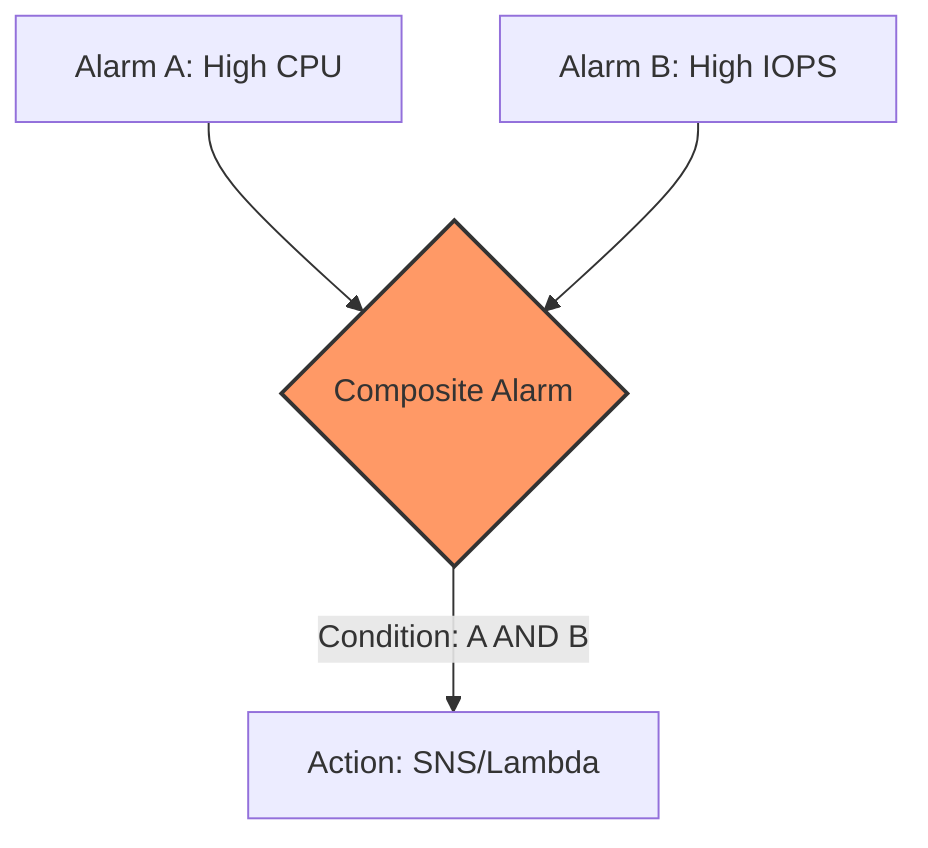
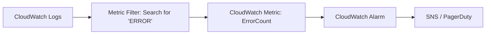

# 🔔 Amazon CloudWatch Alarms: The Reactive Powerhouse

CloudWatch Alarms are the "if this, then that" of the AWS monitoring world. They don't just watch your metrics; they **act** on them.

## 1. Alarm Fundamentals & States 🚦

An alarm watches a single metric over a specified **period**. To understand what your alarm is thinking, you need to know its three possible states:

| State | Meaning |
| --- | --- |
| **`OK`** | Everything is fine. The metric is within the threshold. |
| **`ALARM`** | Threshold breached! (e.g., CPU > 80%). This triggers the configured action. |
| **`INSUFFICIENT_DATA`** | The alarm just started, or the metric is missing data points to make a call. |

> [!TIP]
> **Pro Tip:** Use the CLI command `aws cloudwatch set-alarm-state` to manually force an alarm into the `ALARM` state. It’s the best way to test if your SNS notifications or Lambda functions actually work without having to break your production server!

---

## 2. Taking Action: Where do Alarms go? 🎯

When an alarm triggers, it doesn't just sit there. It hits one of three main targets:

1. **EC2 Actions:** Stop, Terminate, Reboot, or **Recover** an instance.
2. **Auto Scaling:** Scale Out (add capacity) or Scale In (save money) based on demand.
3. **SNS Notifications:** Send an email, SMS, or trigger a **Lambda Function** for custom automation (like posting to Slack or fixing a database).

---

## 3. Composite Alarms: Reducing "Alarm Fatigue" 🧠

Normal alarms monitor one metric. **Composite Alarms** monitor the *states* of other alarms. This is crucial for avoiding "noise."

* **Logic:** Uses `AND` / `OR` conditions.
* **Example:** Only alert me if (`High CPU Alarm` **AND** `High Network IO Alarm`).
* **Benefit:** If only the CPU is high but the network is idle, it might just be a background cron job—no need to wake up the engineer at 3:00 AM.

### Composite Alarm Logic Flow

---

## 4. EC2 Instance Recovery: The Self-Healing Server 🩹

This is a specific, powerful use case for Alarms. If an EC2 instance fails a **System Status Check** (hardware failure), CloudWatch can automatically "Recover" it.

* **What stays the same:** Private/Public IP, Elastic IP, Metadata, and Placement Group.
* **How it works:** AWS moves the instance to a new physical host. It’s like a transparent heart transplant for your server.

---

## 5. From Logs to Alarms: The Metric Filter Pipeline 📝

You can turn "text" into "numbers" using **Metric Filters**. This is how you monitor application errors.

---

## 6. What’s Missing? (Bonus Concepts for the Exam) 🎓

To round out your knowledge, keep these "unspoken" features in mind:

* **Missing Data Treatment:** You can configure how the alarm treats missing data (e.g., treat missing as `breaching`, `notBreaching`, `ignore`, or `missing`). This is vital for intermittent workloads.
* **Datapoints to Alarm (n out of m):** You can set an alarm to trigger only if the threshold is breached in, say, 3 out of 5 evaluation periods. This prevents "flapping" (alarms triggering on a single, tiny spike).
* **Metric Math:** You can create an alarm based on a **mathematical expression** of multiple metrics (e.g., `(Errors / TotalRequests) * 100`).

---